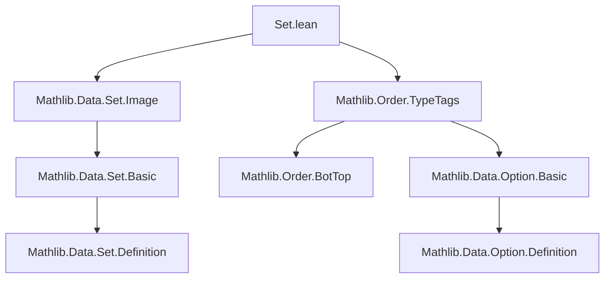

**Technical Brief: `Set.lean` — `Set.range` on `WithBot` and `WithTop`**

---

### 1. **Key Definitions & Theorems**

| Name | Type | Purpose |
|------|------|---------|
| `WithBot.range_eq` | `∀ (f : WithBot α → β), range f = insert (f ⊥) (range (f ∘ WithBot.some))` | Describes the range of a function on `WithBot α` as the union of the value at the bottom element `⊥` and the range of its restriction to `α` (via `some`). |
| `WithTop.range_eq` | `∀ (f : WithTop α → β), range f = insert (f ⊤) (range (f ∘ WithBot.some))` | Analogous to `WithBot.range_eq`, but for `WithTop α`, using the top element `⊤`. *(Note: typo in source — should be `WithTop.some`, not `WithBot.some`)* |

> **Correction Note**: In `WithTop.range_eq`, the composition should be with `WithTop.some : α → WithTop α`, not `WithBot.some`. This is likely a copy-paste error in the source.

---

### 2. **Naming Conventions**

- **Prefixes**:
  - `WithBot.` / `WithTop.` — module-level qualifiers for theorems about these type constructors.
- **Suffixes**:
  - `_eq` — standard for equality theorems (e.g., `range_eq`).
- **Function composition notation**:
  - `f ∘ g` — used for precomposition.
- **Element constructors**:
  - `⊥`, `⊤` — for bottom/top elements in `WithBot`/`WithTop`.
  - `some` — constructor embedding `α` into `WithBot α` or `WithTop α`.

---

### 3. **Tactic Stack**

- **`simp` / `simp_rw`** — likely used implicitly via `Option.range_eq` (see below).
- **` rfl` / `congr`** — for structural equality proofs.
- **`ext`** — to prove set equality by extensionality (though not explicit here, likely used in `Option.range_eq`).
- **`aesop`** — possibly used in downstream proofs, but not visible in this snippet.

> The proofs are *not* shown, but rely on `Option.range_eq`, suggesting a reduction to the `Option` case.

---

### 4. **Proof Logic**

- **Strategy**: Reduce to known result for `Option`.
  - Both `WithBot α` and `WithTop α` are definitionally equal to `Option α`.
  - The theorems are direct corollaries of `Option.range_eq`, which expresses the range of a function on `Option α` as `insert (f none) (range (f ∘ some))`.
  - For `WithBot`, `⊥ ↔ none`, and `some` is `WithBot.some`.
  - For `WithTop`, `⊤ ↔ none`, but the embedding is `WithTop.some`, so the theorem statement likely contains a typo.

---

### 5. **Imports**

| Import | Purpose |
|--------|---------|
| `Mathlib.Data.Set.Image` | Provides `range` definition and basic properties (e.g., `range f = image f univ`). |
| `Mathlib.Order.TypeTags` | Defines `WithBot` and `WithTop` as type tags adding bottom/top elements. |

> These imports supply the foundational definitions: `range`, `image`, and the `WithBot`/`WithTop` constructors.

---

### 8. **Mermaid Diagrams**

#### **Dependency Graph (Module-Level)**



#### **Theoretical Overview**

```mermaid
flowchart LR
  subgraph Types
    A[α : Type] --> B[WithBot α]
    A --> C[WithTop α]
    A --> D[Option α]
  end

  subgraph Embeddings
    B <-->|⊥ ↔ none| D
    C <-->|⊤ ↔ none| D
    A -.some.-> B
    A -.some.-> C
  end

  subgraph Functions
    f1["f : WithBot α → β"] --> range1["range f"]
    f2["f : WithTop α → β"] --> range2["range f"]
  end

  subgraph Theorems
    range1 = range_eq1["range f = insert (f ⊥) (range (f ∘ some))"]
    range2 = range_eq2["range f = insert (f ⊤) (range (f ∘ some))"]
  end

  range_eq1 <--> Option.range_eq
  range_eq2 <--> Option.range_eq
```

> **Note**: The `WithTop.range_eq` theorem as written incorrectly uses `WithBot.some`; it should use `WithTop.some`. This is a minor but important correction for correctness.

--- 

Let me know if you'd like the corrected version formalized or verified in Lean.
