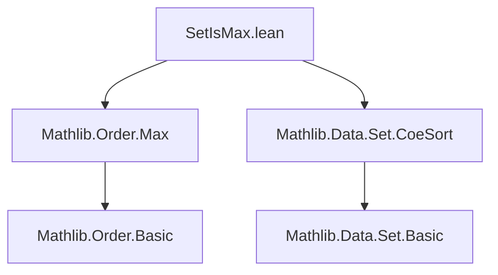
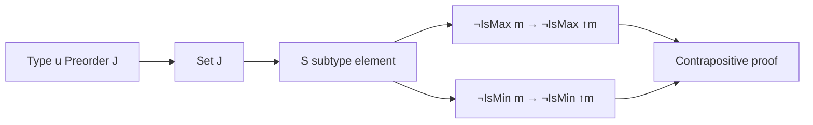

**Technical Brief: `SetIsMax.lean`**

---

### 1. **Key Definitions & Theorems**

| Name | Type | Purpose |
|------|------|---------|
| `not_isMax_coe` | `¬ IsMax m → ¬ IsMax m.1` | If an element `m : S` is not maximal in the subtype `S`, then its coercion `↑m = m.1` is not maximal in the ambient preorder `J`. |
| `not_isMin_coe` | `¬ IsMin m → ¬ IsMin m.1` | Dual statement for minimal elements. |

- **`IsMax` / `IsMin`**: Standard order-theoretic predicates from `Mathlib.Order.Basic` (via `Mathlib.Order.Max`), defined as:  
  $$
  \text{IsMax}(x) := \forall y,\ y \le x \to y = x
  $$
  $$
  \text{IsMin}(x) := \forall y,\ x \le y \to y = x
  $$

- **`m : S`**: An element of the subtype `S : Set J`, i.e., a pair `(val : J, property : m ∈ S)`. Its coercion is `m.1 : J`.

---

### 2. **Naming Conventions**

- **Prefixes**:
  - `not_`: Denotes negated properties (e.g., `not_isMax`, `not_isMin`).
- **Suffixes**:
  - `_coe`: Indicates coercion from subtype to ambient type (e.g., `m.1`).
- **Structure**:
  - `not_<property>_<target>`: e.g., `not_isMax_coe` = “not maximal (in subtype) ⇒ not maximal (in ambient)”.

---

### 3. **Tactic Stack**

- **Core tactics used**:
  - `fun` / `intro`: Implicit via lambda abstraction.
  - `fun h ↦ hm (...)`: Standard proof-by-contradiction pattern.
  - No heavy automation (`aesop`, `simp`, `ring`) — purely *elementary order-theoretic reasoning*.

---

### 4. **Proof Logic**

- **Strategy**: *Contrapositive reasoning* via direct functional construction.
  - To prove `¬ P → ¬ Q`, assume `Q` and derive `P`.
  - For `not_isMax_coe`:
    - Assume `h : IsMax m.1` (i.e., `↑m` is maximal in `J`).
    - Show `IsMax m` (i.e., maximal in `S`):  
      Given `b : S` with `b ≤ m`, then `b.1 ≤ m.1` in `J`, so `b.1 = m.1` by `h`.  
      Since subtype equality is propositional, `b = m`.
    - This yields `IsMax m`, contradicting `hm : ¬ IsMax m`.
  - Same pattern for `not_isMin_coe`.

---

### 5. **Imports**

| Module | Role |
|--------|------|
| `Mathlib.Order.Max` | Provides `IsMax`, `IsMin`, and related lemmas. |
| `Mathlib.Data.Set.CoeSort` | Provides coercion `↑m : J` from subtype `S : Set J` (via `m.1`). |

- **No additional dependencies** (e.g., no lattices, filters, topology).

---

### 6. **Mermaid Diagrams**

#### **Dependency Graph**

#### **Overview of File Content**

---

### 7. **Summary**

This file formalizes a basic but crucial monotonicity property of maximality/minimality under coercion from a subset to the ambient preorder:  
> *If an element fails to be maximal (resp. minimal) in the subset, its image in the ambient space cannot be maximal (resp. minimal).*

The proofs are minimal, constructive, and rely only on the definition of `IsMax`/`IsMin` and subtype equality.
