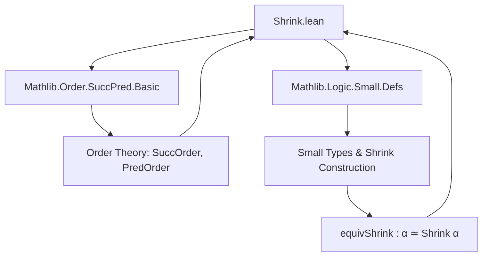

**Technical Brief: `Shrink.lean` — Order Instances on `Shrink`**

---

### 1. **Key Definitions & Theorems**

| Name | Type / Signature | Purpose |
|------|------------------|---------|
| `Bot (Shrink.{u} α)` | `Bot (Shrink.{u} α)` | Transport bottom element via `equivShrink` |
| `Preorder (Shrink.{u} α)` | `Preorder (Shrink.{u} α)` | Lift preorder structure via `equivShrink.symm` |
| `orderIsoShrink α` | `α ≃o Shrink.{u} α` | Canonical order isomorphism between `α` and `Shrink.{u} α` |
| `equivShrink_le_equivShrink` | `equivShrink α x ≤ equivShrink α y ↔ x ≤ y` | Characterizes order preservation under `equivShrink` |
| `equivShrink_lt_equivShrink` | `equivShrink α x < equivShrink α y ↔ x < y` | Characterizes strict order preservation |
| `OrderBot (Shrink.{u} α)` | `[OrderBot α] → OrderBot (Shrink.{u} α)` | Transport order-bottom structure |
| `SuccOrder (Shrink.{u} α)` | `[SuccOrder α] → SuccOrder (Shrink.{u} α)` | Transport successor-order structure via `orderIsoShrink` |
| `WellFoundedLT (Shrink.{u} α)` | `[WellFoundedLT α] → WellFoundedLT (Shrink.{u} α)` | Transport well-foundedness of `<` |
| `WellFoundedGT (Shrink.{u} α)` | `[WellFoundedGT α] → WellFoundedGT (Shrink.{u} α)` | Dual version for `>` |
| `PartialOrder (Shrink.{u} α)` | `[PartialOrder α] → PartialOrder (Shrink.{u} α)` | Transport partial order via injectivity of `equivShrink.symm` |
| `LinearOrder (Shrink.{u} α)` | `[LinearOrder α] → LinearOrder (Shrink.{u} α)` | Transport linear order via `lift'` |

---

### 2. **Naming Conventions**

- **Prefixes**:
  - `equivShrink_`: functions/lemmas involving `equivShrink` (e.g., `equivShrink_bot`, `equivShrink_le_equivShrink`)
  - `orderIsoShrink_`: lemmas about the order isomorphism `orderIsoShrink`
- **Suffixes**:
  - `_bot`: for bottom-related constructions/lemmas
  - `_le_`, `_lt_`: for order comparisons
  - `_symm_`: for inverses (e.g., `equivShrink_symm_bot`)
- **Dual annotations**:
  - `[to_dual]`, `[to_dual (attr := simp)]`, `[to_dual existing]`: indicate dualizable constructions (for `≤` ↔ `≥`, `bot` ↔ `top`, etc.)

---

### 3. **Tactic Stack**

Frequent tactics used in proofs:
- `simp` / `simp only [...]`: simplification with `equivShrink`, `orderIsoShrink`, and `symm` lemmas
- `rfl`: for definitional equalities (e.g., `equivShrink_bot`)
- `obtain ⟨a, rfl⟩ := ...`: surjectivity of `equivShrink.symm` to reduce to canonical representatives
- `injective`, `surjective`: used to justify injectivity/surjectivity arguments
- `rw [← orderIsoShrink.symm.le_iff_le]`: rewrite using order-isomorphism properties
- `isWellFounded.wf`: extract well-foundedness from embeddings

No heavy automation (e.g., `aesop`, `linarith`) is used—proofs are mostly structural and rely on properties of `equivShrink`.

---

### 4. **Proof Logic**

- **General pattern**: Transport structure along the equivalence `equivShrink α : α ≃ Shrink.{u} α`.
- **Order constructions**:
  - `Preorder`, `PartialOrder`, `LinearOrder`: use `Preorder.lift`, `partialOrder`, `lift'` with injectivity of `equivShrink.symm`.
- **Order-isomorphism proofs**:
  - `orderIsoShrink` is defined by lifting the equivalence to an order isomorphism.
  - Lemmas like `equivShrink_le_equivShrink` follow from `orderIsoShrink.map_rel_iff`.
- **Bottom & successor**:
  - `bot` is defined via transport (`equivShrink _ ⊥`).
  - `OrderBot`, `SuccOrder` use `orderIsoShrink` or direct transport.
- **Well-foundedness**:
  - Uses that order isomorphisms induce well-founded embeddings; pulls back `wf` via `isWellFounded.wf`.

Induction is not used—proofs are mostly *definitional* or *equational* via properties of equivalences and order morphisms.

---

### 5. **Imports**

- `Mathlib.Order.SuccPred.Basic`: for `SuccOrder`, successor-related structures
- `Mathlib.Logic.Small.Defs`: for `Small.{u} α`, `Shrink.{u} α`, `equivShrink`

These imports define the foundational objects (`Shrink`, `Small`, `equivShrink`) and the order-theoretic structures being transported.

---

### 6. **Mermaid Diagrams**

#### **Dependency Graph (Module-Level)**



#### **Overview of Theoretical Flow**

```mermaid
flowchart LR
  subgraph Input
    α[Type u] --> Small[Small.{u} α]
  end

  subgraph Core Equivalence
    equiv[equivShrink α : α ≃ Shrink.{u} α]
  end

  subgraph Transported Structures
    Preorder[Preorder]
    PartialOrder[PartialOrder]
    LinearOrder[LinearOrder]
    OrderBot[OrderBot]
    SuccOrder[SuccOrder]
    WellFoundedLT[WellFoundedLT]
    WellFoundedGT[WellFoundedGT]
  end

  Small --> equiv
  equiv --> Preorder
  equiv --> PartialOrder
  equiv --> LinearOrder
  equiv --> OrderBot
  equiv --> SuccOrder
  equiv --> WellFoundedLT
  equiv --> WellFoundedGT

  Preorder --> orderIso[orderIsoShrink : α ≃o Shrink α]
  orderIso --> equiv_le[equivShrink_le_equivShrink]
  orderIso --> equiv_lt[equivShrink_lt_equivShrink]
```

---

### 7. **Summary**

This module formalizes how *order-theoretic structure* on a `u`-small type `α` can be *canonically transferred* to `Shrink.{u} α` via the equivalence `equivShrink α`. It constructs:
- an **order isomorphism** `α ≃o Shrink.{u} α`,
- and transports `Bot`, `Preorder`, `PartialOrder`, `LinearOrder`, `OrderBot`, `SuccOrder`, and well-foundedness of `<` / `>`.

All constructions are *noncomputable* (as `Shrink` is defined via choice), but the isomorphism is *computable on elements* (via `equivShrink`), and lemmas are stated with `@[simp]` where appropriate.

The file exemplifies Lean’s *structure transport* pattern using equivalences and order isomorphisms, with minimal reliance on automation—emphasizing correctness and modularity.
