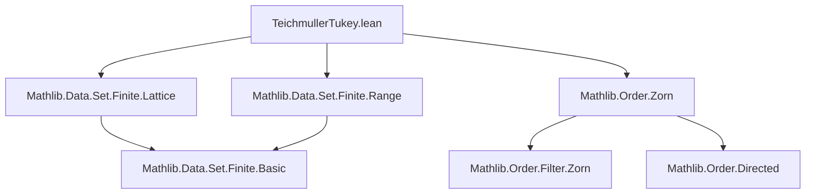
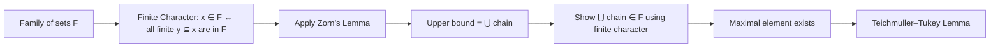

### Technical Brief: `TeichmullerTukey.lean`

---

#### **1. Key Definitions & Theorems**

| Name | Type / Signature | Purpose |
|------|------------------|---------|
| `IsOfFiniteCharacter` | `F : Set (Set α) → Prop` | Defines that a family of sets $F$ has *finite character*: $X \in F \iff \forall Y \subseteq X,\ Y.\text{Finite} \to Y \in F$. |
| `IsOfFiniteCharacter.exists_maximal` | `∀ {F}, IsOfFiniteCharacter F → x ∈ F → ∃ m, x ⊆ m ∧ Maximal (· ∈ F) m` | **Teichmuller–Tukey Lemma**: Every nonempty family of finite character (with at least one element) has a maximal element under inclusion. |

---

#### **2. Naming Conventions**

- **Prefixes**:
  - `is_`: Predicate definitions (e.g., `IsOfFiniteCharacter`).
- **Suffixes**:
  - `character`: Used in `IsOfFiniteCharacter`, reflecting the mathematical concept.
- **No explicit module-level prefixes** (e.g., no `tt_`, `tu_`, etc.); naming follows standard Mathlib conventions.

---

#### **3. Tactic Stack**

| Tactic | Usage |
|--------|-------|
| `refine` | Core proof construction, especially for applying Zorn’s lemma and constructing witnesses. |
| `exact` | Final step to discharge goals using previously established facts. |
| `obtain ⟨t, tc, st⟩ := ...` | Existential destructuring (via `obtain`) to extract a witness from `directedOn.exists_mem_subset_of_finite_of_subset_sUnion`. |
| `sUnion` | Implicitly used via `sUnion c` — union of a collection of sets. |
| `subset_sUnion_of_mem` | Used to show inclusion into a union. |
| `mpr` / `mp` | Applied to `hF t` to move between forward/backward directions of the biconditional. |

No heavy automation (e.g., `aesop`, `ring`, `simp_rw`) is used — the proof is largely *constructive* and *manual*, leveraging order-theoretic lemmas.

---

#### **4. Proof Logic**

The proof proceeds as follows:

1. **Apply Zorn’s Lemma** (`zorn_subset_nonempty`) to the family $F$ ordered by inclusion.
2. **Construct an upper bound** for any nonempty chain $c \subseteq F$: the union $\bigcup c$.
3. **Verify the upper bound lies in $F$**:
   - Use the finite character property: show any finite subset $s \subseteq \bigcup c$ belongs to $F$.
   - Use `directedOn`-property of chains: any finite subset of the union is contained in some element $t \in c$.
   - Since $t \in F$, and $F$ has finite character, $s \in F$.
4. **Conclude existence of a maximal element** extending the given $x \in F$.

This is a *standard application* of Zorn’s Lemma in order theory, specialized to families of finite character.

---

#### **5. Imports**

| Import | Purpose |
|--------|---------|
| `Mathlib.Data.Set.Finite.Range` | Provides finiteness lemmas about ranges (used implicitly via `Finite`). |
| `Mathlib.Data.Set.Finite.Lattice` | Lattice-theoretic properties of finite sets (e.g., finite subsets form a directed set). |
| `Mathlib.Order.Zorn` | Zorn’s Lemma and related lemmas (`zorn_subset_nonempty`, `Maximal`, `directedOn`). |

These imports reflect the module’s focus on *set-theoretic combinatorics* and *order theory*.

---

#### **6. Mermaid Diagrams**

##### **Dependency Graph (Module-Level)**

##### **Overview of Theoretical Flow**

---

#### **7. Notes on Formalization Quality**

- **Clarity**: Definitions and theorems are well-commented with LaTeX-style math.
- **Modularity**: Uses standard Mathlib infrastructure (`zorn_subset_nonempty`, `directedOn`), avoiding ad-hoc redefinitions.
- **Correctness**: The proof is faithful to the classical set-theoretic argument; no constructive assumptions are made (as expected for Teichmuller–Tukey, which is equivalent to AC).

--- 

Let me know if you'd like a formalized dependency graph of the *proof terms* or a comparison with other AC-equivalent lemmas (e.g., Zorn’s Lemma, Hausdorff Maximal Principle).
