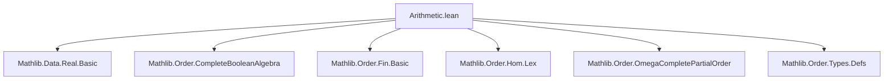
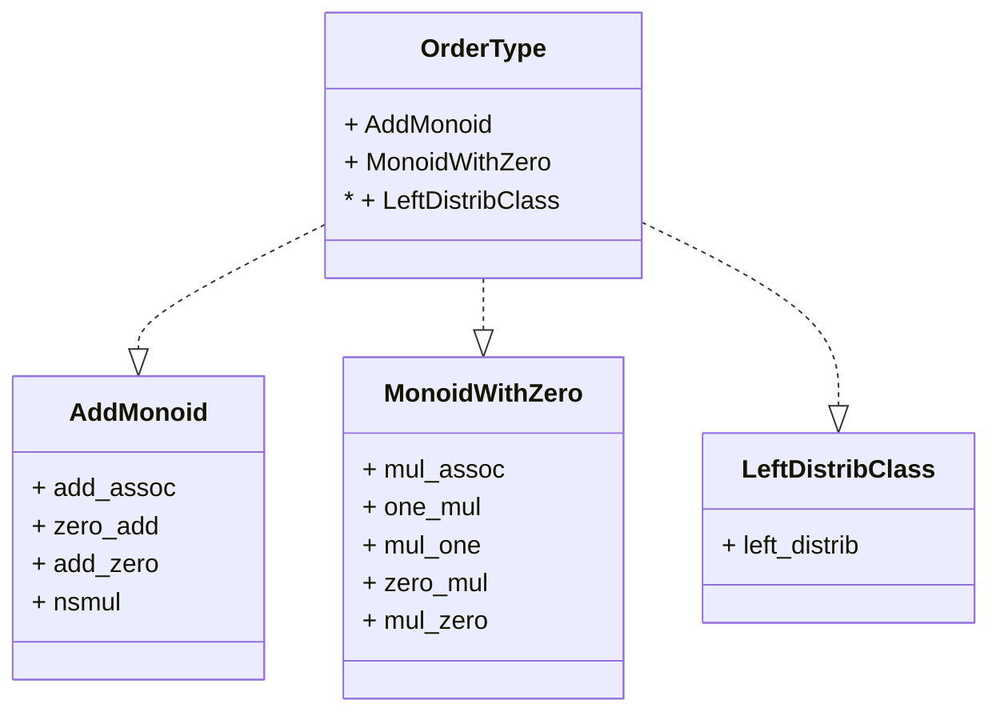

**Technical Brief: `Arithmetic.lean` — Order Type Arithmetic in Lean 4**

---

### 1. **Key Definitions & Theorems**

| Name | Type / Signature | Purpose |
|------|------------------|---------|
| `OrderType.card o` | `OrderType → Cardinal` | Cardinality of an order type (noncomputable, defined elsewhere in the module or imported). |
| `o₁ + o₂` | `OrderType → OrderType → OrderType` | Lexicographic sum of order types; forms the addition in an `AddMonoid`. |
| `o₁ * o₂` | `OrderType → OrderType → OrderType` | Lexicographic *product* (note: `s ×ₗ r`, i.e., reversed order in product), forms multiplication in a `MonoidWithZero`. |
| `type_lex_sum` | `type (α ⊕ₗ β) = type α + type β` | Connects syntactic sum `⊕ₗ` on types to `+` on order types. |
| `type_lex_prod` | `type (α ×ₗ β) = type β * type α` | Connects syntactic lexicographic product `×ₗ` to `*` on order types (note: `β * α`, not `α * β`). |
| `eta` | `OrderType` | Order type of `ℚ` (denoted `η`). |
| `theta` | `OrderType` | Order type of `ℝ` (denoted `θ`). |

**Key Theorems (proofs via induction & order isomorphisms):**
- `add_assoc`, `zero_add`, `add_zero`: `AddMonoid` laws.
- `mul_assoc`, `one_mul`, `mul_one`: `Monoid` laws (with `1 = type PUnit`, `0 = type PEmpty`).
- `left_distrib`: `a * (b + c) = a * b + a * c` (lexicographic product distributes over lexicographic sum on the left).
- `type_lex_sum`, `type_lex_prod`: coherence lemmas linking type constructors to operations.

---

### 2. **Naming Conventions**

- **Prefixes:**
  - `type_`: relates constructions on types (e.g., `type_lex_sum`, `type_lex_prod`).
  - `is_`, `of_`, `to_`: not used here (this module focuses on *operations*, not predicates or coercions).
- **Suffixes:**
  - `_sum`, `_prod`: denote lexicographic sum/product constructions.
  - `_lex`: indicates lexicographic order (e.g., `⊕ₗ`, `×ₗ`, `sumLex`, `prodLex`).
- **Notation:**
  - `η`, `θ`: scoped notations for `OrderType.eta`, `OrderType.theta`.
  - `+`, `*`: overloaded via `Add`, `Mul`, `HAdd`, `HMul` instances.

---

### 3. **Tactic Stack**

| Tactic | Usage Frequency | Role |
|--------|-----------------|------|
| `inductionOn` / `inductionOn₃` | High | Structural induction on order types (via `OrderType.liftOn₂`/`inductionOn`). |
| `simp` / `simp only` | Very High | Simplify using `@[simp]` lemmas (`type_lex_sum`, `type_lex_prod`, `zero`, `one`, `sumLexEmpty`, etc.). |
| `exact` | Medium | Apply known order isomorphisms (e.g., `OrderIso.sumLexAssoc`, `Prod.Lex.prodLexAssoc`). |
| `type_congr` | Medium | Prove equality of order types via isomorphism. |
| `Classical.choice` | Medium | Extract witnesses from existence proofs (e.g., `type_eq_type.mp ha`). |
| `rfl` | Low | For definitional equalities (e.g., `0 = type PEmpty`). |

---

### 4. **Proof Logic**

- **Inductive structure**: Proofs over `OrderType` use `inductionOn` (or `inductionOn₃` for binary/ternary operations), reducing to the case where the order type is `type α` for some linearly ordered type `α`.
- **Core strategy**:
  1. Reduce to `type α`, `type β`, `type γ` via induction.
  2. Rewrite using `← type_lex_sum` / `← type_lex_prod` to express operations in terms of `⊕ₗ`, `×ₗ`.
  3. Apply known order isomorphisms (e.g., `OrderIso.sumLexAssoc`, `Prod.Lex.prodLexProdDistrib`).
  4. Conclude via `type_congr`: if two types are order-isomorphic, their order types are equal.
- **Key insight**: Order type arithmetic is *defined* via lifting operations on well-ordered types, and all algebraic laws are proven by showing the underlying type constructions are isomorphic.

---

### 5. **Imports**

| Import | Role |
|--------|------|
| `Mathlib.Data.Real.Basic` | Provides `ℝ`, `ℚ`, and their linear orders (used for `η`, `θ`). |
| `Mathlib.Order.CompleteBooleanAlgebra` | Possibly for `Cardinal`-related reasoning (via `card`). |
| `Mathlib.Order.Fin.Basic` | Provides `Fin n`, used in `OfNat` instance. |
| `Mathlib.Order.Hom.Lex` | Lexicographic constructions (`⊕ₗ`, `×ₗ`, `sumLex`, `prodLex`). |
| `Mathlib.Order.OmegaCompletePartialOrder` | May support transfinite induction (not directly used here, but part of `OrderType` theory). |
| `Mathlib.Order.Types.Defs` | Core definitions: `OrderType`, `type`, `liftOn₂`, `type_congr`, `type_eq_type`. |

---

### 6. **Mermaid Diagrams**

#### **Dependency Graph (Module-Level)**



#### **Conceptual Overview of `OrderType` Arithmetic**

```mermaid
flowchart LR
  subgraph Types
    α[Linearly ordered type α]
    β[Linearly ordered type β]
  end

  subgraph OrderTypes
    a[type α]
    b[type β]
  end

  subgraph Operations
    sum[+ : OrderType → OrderType → OrderType]
    prod[* : OrderType → OrderType → OrderType]
  end

  α -- ⊕ₗ --> α⊕ₗβ -- type --> type (α⊕ₗβ) = a + b
  β -- ⊕ₗ --> α⊕ₗβ

  α -- ×ₗ --> α×ₗβ -- type --> type (α×ₗβ) = b * a
  β -- ×ₗ --> α×ₗβ

  a -- sum --> a + b
  b -- sum --> a + b
  a -- prod --> a * b
  b -- prod --> a * b

  style a fill:#f9f,stroke:#333
  style b fill:#f9f,stroke:#333
  style sum fill:#bbf,stroke:#333
  style prod fill:#bbf,stroke:#333
```

#### **Algebraic Structure Hierarchy**



---

### 7. **Notes & Observations**

- **Product order reversal**: `type (α ×ₗ β) = type β * type α` — the product is defined with reversed argument order to ensure `1 * o = o`. This is a common convention in order theory (right action → left multiplication).
- **Zero & One**: `0 = type PEmpty`, `1 = type PUnit`, aligning with cardinal arithmetic intuition.
- **Noncomputability**: The module is `noncomputable`, as `OrderType` involves quotients over classes (not constructive).
- **Scoping**: Notations `η`, `θ` are scoped to `OrderType`, avoiding global namespace pollution.

--- 

Let me know if you'd like formalization of Cantor normal form or dense order types (`η`, `θ` properties) next.
