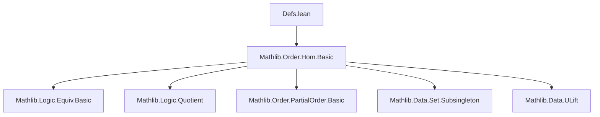

### Technical Brief: `Defs.lean` — Order Types in Lean 4

---

#### **1. Key Definitions & Theorems**

| Name | Type / Signature | Purpose |
|------|------------------|---------|
| `OrderType.instSetoid` | `Setoid LinOrd` | Defines equivalence relation on linear orders via order isomorphism (`≃o`). |
| `OrderType` | `Type (u + 1)` | Quotient of `LinOrd` (linear orders in `Type u`) by `≃o`. Represents *order types*. |
| `ToType (o : OrderType)` | `Type u` | Choice-dependent representative type of order type `o`. |
| `type (α : Type u) [LinearOrder α]` | `OrderType` | Maps a linearly ordered type to its equivalence class (order type). |
| `0` | `OrderType` | Order type of empty type (`PEmpty`). |
| `1` | `OrderType` | Order type of unit type (`PUnit`). |
| `ω` (`omega0`) | `OrderType` | Order type of `ℕ` (via `ULift ℕ`). |
| `type_eq_type` | `type α = type β ↔ Nonempty (α ≃o β)` | Characterizes equality of order types. |
| `type_le_type_iff` | `type α ≤ type β ↔ Nonempty (α ↪o β)` | Defines the preorder on `OrderType` via order embeddings. |
| `zero_le` | `0 ≤ o` | `0` is the least element in the preorder. |
| `bot_eq_zero` | `⊥ = 0` | Identifies bottom element with `0`. |
| `inductionOn`, `inductionOn₂`, `inductionOn₃` | Eliminators for `Quotient` | Enable reasoning by lifting over representatives. |
| `liftOn`, `liftOn₂` | Definitional eliminators | Define functions/relations on `OrderType` by checking well-definedness on representatives. |

---

#### **2. Naming Conventions**

- **Prefixes**:
  - `type_`: Relates to mapping from types with linear orders to `OrderType`.
  - `toType`: Relates to extracting a representative type from an `OrderType`.
  - `zero_`, `bot_`: Pertaining to the bottom element (`0`).
  - `nonempty_`, `isEmpty_`: Logical properties of underlying types.
- **Suffixes**:
  - `_iff`: Equivalence between propositions.
  - `_congr`: Congruence under isomorphism/equality.
  - `_ne_zero`, `_ne_zero_iff`: Negated equality with `0`.
- **Notation**:
  - `ω` for `OrderType.omega0`.
  - `0`, `1`, `⊥` for canonical order types.

---

#### **3. Tactic Stack**

Frequently used tactics in proofs:
- `rfl`, `simp`, `simp_rw`: Simplification and definitional equality.
- `inductionOn`, `inductionOn₂`, `inductionOn₃`: Custom eliminators for `Quotient`.
- `apply`, `exact`, `intro`, `cases`: Basic proof scripting.
- `propext`: To prove propositional equality from bi-implication.
- `nonempty_intro`, `nonempty.elim`, `not_nonempty_iff`: Reasoning about existence.
- `Quot.sound`, `Quotient.sound`: Use quotient structure.
- `type_congr`, `type_eq_type`: Leverage order-isomorphism characterizations.

---

#### **4. Proof Logic**

- **Inductive structure**: Proofs over `OrderType` rely heavily on `inductionOn`-style principles to reduce to statements about concrete linearly ordered types.
- **Quotient reasoning**: Equality and membership in `OrderType` are handled via `Quotient.eq'` and `Quotient.sound`.
- **Embedding-based ordering**: The preorder `≤` is defined via existence of order embeddings; transitivity and reflexivity follow from embedding composition and identity.
- **Zero handling**: Properties of `0` (empty type) are often proven via `OrderEmbedding.ofIsEmpty`.
- **Choice usage**: `ToType` uses the axiom of choice (via `out`), but is not exposed by default.

---

#### **5. Imports**

- `Mathlib.Order.Hom.Basic`: Provides foundational definitions for order homomorphisms, embeddings, and isomorphisms (`OrderEmbedding`, `OrderIso`, `LE`, etc.).
- Implicit reliance on:
  - `Mathlib.Logic.Equiv.Basic`
  - `Mathlib.Logic.Quotient`
  - `Mathlib.Order.PartialOrder.Basic`
  - `Mathlib.Data.Set.Subsingleton`
  - `Mathlib.Data ULift`

---

#### **6. Mermaid Diagrams**

##### **Dependency Graph (Module-Level)**



##### **Overview of Theory Structure**

```mermaid
graph TD
  LinOrd[Linear Orders in Type u] -->|Quotient by ≃o| OrderType[OrderType.{u}]
  OrderType -->|represents| ToType[Representative Type]
  OrderType -->|preordered by| Embeddings[Order Embeddings ↪o]
  OrderType -->|has| Zero[0 = type PEmpty]
  OrderType -->|has| One[1 = type PUnit]
  OrderType -->|has| Omega[ω = type ULift ℕ]
  Zero -->|is bottom| Bot[⊥]
  Embeddings -->|type α ≤ type β ↔ ∃ α ↪o β|
```

##### **Proof Strategy Flow (Example: `type_le_type_iff`)**

```mermaid
graph LR
  A[type α ≤ type β] -->|def of ≤| B[Quotient.liftOn₂]
  B -->|unfold| C[Nonempty (α ↪o β)]
  C -->|constructor| D[type_le_type]
  D -->|⟨h⟩| A
```

---

#### **7. Summary**

This module formalizes **order types** as the quotient of linear orders under order isomorphism. It establishes:
- A **preorder** structure via order embeddings,
- Canonical representatives (`0`, `1`, `ω`),
- Induction and elimination principles for reasoning about `OrderType`,
- Key equivalences between properties of types and their order types (e.g., `type α = 0 ↔ IsEmpty α`).

It serves as the foundational groundwork for ordinal arithmetic and transfinite induction in Lean, aligning with classical set-theoretic definitions (e.g., Cantor’s theory of order types).
