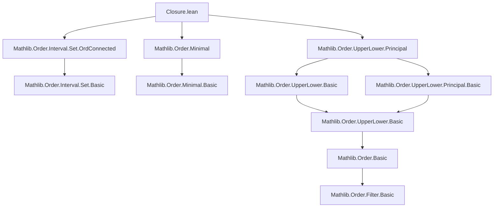
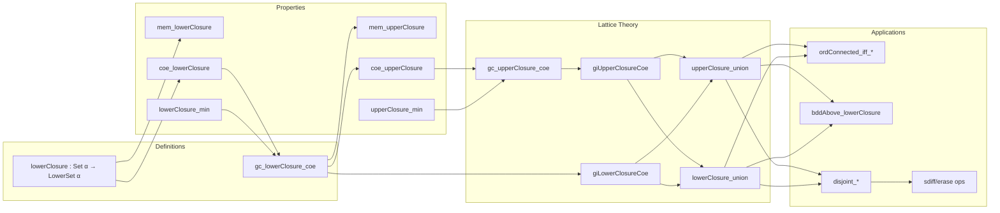

### Technical Brief: `Closure.lean` — Upper and Lower Closures in Lean 4

---

#### **1. Key Definitions & Theorems**

| Name | Type / Signature | Purpose |
|------|------------------|---------|
| `upperClosure s` | `Set α → UpperSet α` | Constructs the **greatest upper set** containing `s`. |
| `lowerClosure s` | `Set α → LowerSet α` | Constructs the **least lower set** containing `s`. |
| `mem_upperClosure` | `x ∈ upperClosure s ↔ ∃ a ∈ s, a ≤ x` | Membership characterization. |
| `mem_lowerClosure` | `x ∈ lowerClosure s ↔ ∃ a ∈ s, x ≤ a` | Membership characterization. |
| `coe_upperClosure` | `↑(upperClosure s) = ⋃ a ∈ s, Ici a` | Shows upper closure as union of principal upper sets. |
| `coe_lowerClosure` | `↑(lowerClosure s) = ⋃ a ∈ s, Iic a` | Shows lower closure as union of principal lower sets. |
| `upperClosure_min`, `lowerClosure_min` | Monotonicity + minimality | Universal property: smallest upper/lower superset. |
| `IsUpperSet.upperClosure`, `IsLowerSet.lowerClosure` | `↑(upperClosure s) = s` if `s` is already upper/lower. |
| `UpperSet.upperClosure`, `LowerSet.lowerClosure` | `upperClosure (s : Set α) = s` for `s : UpperSet/LowerSet`. |
| `gc_upperClosure_coe`, `gc_lowerClosure_coe` | `GaloisConnection` | `upperClosure` ⊣ `↑` (reversed), `lowerClosure` ⊣ `↑`. |
| `giUpperClosureCoe`, `giLowerClosureCoe` | `GaloisInsertion` | Refinements of the Galois connections. |
| `upperClosure_anti`, `lowerClosure_mono` | `Antitone`, `Monotone` | Monotonicity of closure operators. |
| `upperClosure_empty`, `lowerClosure_empty` | `= ⊤`, `= ⊥` | Empty set closures. |
| `upperClosure_singleton`, `lowerClosure_singleton` | `= Ici a`, `= Iic a` | Singleton closures. |
| `upperClosure_union`, `lowerClosure_union` | Distribute over finite unions (with dual ops). |
| `upperClosure_iUnion`, `lowerClosure_iUnion` | Distribute over arbitrary unions. |
| `ordConnected_iff_upperClosure_inter_lowerClosure` | `s.OrdConnected ↔ ↑(upperClosure s) ∩ ↑(lowerClosure s) = s` | Characterization of order-convex sets. |
| `upperBounds_lowerClosure`, `lowerBounds_upperClosure` | Bounds preserved under closure. |
| `bddAbove_lowerClosure`, `bddBelow_upperClosure` | Boundedness preserved. |
| `IsLowerSet.disjoint_upperClosure_left/right`, etc. | Disjointness criteria with closures. |
| `upperClosure_eq`, `lowerClosure_eq` | `↑(upperClosure s) = s ↔ IsUpperSet s`. |
| `IsAntichain.minimal_mem_upperClosure_iff_mem` | Minimal elements of `upperClosure s` lie in `s` if `s` is antichain. |
| `upperClosure_eq_bot_iff`, `lowerClosure_eq_top_iff` | Characterization of trivial closures in linear orders. |
| `LowerSet.sdiff`, `UpperSet.sdiff` | `s \ upperClosure t` / `s \ lowerClosure t`: maximal disjoint subsets. |
| `LowerSet.erase`, `UpperSet.erase` | `s \ Ici a` / `s \ Iic a`: remove an element. |
| `sdiff_sup_lowerClosure`, `erase_sup_Iic`, etc. | Decomposition lemmas for lattices. |

---

#### **2. Naming Conventions**

- **Prefixes**:
  - `upperClosure_`, `lowerClosure_`: for set-based closure operators.
  - `sdiff_`, `erase_`: for set-difference-like operations on (upper/lower) sets.
- **Suffixes**:
  - `_left`, `_right`: for symmetry in binary relations (e.g., disjointness).
  - `_iff`: for biconditional characterizations.
  - `_eq`: for equality lemmas (often `simp`-friendly).
- **Adjectives**:
  - `anti`, `mono`: for monotonicity/antitonicity.
  - `min`, `max`: for minimal/maximal element lemmas.
  - `disjoint`, `bddAbove`, `bddBelow`: for order-theoretic properties.

---

#### **3. Tactic Stack**

Frequently used tactics in proofs:
- `simp` / `simp_rw`: for simplification using `@[simp]` lemmas (e.g., `mem_upperClosure`, `coe_*`).
- `ext`: extensionality for sets/functions.
- `rw`: rewriting using equivalences (e.g., `upperClosure_min`, `gc_*`).
- `exact`, `assumption`, `intro`, `cases`: basic natural deduction.
- `antisymm`: for proving equality of sets/sets via inclusion.
- `apply`, `refine`: for constructing proofs with holes.
- `simpa`: `simp` + `using` (e.g., `simpa [h₁] using ...`).
- `convert`: for congruence-based equality proofs.
- `aesop`: for automated reasoning in order-theoretic contexts (e.g., `disjoint`, `bdd*`).
- `ofDual`, `toDual`, `toDual_symm_apply`: for dual-order reasoning.

---

#### **4. Proof Logic**

- **Structure**:
  - Most proofs follow a **two-step inclusion** (`antisymm`) or **`ext` + `simp`** pattern.
  - Galois connections (`gc_*`) are used to derive universal properties and lattice operations.
  - `GaloisInsertion` structure enables `choice`-based constructions and uniqueness arguments.
- **Induction**: Not heavily used; instead, **element-chasing** and **order-theoretic reasoning** dominate.
- **Case analysis**: `em (a ∈ t)` for decidability in `sdiff`/`erase` lemmas.
- **Duality**: `toDual`/`ofDual` used to transfer results between upper/lower cases (e.g., `lowerClosure_eq_top` from `upperClosure_eq_bot`).
- **Abstraction**: Proofs avoid unfolding definitions directly; rely on `SetLike.coe_injective`, `UpperSet.upper`, `LowerSet.lower`.

---

#### **5. Imports & Dependencies**

- **Core imports**:
  ```lean
  Mathlib.Order.Interval.Set.OrdConnected
  Mathlib.Order.Minimal
  Mathlib.Order.UpperLower.Principal
  ```
- **Key dependencies**:
  - `Preorder`, `PartialOrder`, `LinearOrder` typeclasses.
  - `UpperSet`, `LowerSet`, `OrderDual`.
  - `Set.Ici`, `Set.Iic`, `upperBounds`, `lowerBounds`, `BddAbove`, `BddBelow`.
  - `GaloisConnection`, `GaloisInsertion`.
  - `Set.OrdConnected`, `IsAntichain`.

---

#### **6. Mermaid Diagrams**

##### **Dependency Graph (Module-Level)**



##### **Overview of Theory Flow**



---

#### **7. Summary**

This module formalizes **upper and lower closures** as adjoint constructions in order theory, with deep connections to:
- **Galois connections** and **Galois insertions**,
- **Lattice operations** (unions, intersections, sup/inf),
- **Order-convexity** (`OrdConnected`),
- **Boundedness** and **antichains**.

It serves as a foundational building block for more advanced order-theoretic developments (e.g., intervals, convex hulls, topology on posets), and demonstrates Lean 4’s strength in expressing categorical order theory.

--- 

Let me know if you'd like a **dependency graph of theorems** or a **proof automation strategy** for this module.
