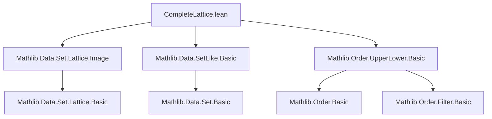
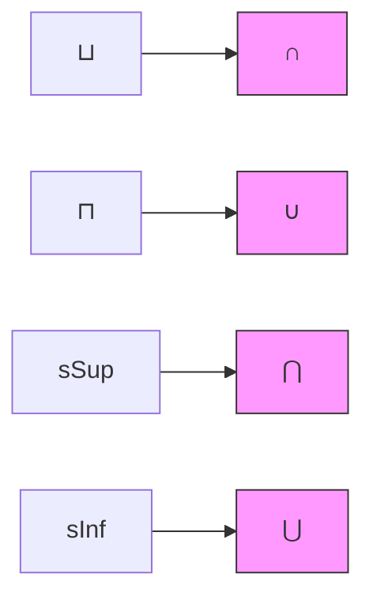

### Technical Brief: `CompleteLattice.lean`

---

#### **1. Key Definitions & Theorems**

| Name | Type / Signature | Purpose |
|------|------------------|---------|
| `UpperSet α` | Type _ → Type _ | Type of upper sets of a preordered type `α`, i.e., subsets closed under going up. |
| `LowerSet α` | Type _ → Type _ | Type of lower sets of a preordered type `α`, i.e., subsets closed under going down. |
| `UpperSet.compl` | `UpperSet α → LowerSet α` | Complement of an upper set, viewed as a lower set. |
| `LowerSet.compl` | `LowerSet α → UpperSet α` | Complement of a lower set, viewed as an upper set. |
| `upperSetIsoLowerSet` | `UpperSet α ≃o LowerSet α` | Order-isomorphism via complementation. |
| `UpperSet.completeLattice` | `CompleteLattice (UpperSet α)` | Complete lattice structure on upper sets (ordered by reverse inclusion). |
| `UpperSet.completelyDistribLattice` | `CompletelyDistribLattice (UpperSet α)` | Complete distributivity of the lattice. |
| `UpperSet.map` | `α ≃o β → UpperSet α ≃o UpperSet β` | Induced order isomorphism on upper sets along an order isomorphism. |
| `LowerSet.map` | `α ≃o β → LowerSet α ≃o LowerSet β` | Same for lower sets. |
| `coe_sup`, `coe_inf`, `coe_sSup`, `coe_sInf`, etc. | `↑(s ⊔ t) = s ∩ t`, `↑(s ⊓ t) = s ∪ t`, etc. | Realization of lattice operations as set-theoretic operations (with reversal for sup/inf). |
| `mem_iSup_iff`, `mem_iInf_iff`, etc. | Characterizations of membership in suprema/infima. | E.g., `a ∈ ⨆ i, f i ↔ ∀ i, a ∈ f i` for upper sets. |
| `compl_le_compl` | `s.compl ≤ t.compl ↔ s ≤ t` | Complementation is an *order-embedding* (in fact, an order-anti-automorphism). |
| `compl_sup`, `compl_inf`, `compl_sSup`, etc. | De Morgan laws for complementation. | E.g., `(s ⊔ t).compl = s.compl ⊓ t.compl`. |

---

#### **2. Naming Conventions**

- **Prefixes**:
  - `coe_`: Relates coercion `↑s : Set α` to operations on `s : UpperSet α` / `LowerSet α`.
  - `mem_`: Membership characterizations (e.g., `mem_sup_iff`, `mem_iSup_iff`).
  - `compl_`: Properties of complementation (`compl_le_compl`, `compl_sup`, `compl_iSup`, etc.).
  - `map_`: Properties of the map induced by an order isomorphism (`map_map`, `mem_map`, `coe_map`).
- **Suffixes**:
  - `_iff`: Biconditional lemmas (e.g., `mem_sup_iff`, `compl_le_compl`).
  - `_₂`: Binary indexed versions (e.g., `coe_iSup₂`, `mem_iSup₂_iff`).
  - `s_`: For set-indexed operations (`sSup`, `sInf`, `sSup S`, `sInf S`).
  - `i_`: For function-indexed operations (`iSup f`, `iInf f`).
- **`ext`**: Extensionality lemmas (`UpperSet.ext`, `LowerSet.ext`).
- **`nonrec`**: Used to prevent recursion in simplifier (`compl_compl`).

---

#### **3. Tactic Stack**

- **Core tactics**:
  - `simp`, `simp_rw`, `rw`, `ext`, `congr`, `cases`, `refl`, `exact`, `intro`, `apply`.
- **Order-specific**:
  - `exact Lattice.toLinearOrder _` (for `LinearOrder` instances).
  - `completeLattice _ ...` pattern for pulling back structure via injective maps.
- **Set-theoretic**:
  - `simp only [SetLike.mem_coe, mem_iInter, mem_iUnion, compl_iInter, compl_iUnion, ...]`.
  - `Set.image_compl_eq`, `Set.preimage_image`, `Set.image_subset_image_iff`.
- **Meta-level**:
  - `classical`, `noncomputable instance`, `by aesop` (not used here — leaner proofs).
  - `initialize_simps_projections` for projection optimization.

---

#### **4. Proof Logic**

- **Structure**:
  - **Step 1**: Define `SetLike` instances to identify `UpperSet α` / `LowerSet α` with their carrier sets.
  - **Step 2**: Define lattice operations (`Max`, `Min`, `Top`, `Bot`, `SupSet`, `InfSet`) via set-theoretic constructions, verifying closure under upper/lower conditions.
  - **Step 3**: Use `SetLike.coe_injective` (or its composition with `toDual.injective`) to *pull back* the complete lattice structure from `Set α` (with appropriate order reversal).
  - **Step 4**: Prove all coherence lemmas (`coe_sup`, `mem_iSup_iff`, etc.) by unfolding definitions and applying set-theoretic facts.
  - **Step 5**: Define complementation and prove it is an order-anti-isomorphism (`upperSetIsoLowerSet`).
  - **Step 6**: For `LinearOrder α`, derive `LinearOrder` on `UpperSet α` / `LowerSet α` using total-ness of upper/lower sets.
  - **Step 7**: Define `map` along order isomorphisms, verify it preserves structure, and relate it to complementation.

- **Common proof patterns**:
  - `ext` + `simp` to prove equality of upper/lower sets.
  - `SetLike.ext'` for extensionality.
  - `UpperSet.ext` / `LowerSet.ext` after simplifying carrier sets.
  - `compl_subset_compl` for order properties of complement.

---

#### **5. Imports**

- `Mathlib.Data.Set.Lattice.Image`: For image/preimage lemmas on set lattices.
- `Mathlib.Data.SetLike.Basic`: For `SetLike` infrastructure.
- `Mathlib.Order.UpperLower.Basic`: For definitions of `UpperSet`, `LowerSet`, and basic properties.

---

#### **6. Mermaid Diagrams**

##### **Dependency Graph (Module-Level)**



##### **Conceptual Overview of Theory**

```mermaid
graph LR
  subgraph Types
    α[Type α]
    UpperSet_α[UpperSet α]
    LowerSet_α[LowerSet α]
  end

  subgraph Set-Theoretic
    Set_α[Set α]
    UpperSet_carrier[carrier : UpperSet α → Set α]
    LowerSet_carrier[carrier : LowerSet α → Set α]
  end

  subgraph Order
    UpperSet_le[≤ on UpperSet α := ⊇]
    LowerSet_le[≤ on LowerSet α := ⊆]
  end

  subgraph Lattice
    UpperSet_completeLattice[CompleteLattice]
    LowerSet_completeLattice[CompleteLattice]
    UpperSet_compl[compl : UpperSet α → LowerSet α]
    LowerSet_compl[compl : LowerSet α → UpperSet α]
  end

  UpperSet_α -- carrier --> Set_α
  LowerSet_α -- carrier --> Set_α
  UpperSet_α -- reverse inclusion --> UpperSet_le
  LowerSet_α -- inclusion --> LowerSet_le
  UpperSet_α -- compl --> LowerSet_α
  LowerSet_α -- compl --> UpperSet_α
  UpperSet_compl -- iso --> UpperSet_α ≃o LowerSet_α
  UpperSet_completeLattice -- pullback --> UpperSet_α
  LowerSet_completeLattice -- pullback --> LowerSet_α
```

##### **Lattice Operations as Set Operations**



> **Note**: For `UpperSet`, `⊔ = ∩`, `⊓ = ∪`, `sSup = ⋂`, `sInf = ⋃`.  
> For `LowerSet`, `⊔ = ∪`, `⊓ = ∩`, `sSup = ⋃`, `sInf = ⋂`.

---

#### **7. Summary**

This file equips `UpperSet α` and `LowerSet α` with a *complete distributive lattice* structure, where:
- **Upper sets** are ordered by **reverse inclusion**, making `⊔ = ∩`, `⊓ = ∪`.
- **Lower sets** use standard inclusion, so `⊔ = ∪`, `⊓ = ∩`.
- Complementation yields an order-isomorphism `UpperSet α ≃o LowerSet α`.
- The structure is *pulled back* along the injective coercion `carrier : UpperSet α → Set α`.
- When `α` is linearly ordered, `UpperSet α` and `LowerSet α` inherit a *complete linear order*.
- The `map` construction transports structure along order isomorphisms, commuting with complement.

This is foundational for later developments involving filters, ideals, topology (e.g., opens/closed sets as upper/lower sets), and domain theory.

--- 

Let me know if you'd like a formalized dependency graph (e.g., for `leanproject`), or a summary of related files (e.g., `Filter.lean`, `Ideal.lean`, `Topology.Order.lean`).
