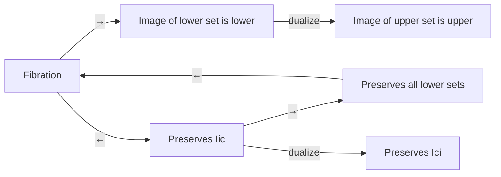

**Technical Brief: Fibration.lean (Mathlib)**  
*Domain: Order Theory / Category-Theoretic Fibrations in Lean 4*

---

### 1. **Key Definitions & Theorems**

| Name | Type / Signature | Purpose |
|------|------------------|---------|
| `Fibration (r : α → α → Prop) (s : β → β → Prop) (f : α → β)` | `∀ x y, r x y → s (f x) (f y)` | A relation-preserving map (generalized fibration); in this file, specialized to order-theoretic cases: `· ≤ ·` and `· ≥ ·`. |
| `IsLowerSet (s : Set α)` | `∀ ⦃x y⦄, x ∈ s → y ≤ x → y ∈ s` | A set closed downward under the order. |
| `IsUpperSet (s : Set α)` | `∀ ⦃x y⦄, x ∈ s → x ≤ y → y ∈ s` | A set closed upward under the order. |
| `Iic x` | `Set α` | Down-set (principal lower set): `{ y | y ≤ x }`. |
| `Ici x` | `Set α` | Up-set (principal upper set): `{ y | x ≤ y }`. |
| `Fibration.isLowerSet_image` | `Fibration (· ≤ ·) (· ≤ ·) f → IsLowerSet s → IsLowerSet (f '' s)` | Image of a lower set under a fibration is a lower set. |
| `fibration_iff_isLowerSet_image_Iic` | `Fibration (· ≤ ·) (· ≤ ·) f ↔ ∀ x, IsLowerSet (f '' Iic x)` | Characterization of fibrations via preservation of principal lower sets. |
| `fibration_iff_isLowerSet_image` | `Fibration (· ≤ ·) (· ≤ ·) f ↔ ∀ s, IsLowerSet s → IsLowerSet (f '' s)` | Full characterization: fibration iff it preserves *all* lower sets. |
| `fibration_iff_image_Iic` | `Monotone f → (Fibration (· ≤ ·) (· ≤ ·) f ↔ ∀ x, f '' Iic x = Iic (f x))` | For monotone maps, fibration ⇔ image of principal down-sets equals principal down-set of image. |
| `Fibration.isUpperSet_image` | Dual of `isLowerSet_image`, for `· ≥ ·`. | Image of an upper set under a *co-fibration* is upper. |
| `fibration_iff_isUpperSet_image_Ici`, `fibration_iff_isUpperSet_image`, `fibration_iff_image_Ici` | Duals of the lower-set analogues. | Upper-set analogues of the above equivalences. |

> **Note**: `Fibration r s f` is defined as `∀ ⦃x y⦄, r x y → s (f x) (f y)`. In this context, it generalizes monotonicity (`r = s = (≤)`) and *op-monotonicity* (`r = s = (≥)`).

---

### 2. **Naming Conventions**

- **Prefixes**:
  - `isLowerSet_`, `isUpperSet_`: predicates on sets.
  - `fibration_iff_`: equivalence lemmas characterizing fibrations.
  - `image_`: lemmas about images of sets under `f`.
- **Suffixes**:
  - `_Iic`: refers to principal *initial* segments (`Iic x = ↓x`).
  - `_Ici`: refers to principal *final* segments (`Ici x = ↑x`).
- **Alias convention**: `alias _root_.IsLowerSet.image_fibration := ...` — promotes lemma to global namespace under `IsLowerSet.image_fibration`.

---

### 3. **Tactic Stack**

Frequent tactics used in proofs:
- `intro` / `rintro`: for introducing hypotheses and destructuring existentials/conjunctions.
- `obtain ⟨…⟩`: destructuring existential quantifiers.
- `rfl`: reflexivity (used in equality proofs via definitional equality).
- `exact`: direct proof application.
- `symm`: reverse an equality.
- `△` (`rfl ▸` or `e ▸`): substitution using equality `e`.
- `le_antisymm`: prove equality of two elements by double inequality.
- `Iic_subset` / `Iic_subset_iff`: lemmas about inclusion into principal down-sets.
- `isLowerSet_Iic`, `isUpperSet_Iic`: facts that principal down/up-sets are lower/upper sets.

No heavy automation (e.g., `aesop`, `linarith`) is used — proofs are mostly *manual* and structural.

---

### 4. **Proof Logic**

- **Structure**: All proofs follow a *two-directional* pattern (`↔`):
  1. **(→)**: Assume `Fibration r s f`, then show preservation property (e.g., image of lower set is lower).
     - Use definition of fibration to lift order relations.
     - Apply hypothesis (e.g., `hs : IsLowerSet s`) to get membership in image.
  2. **(←)**: Assume preservation property (e.g., `∀ x, IsLowerSet (f '' Iic x)`), then prove fibration condition.
     - Reduce to principal down-sets (`Iic x`) using `Iic_subset` or direct witness construction.
     - Construct witness `⟨x, le_rfl, rfl⟩` to show inclusion.

- **Duality**: Upper-set results are obtained via **order dualization**:
  - Replace `α` with `αᵒᵈ`, `≤` with `≥`, `Iic` with `Ici`, etc.
  - Use `@... αᵒᵈ βᵒᵈ _ _ _` or `.dual` (e.g., `hf.dual` for monotonicity dual).

- **Monotonicity interplay**: In `fibration_iff_image_Iic`, monotonicity is required to prove `f '' Iic x ⊆ Iic (f x)`; the reverse inclusion uses the fibration property.

---

### 5. **Imports & Dependencies**

- **Core import**:
  ```lean
  import Mathlib.Order.UpperLower.Basic
  ```
  - Provides:
    - `IsLowerSet`, `IsUpperSet`
    - `Iic`, `Ici`
    - Basic lemmas like `isLowerSet_Iic`, `isUpperSet_Ici`, `Iic_subset_iff`, etc.

- **Implicit dependencies**:
  - `Mathlib.Order.Preorder` (for `Preorder α`, `LE α`, `Monotone`)
  - `Mathlib.Data.Set.Image` (for `f '' s`, image notation)
  - `Mathlib.Order.Dual.Basic` (for `αᵒᵈ`, dualization)

---

### 6. **Mermaid Diagrams**

#### **Dependency Graph (Module-Level)**

```mermaid
graph TD
  A[Fibration.lean] --> B[Mathlib.Order.UpperLower.Basic]
  B --> C[Mathlib.Order.Preorder]
  B --> D[Mathlib.Data.Set.Image]
  B --> E[Mathlib.Order.Dual.Basic]
  A --> F[Mathlib.Order.Basic]  %% implicit via LE, Preorder
```

#### **Conceptual Overview of Theory Flow**

```mermaid
flowchart LR
  A[Fibration r s f] --> B[Preserves lower sets]
  A --> C[Preserves upper sets]
  B --> D[fibration_iff_isLowerSet_image_Iic]
  B --> E[fibration_iff_isLowerSet_image]
  D --> F[fibration_iff_image_Iic] %% + monotonicity
  C --> G[fibration_iff_isUpperSet_image_Ici]
  C --> H[fibration_iff_isUpperSet_image]
  G --> I[fibration_iff_image_Ici] %% + monotonicity
  D & G -.->|duality| E & H
```

#### **Proof Strategy Skeleton**



---

### Summary

This module formalizes the **order-theoretic notion of fibration** (a map preserving order relations) and establishes its equivalence to **preservation of lower/upper sets**, especially via principal down/up-sets. It leverages duality extensively and is tightly integrated with Mathlib’s order theory infrastructure. The results are foundational for categorical and domain-theoretic applications (e.g., continuous dcpo maps, Grothendieck fibrations in posetal contexts).
