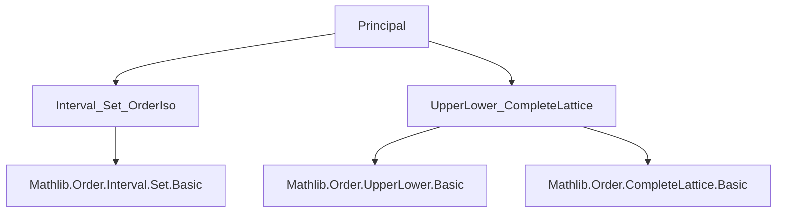
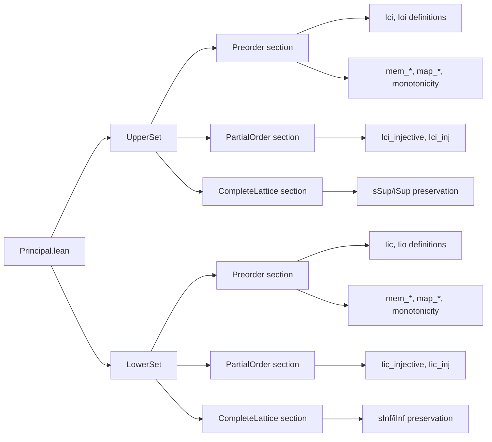

### Technical Brief: `Principal.lean`

---

#### **1. Key Definitions & Theorems**

| Name | Type | Purpose |
|------|------|---------|
| `UpperSet.Ici` | `α → UpperSet α` | Embeds the principal upper set `↑(Ici a) = {x | a ≤ x}` as an upper set. |
| `UpperSet.Ioi` | `α → UpperSet α` | Embeds the strict principal upper set `↑(Ioi a) = {x | a < x}` as an upper set. |
| `LowerSet.Iic` | `α → LowerSet α` | Embeds the principal lower set `↑(Iic a) = {x | x ≤ a}` as a lower set. |
| `LowerSet.Iio` | `α → LowerSet α` | Embeds the strict principal lower set `↑(Iio a) = {x | x < a}` as a lower set. |
| `Ici_le_Ioi` | `Ici a ≤ Ioi a` | Shows inclusion of strict principal upper set into non-strict one. |
| `Ioi_le_Ici` | `Ioi a ≤ Ici a` | Dually, inclusion of strict principal lower set into non-strict one. |
| `Ici_injective` | `Injective (Ici)` | Proves injectivity of `Ici` under partial order. |
| `Iic_injective` | `Injective (Iic)` | Proves injectivity of `Iic` under partial order. |
| `Ici_sup` | `Ici (a ⊔ b) = Ici a ⊔ Ici b` | `Ici` preserves binary suprema in semilattice-sup. |
| `Iic_inf` | `Iic (a ⊓ b) = Iic a ⊓ Iic b` | `Iic` preserves binary infima in semilattice-inf. |
| `Ici_sSup` | `Ici (sSup S) = ⨆ a ∈ S, Ici a` | `Ici` preserves arbitrary suprema in complete lattices. |
| `Ici_iSup` | `Ici (⨆ i, f i) = ⨆ i, Ici (f i)` | `Ici` preserves indexed suprema. |
| `Ici_iSup₂` | `Ici (⨆ (i) (j), f i j) = ⨆ (i) (j), Ici (f i j)` | `Ici` preserves binary indexed suprema. |
| `Iic_sInf` | `Iic (sInf S) = ⨅ a ∈ S, Iic a` | `Iic` preserves arbitrary infima. |
| `Iic_iInf` | `Iic (⨅ i, f i) = ⨅ i, Iic (f i)` | `Iic` preserves indexed infima. |
| `Iic_iInf₂` | `Iic (⨅ (i) (j), f i j) = ⨅ (i) (j), Iic (f i j)` | `Iic` preserves binary indexed infima. |
| `map_Ici`, `map_Ioi`, `map_Iic`, `map_Iio` | `map f (principal) = principal of image` | Principal sets commute with order isomorphisms. |
| `Ici_strictMono`, `Ioi_strictMono`, `Iic_strictMono`, `Iio_strictMono` | `StrictMono` | Principal set constructors are strictly monotone. |

---

#### **2. Naming Conventions**

- **Prefixes**:
  - `Ici_`, `Ioi_`, `Iic_`, `Iio_`: Standard notation for *interval* sets (`[a,∞)`, `(a,∞)`, `(-∞,a]`, `(-∞,a)`).
  - `map_`: Action of order morphisms on upper/lower sets.
  - `le_`, `lt_`, `ne_`, `eq_`: Relational properties (e.g., `Ici_le_Ioi`, `Ici_lt_top`, `Ici_ne_top`).
- **Suffixes**:
  - `_inj`, `_inj₂`: Injectivity or injectivity-based equivalences.
  - `_sup`, `_inf`, `_sSup`, `_sInf`, `_iSup`, `_iInf`: Preservation of lattice operations.
  - `_bot`, `_top`: Behavior at bounds.

---

#### **3. Tactic Stack**

- `simp`: Dominant tactic for simplifying membership, equality, and order-theoretic goals.
- `ext`: Extensionality for sets and (upper/lower) sets.
- `congr_arg`: To lift equality of elements to equality of sets.
- `rw`, `apply`, `exact`: Used in short proofs (e.g., `Ici_injective`, `Iic_injective`).
- `by simp only [...]`: For precise control over simplifier (e.g., in `Ici_sSup`, `Iic_sInf`).
- `SetLike.coe_injective`: To prove equality of sets via coercion.
- `Iff.rfl`: For trivial iff-lemmas like `mem_Ici_iff`.

---

#### **4. Proof Logic**

- **Structure**: Proofs follow a modular pattern:
  1. **Definition**: Define principal sets as `⟨set, property⟩`.
  2. **Simplification lemmas**: Prove `coe_* = Set.*` and `mem_* ↔ ...`.
  3. **Monotonicity**: Use set-theoretic inclusion facts (e.g., `Ioi_subset_Ici_self`) to derive order relations.
  4. **Injectivity**: Under `PartialOrder`, use coercion injectivity + extensionality.
  5. **Lattice preservation**: Reduce to set-theoretic identities (e.g., `Ici_inter_Ici`, `Iic_inter_Iic`) and apply `SetLike.coe_injective`.
  6. **Complete lattice**: Use `SetLike.ext` + `simp only [mem_*, iSup/sSup_*]` to reduce to order-theoretic characterizations.

- **Induction**: Not used directly; proofs rely on set extensionality and order-theoretic definitions.

---

#### **5. Imports**

- `Mathlib.Order.Interval.Set.OrderIso`: For interval order isomorphisms.
- `Mathlib.Order.UpperLower.CompleteLattice`: For lattice-theoretic infrastructure on upper/lower sets.

---

#### **6. Mermaid Diagrams**

##### **Dependency Graph (Module-Level)**

##### **Overview of File Structure**

---

#### **7. Theory Context**

- **Domain**: Order theory in Lean, specifically the theory of **upper/lower sets** and their interaction with **preorders**, **partial orders**, and **complete lattices**.
- **Role**: This file formalizes the foundational bridge between element-wise order-theoretic constructions (`Ici`, `Ioi`, etc.) and their categorical counterparts as upper/lower sets.
- **Applications**: Used in:
  - Formalization of topology (e.g., upper/lower topology),
  - Domain theory (Scott topology, continuous lattices),
  - Formalization of intervals and order topology.

--- 

Let me know if you'd like a formalized dependency graph for the entire `Mathlib.Order.*` hierarchy.
