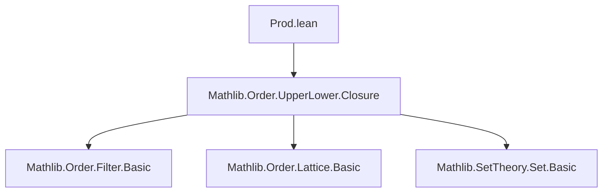

**Technical Brief: `Prod.lean` – Upper and Lower Set Product in Lean 4**

---

### 1. **Key Definitions & Theorems**

| Name | Type / Signature | Purpose |
|------|------------------|---------|
| `UpperSet.prod` | `UpperSet α → UpperSet β → UpperSet (α × β)` | Defines the product of two upper sets as an upper set on the product type. |
| `LowerSet.prod` | `LowerSet α → LowerSet β → LowerSet (α × β)` | Defines the product of two lower sets as a lower set on the product type. |
| `instSProd` | `SProd (UpperSet α) (UpperSet β) (UpperSet (α × β))` | Installs `×ˢ` as notation for `UpperSet.prod`. |
| `mem_prod` | `x ∈ s ×ˢ t ↔ x.1 ∈ s ∧ x.2 ∈ t` | Characterizes membership in the product. |
| `Ici_prod_Ici` | `Ici a ×ˢ Ici b = Ici (a, b)` | Product of principal upper sets is principal upper set of pair. |
| `Iic_prod_Iic` | `Iic a ×ˢ Iic b = Iic (a, b)` | Product of principal lower sets is principal lower set of pair. |
| `prod_le_prod_iff` | `s₁ ×ˢ t₁ ≤ s₂ ×ˢ t₂ ↔ s₁ ≤ s₂ ∧ t₁ ≤ t₂ ∨ s₂ = ⊤ ∨ t₂ = ⊤` (UpperSet) <br> `s₁ ×ˢ t₁ ≤ s₂ ×ˢ t₂ ↔ s₁ ≤ s₂ ∧ t₁ ≤ t₂ ∨ s₁ = ⊥ ∨ t₁ = ⊥` (LowerSet) | Gives necessary and sufficient condition for inclusion of products. |
| `prod_eq_top` / `prod_eq_bot` | `s ×ˢ t = ⊤ ↔ s = ⊤ ∨ t = ⊤` <br> `s ×ˢ t = ⊥ ↔ s = ⊥ ∨ t = ⊥` | Characterizes when a product is top/bottom. |
| `codisjoint_prod` / `disjoint_prod` | `Codisjoint (s₁ ×ˢ t₁) (s₂ ×ˢ t₂) ↔ Codisjoint s₁ s₂ ∨ Codisjoint t₁ t₂` <br> `Disjoint (s₁ ×ˢ t₁) (s₂ ×ˢ t₂) ↔ Disjoint s₁ s₂ ∨ Disjoint t₁ t₂` | Product preserves codisjointness/disjointness in one factor. |
| `upperClosure_prod` | `upperClosure (s ×ˢ t) = upperClosure s ×ˢ upperClosure t` | Upper closure commutes with Cartesian product. |
| `lowerClosure_prod` | `lowerClosure (s ×ˢ t) = lowerClosure s ×ˢ lowerClosure t` | Lower closure commutes with Cartesian product. |

---

### 2. **Naming Conventions**

- **Prefixes**:
  - `prod_`: for product-related definitions and theorems (`prod`, `prod_mono`, `prod_le_prod_iff`, etc.)
  - `upperClosure_`, `lowerClosure_`: for closure operators.
- **Suffixes**:
  - `_prod`: often used for theorems about interaction of operations with `prod`.
  - `_prod_Ici` / `_prod_Iic`: for principal (co)filter-like sets.
- **Notation**:
  - `×ˢ` is overloaded via `SProd` for both `UpperSet.prod` and `LowerSet.prod`.

---

### 3. **Tactic Stack**

- `ext`: Used repeatedly to prove set equality by extensionality.
- `simp` / `simp_rw`: For simplification using `mem_prod`, `coe_prod`, `Ici_prod_Ici`, etc.
- `exact`: Often used after `simp` to finish proofs (e.g., `exact prod_empty`, `exact univ_prod_univ`).
- `rfl`: For definitional equalities (e.g., `coe_prod`, `Ici_prod`).
- `by`: Used in short proofs where tactics are composed inline (e.g., `by simp_rw [...]`).
- `Set.prod_*` lemmas are reused from `Set` theory (e.g., `Set.prod_mono`, `Set.prod_inter`, `Set.prod_union`).

---

### 4. **Proof Logic**

- **Structure**:
  - Proofs are mostly *extensional*: show two sets are equal by proving membership equivalence (`ext` + `simp`).
  - Many proofs reduce to known `Set` lemmas (e.g., `prod_inter`, `prod_union`, `prod_empty`, `univ_prod_univ`).
  - For lattice-theoretic properties (e.g., `sup_prod`, `inf_prod`), the proof uses `ext` and rewrites using `Set`-level algebraic identities.
  - For order-theoretic equivalences (e.g., `prod_le_prod_iff`), proofs go via `prod_subset_prod_iff` and simplify using `Set`-level characterizations.
  - Closure lemmas (`upperClosure_prod`, `lowerClosure_prod`) use `ext`, then `simp` with `Prod.le_def` and logical commutativity.

- **Induction**: Not used — all arguments are pointwise and extensional.

---

### 5. **Imports**

- `Mathlib.Order.UpperLower.Closure`: Provides `UpperSet`, `LowerSet`, `upperClosure`, `lowerClosure`, and basic order-theoretic infrastructure.

---

### 6. **Dependency & Theory Overview**

#### **Mermaid Diagram: Module Dependencies**



#### **Mermaid Diagram: Theory Overview**

```mermaid
graph TD
  A[Preorder α × Preorder β] --> B[UpperSet α]
  A --> C[LowerSet α]
  A --> D[UpperSet β]
  A --> E[LowerSet β]

  B --> F[UpperSet (α × β)]
  D --> F
  F <-- prod --> B & D

  C --> G[LowerSet (α × β)]
  E --> G
  G <-- prod --> C & E

  F --> H[Set (α × β)]
  G --> H
  B --> H
  C --> H

  H --> I[Set Theory: prod, closure, disjointness]
```

#### **Summary**

This module formalizes the Cartesian product operation on **upper** and **lower sets**, showing it respects the order structure and interacts well with lattice operations (`⊔`, `⊓`), top/bottom elements, and closure operators. It leverages existing `Set` theory for product sets and extends it to the ordered setting. The results are foundational for building product order theory in `Mathlib`, especially for filters, closures, and domain theory.

--- 

Let me know if you'd like a formalized dependency graph or a summary of how this fits into the broader `Mathlib` order theory ecosystem.
