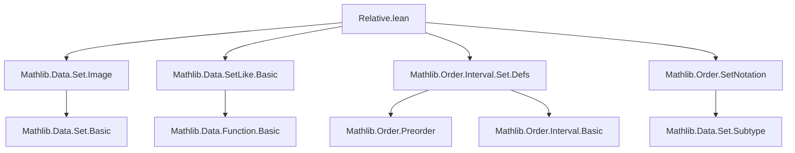
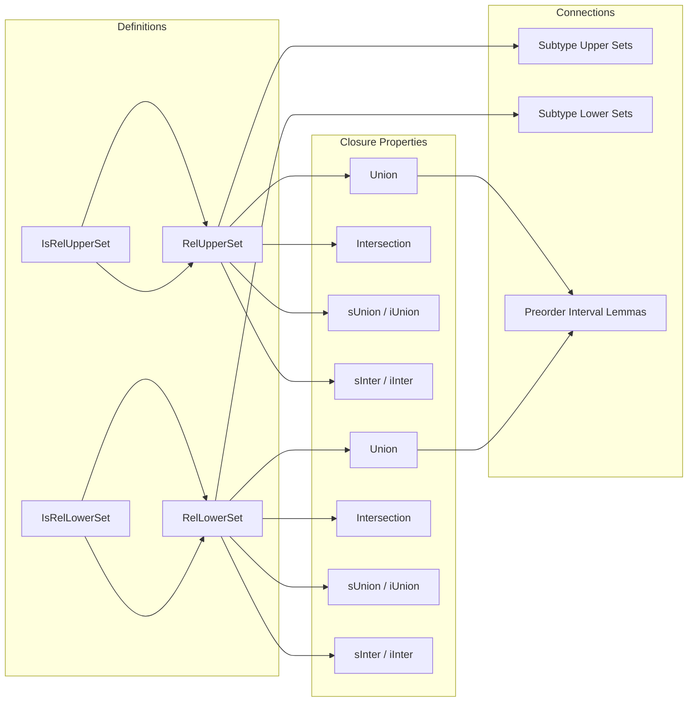

### Technical Brief: `Relative.lean`

---

#### **1. Key Definitions & Theorems**

| Name | Type / Signature | Purpose |
|------|------------------|---------|
| `IsRelUpperSet s P` | `s : Set α → (α → Prop) → Prop` | States that `s` is *relatively upper-closed* w.r.t. predicate `P`: for all `a ∈ s`, if `a ≤ b` and `P b`, then `b ∈ s`. Formally: `∀ a ∈ s, ∀ b, P b → a ≤ b → b ∈ s`. |
| `IsRelLowerSet s P` | `s : Set α → (α → Prop) → Prop` | Dual: for all `a ∈ s`, if `b ≤ a` and `P b`, then `b ∈ s`. |
| `RelUpperSet P` | Type constructor | Type of subsets of `α` satisfying `IsRelUpperSet _ P`, equipped with coercion to `Set α`. |
| `RelLowerSet P` | Type constructor | Dual of `RelUpperSet`. |
| `isRelUpperSet_empty`, `isRelLowerSet_empty` | `IsRelUpperSet ∅ P`, `IsRelLowerSet ∅ P` | Empty set is trivially relatively upper/lower closed. |
| `isRelUpperSet_self`, `isRelLowerSet_self` | `IsRelUpperSet s (· ∈ s)`, etc. | Any set is relatively closed w.r.t. its own membership predicate. |
| `IsRelUpperSet.union`, `IsRelLowerSet.union` | Closure under binary union | Union of two relatively upper/lower sets is again relatively upper/lower. |
| `IsRelUpperSet.inter`, `IsRelLowerSet.inter` | Closure under binary intersection | Intersection preserves relative upper/lower closedness. |
| `IsRelUpperSet.sUnion`, `IsRelLowerSet.sUnion` | Closure under arbitrary unions | Union over a family of relatively closed sets is relatively closed. |
| `IsRelUpperSet.iUnion`, `IsRelLowerSet.iUnion` | Indexed union version | Special case of `sUnion` for families indexed by `ι`. |
| `IsRelUpperSet.iUnion₂`, `IsRelLowerSet.iUnion₂` | Double-indexed union | Generalization to families `f : ∀ i, κ i → Set α`. |
| `IsRelUpperSet.sInter`, `IsRelLowerSet.sInter` | Closure under nonempty intersections | Requires nonemptiness of the index set. |
| `IsRelUpperSet.iInter`, `IsRelLowerSet.iInter` | Indexed intersection | Requires `Nonempty ι`. |
| `IsRelUpperSet.iInter₂`, `IsRelLowerSet.iInter₂` | Double-indexed intersection | Requires `Nonempty ι` and `∀ i, Nonempty (κ i)`. |
| `isUpperSet_subtype_iff_isRelUpperSet` | `IsUpperSet s ↔ IsRelUpperSet (Subtype.val '' s) P` | Relates upper sets on the subtype `{x // P x}` to relative upper sets on `α`. |
| `isLowerSet_subtype_iff_isRelLowerSet` | Dual of above | Relates lower sets on subtype to relative lower sets. |
| `isRelUpperSet_Icc_le` | `IsRelUpperSet (Icc a c) (· ≤ c)` | Interval `[a, c]` is relatively upper-closed w.r.t. `· ≤ c`. |
| `isRelLowerSet_Icc_ge` | `IsRelLowerSet (Icc c a) (c ≤ ·)` | Interval `[c, a]` is relatively lower-closed w.r.t. `c ≤ ·`. |

---

#### **2. Naming Conventions**

- **Predicates**: `IsRelUpperSet`, `IsRelLowerSet` — prefix `IsRel` indicates *relative* closure.
- **Constructors / Instances**: `RelUpperSet`, `RelLowerSet` — noun form for the type of such sets.
- **Properties**: `isRelUpperSet_*`, `isRelLowerSet_*` — lowercase `is` + `Rel` + structure + property.
- **Lemmas**: `*_prop_of_mem`, `*_union`, `*_inter`, `*_sUnion`, `*_iUnion`, `*_sInter`, `*_iInter`, `*_iInter₂`, etc.
- **Equivalences**: `*_subtype_iff_*` — bi-implication lemmas linking subtype structure and relative sets.

---

#### **3. Tactic Stack**

- `simp_all only [...]` — heavily used to simplify goals using specific lemmas (e.g., `mem_Icc`, `true_and`, `isRelUpperSet` definitions).
- `cases` — for destructing disjunctions (`mb : b ∈ s ∪ t`) or existential witnesses (`⟨s, ms, mb⟩`).
- `refine` — for constructing proofs with holes (e.g., `refine ⟨_, fun _ x y ↦ _⟩`).
- `exact`, `id`, `trans` — basic proof steps for equality/inequality chaining.
- `by simpa [h ...]` — simplification using a hypothesis and rewriting.
- `obtain ⟨...⟩` — destructing existential quantifiers or conjunctions.
- `forall_mem_range.2` — used to lift pointwise properties to range membership.

---

#### **4. Proof Logic**

- **Structure**: Most proofs follow a *definitional unpacking* pattern:
  1. Unfold `IsRelUpperSet` / `IsRelLowerSet`.
  2. Introduce assumptions (`a ∈ s`, `P b`, `a ≤ b`).
  3. Use induction or case analysis on membership in unions/intersections.
  4. Apply inductive hypothesis (`hs`, `ht`) to get membership and monotonicity.
  5. Reassemble using `⟨_, fun _ ↦ ...⟩` to reconstruct the required witness and monotonicity proof.

- **Induction Style**: Not inductive on natural numbers; rather *structural induction* on set operations (union, intersection, sUnion, iUnion, etc.).
- **Subtype Equivalence Proofs**: Use extensionality of subtype coercion (`SetCoe.ext_iff`) and image membership (`mem_image`), with `exists_eq_right` to simplify.

- **Intersections**: Require nonemptiness to pick a base witness (`obtain ⟨s₀, ms₀⟩`), then use it to extract the required element.

---

#### **5. Imports**

- `Mathlib.Data.Set.Image` — for `image`, `mem_image`, etc.
- `Mathlib.Data.SetLike.Basic` — for `SetLike` typeclass and coercion infrastructure.
- `Mathlib.Order.Interval.Set.Defs` — for `Icc`, interval definitions.
- `Mathlib.Order.SetNotation` — for set notation (`{x | P x}`, etc.).

---

#### **6. Theory Overview & Dependencies**

##### **Mermaid Diagram: Theory Dependencies**

##### **Mermaid Diagram: Module Overview**

##### **Core Theory Role**

This file formalizes the *relative* notion of upper/lower closure — a generalization of upper/lower sets where closure is only required *within the predicate `P`*. It serves as a bridge between:
- Classical order theory (`IsUpperSet`, `IsLowerSet`)
- Subtype constructions (`{x // P x}`)
- Interval constructions (`Icc`)

It is foundational for later work involving *relative* topology, *relative* lattices, or *relative* domain theory (e.g., in denotational semantics or domain logic), where one restricts attention to subsets defined by a predicate `P`.

--- 

Let me know if you'd like a formalization roadmap or a plan for extending this module (e.g., with lattices, continuity, or Scott topology).
