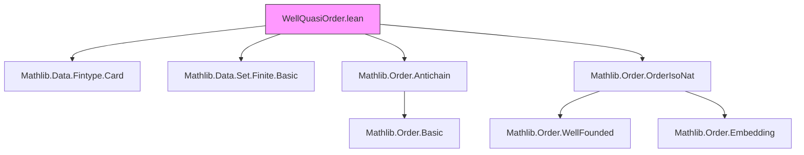

### Technical Brief: `WellQuasiOrder.lean`

---

#### **1. Key Definitions & Theorems**

| Name | Type / Signature | Purpose |
|------|------------------|---------|
| `WellQuasiOrdered (r : α → α → Prop)` | `Prop` | Predicate stating that every sequence `f : ℕ → α` has a pair `m < n` with `r (f m) (f n)`. Captures the “no infinite antichains + infinite monotone subsequence” property. |
| `WellQuasiOrderedLE (α : Type*) [LE α]` | `Type u → Prop` | Typeclass for bundled WQO: `≤` is a WQO relation. Defined as `@WellQuasiOrdered α (· ≤ ·)`. |
| `wellQuasiOrdered_iff_exists_monotone_subseq` | `WellQuasiOrdered r ↔ ∀ f, ∃ g : ℕ ↪o ℕ, ∀ m ≤ n, r (f (g m)) (f (g n))` | Equivalence between the sequential definition and existence of monotone subsequences (for preorders). |
| `Finite.wellQuasiOrdered` | `[Finite α] [Std.Refl r] ⇒ WellQuasiOrdered r` | Any finite type with reflexive relation is WQO. |
| `WellQuasiOrdered.prod` | `WellQuasiOrdered r → WellQuasiOrdered s → WellQuasiOrdered (λ (a,b) ↦ r a.1 b.1 ∧ s a.2 b.2)` | Product of WQOs is WQO. |
| `WellQuasiOrdered.pi` | `[Finite ι] [∀ i, IsPreorder (α i) (r i)] [∀ i, WellQuasiOrdered (r i)] ⇒ WellQuasiOrdered (λ a b ↦ ∀ i, r i (a i) (b i))` | Finite product (Pi type) of WQOs is WQO — **Dickson’s Lemma**. |
| `RelIso.wellQuasiOrdered_iff` | `(r ≃r s) → WellQuasiOrdered r ↔ WellQuasiOrdered s` | WQO is preserved under relational isomorphism. |
| `wellQuasiOrderedLE_iff` | `[Preorder α] ⇒ WellQuasiOrderedLE α ↔ WellFoundedLT α ∧ ∀ s, IsAntichain (· ≤ ·) s → s.Finite` | Characterization: WQO ⇔ well-founded + no infinite antichains. |
| `wellQuasiOrderedLE_iff_wellFoundedLT` | `[LinearOrder α] ⇒ WellQuasiOrderedLE α ↔ WellFoundedLT α` | For linear orders, WQO ⇔ well-order. |
| `Finite.to_wellQuasiOrderedLE` | `[Finite α] ⇒ WellQuasiOrderedLE α` | Finite preorders are WQO (instance). |
| `WellQuasiOrderedLE.to_wellFoundedLT` | `[WellQuasiOrderedLE α] ⇒ WellFoundedLT α` | WQO implies well-foundedness of strict order. |
| `Pi.wellQuasiOrderedLE` | `[∀ i, Preorder (α i)] [∀ i, WellQuasiOrderedLE (α i)] [Finite ι] ⇒ WellQuasiOrderedLE (∀ i, α i)` | Instance version of Dickson’s Lemma for `≤`. |

---

#### **2. Naming Conventions**

- **Predicates**: `WellQuasiOrdered`, `WellQuasiOrderedLE`
- **Theorems**:
  - Prefix `wellQuasiOrdered_`: equivalences, characterizations (`wellQuasiOrdered_iff_...`)
  - Prefix `Finite.` / `WellQuasiOrdered.` / `WellQuasiOrderedLE.`: structural properties
  - `prod`, `pi`: closure under products
  - `to_...`: derived instances/lemmas (e.g., `to_wellFoundedLT`)
- **Suffixes**:
  - `_iff`: logical equivalences
  - `_of_...`: implications from assumptions (e.g., `finite_of_wellQuasiOrdered`)
  - `le`: for bundled order versions (e.g., `wellQuasiOrdered_le`)

---

#### **3. Tactic Stack**

Frequent tactics used in proofs:

| Tactic | Role |
|--------|------|
| `intro`, `refine`, `exact`, `cases` | Basic proof structure |
| `obtain ⟨...⟩` / `rcases` | Extract witnesses from existential hypotheses |
| `rw [wellQuasiOrdered_iff_exists_monotone_subseq]` | Rewriting using key equivalences |
| `simp only [...]` | Simplify using finite/Finset lemmas |
| `contrapose!` | Turn goal into negated implication for contradiction |
| `exfalso` | Derive contradiction from `False` assumption |
| `apply RelEmbedding.not_wellFounded` | Use well-foundedness to block embeddings |
| `Finset.cons_induction` | Induction over finite sets (used in `pi` proof) |
| `OrderHomClass.mono`, `g.strictMono`, `g.monotone` | Reason about monotonicity of embeddings |
| `lt_trichotomy`, `le_of_not_ge`, `ne_of_lt` | Linear order reasoning (in `LinearOrder` section) |
| `aesop`, `ring`, `linarith` | Not used heavily here — mostly structural reasoning |

---

#### **4. Proof Logic**

- **Core Strategy**: Reduce WQO to existence of monotone subsequences (via `wellQuasiOrdered_iff_exists_monotone_subseq`).
- **Inductive Proofs**:
  - `pi` uses `Finset.cons_induction` over finite index set `ι`.
  - Base case: empty index → trivial embedding.
  - Inductive step: extract monotone subsequence on new coordinate, then apply IH on remaining coordinates.
- **Contrapositive Reasoning**:
  - `finite_of_isAntichain` and `wellQuasiOrderedLE_iff` use contradiction: assume infinite antichain → construct sequence with no monotone pair.
- **Case Analysis**:
  - `exists_increasing_or_nonincreasing_subseq` splits into monotone increasing or nonincreasing subsequences.
  - In linear orders, nonincreasing + WQO ⇒ contradiction unless finite.
- **Equivalence Proofs**:
  - Use `⟨h1, h2⟩` and `⟨hwf, hc⟩` to decompose conjunctions.
  - `simp only [wellQuasiOrderedLE_def]` to switch between bundled/unbundled forms.

---

#### **5. Imports & Dependencies**

| Module | Purpose |
|--------|---------|
| `Mathlib.Data.Fintype.Card` | Cardinality reasoning, finite types |
| `Mathlib.Data.Set.Finite.Basic` | `Finite`, `Infinite`, `IsAntichain` |
| `Mathlib.Order.Antichain` | Antichains, `IsAntichain`, basic properties |
| `Mathlib.Order.OrderIsoNat` | Order embeddings, isomorphisms, monotone maps |

**Key underlying theories**:
- Preorders, partial orders, linear orders
- Well-founded relations (`WellFoundedLT`)
- Relational embeddings (`RelEmbedding`, `OrderEmbedding`)
- Finite products and Pi types

---

#### **6. Mermaid Diagrams**

##### **Dependency Graph (Module-Level)**



##### **Overview of Theory Flow**

```mermaid
flowchart LR
  WQO_Def[WellQuasiOrdered r] --> WQO_LE[WellQuasiOrderedLE α]
  WQO_Def --> Finite_WQO[Finite α ⇒ WQO]
  WQO_Def --> Prod_WQO[Product of WQOs]
  WQO_Def --> Pi_WQO[Finite Pi-type WQO (Dickson)]

  WQO_LE --> WfLT[WellFoundedLT]
  WQO_LE --> Antichain_Finite[Antichains finite]

  WQO_LE --> Charac[Char: WQO ⇔ Wf + no infinite antichain]
  Charac --> Linear_WQO[Linear order: WQO ⇔ Well-order]

  WQO_LE --> Pi_Instance[Pi.wellQuasiOrderedLE instance]

  style WQO_Def fill:#bbf,stroke:#333
  style WQO_LE fill:#bfb,stroke:#333
  style Charac fill:#fbb,stroke:#333
```

---

#### **7. Theory Context**

- **Goal**: Formalize well quasi-orders (WQOs), a central notion in combinatorics and logic (e.g., Kruskal’s tree theorem, Dickson’s lemma).
- **Position in Mathlib**: Bridges order theory, combinatorics, and type theory.
- **Key Insight**: WQO is strictly weaker than well-order (no linear antisymmetry required), but stronger than just well-foundedness.
- **Applications**:
  - Termination proofs (via no infinite descending chains + finite antichains).
  - Algebra (e.g., Hilbert basis theorem via Dickson’s lemma).
  - Logic (e.g., decidability of monadic second-order logic on trees).

--- 

Let me know if you'd like a **proof sketch** of `WellQuasiOrdered.pi`, or a **dependency analysis** for downstream modules (e.g., `Higman`, `Kruskal`).
