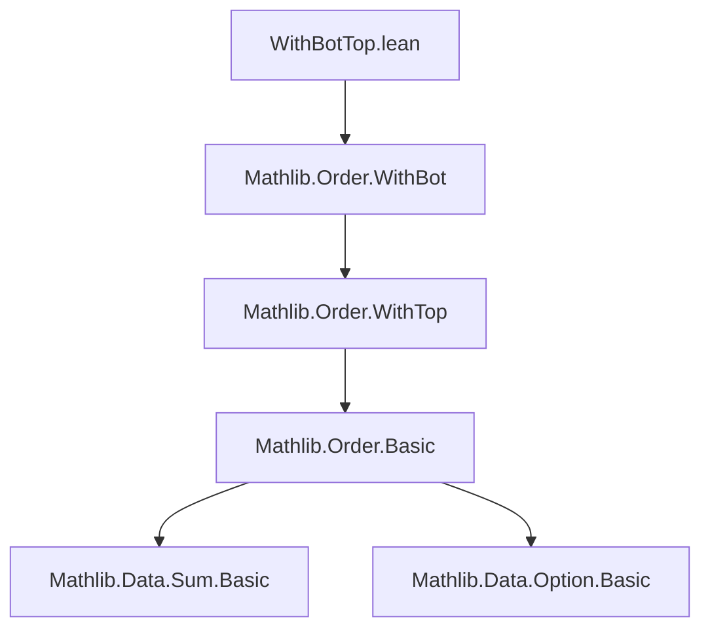

**Technical Brief: `WithBotTop.lean`**

---

### 1. **Key Definitions & Theorems**

| Name | Type / Signature | Purpose |
|------|------------------|---------|
| `WithBotTop` | `Type u → Type u` | Abbreviation for `WithBot (WithTop ι)`, i.e., adding both bottom (`⊥`) and top (`⊤`) elements to a type `ι`. |
| `WithBotTop.coe` | `ι → WithBotTop ι` | Canonical embedding of `ι` into `WithBotTop ι`, defined as `WithBot.some ∘ WithTop.some`. Registered as coercion. |
| `WithBotTop.rec` | `∀ a, motive a` | Recursor (eliminator) for `WithBotTop`, defined by cases on `⊥`, `a : ι`, and `⊤`. |
| `coe_injective` | `Function.Injective (WithBotTop.coe)` | Injectivity of the coercion. |
| `coe_ne_bot`, `coe_ne_top`, `top_ne_bot` | `a ≠ ⊥`, `a ≠ ⊤`, `⊤ ≠ ⊥` | Basic disjointness lemmas for embedded elements and extremal points. |
| `rec_bot`, `rec_coe`, `rec_top` | `rec ... ⊥ = bot`, etc. | Reduction rules for the recursor. |
| `coe_le_coe`, `coe_lt_coe` | `(a ≤ b) ↔ (a ≤ b)`, `(a < b) ↔ (a < b)` | Compatibility of coercion with order relations. |
| `coe_strictMono`, `coe_monotone` | `StrictMono`, `Monotone` | Coercion preserves strict and non-strict order. |
| `EInt` | `Type` | Abbreviation for `WithBotTop ℤ`, i.e., extended integers $[-\infty, \infty]$. |

---

### 2. **Naming Conventions**

- **Prefixes / Suffixes**:
  - `coe_`: for coercion-related lemmas (`coe_injective`, `coe_ne_bot`, `coe_le_coe`, etc.).
  - `rec_`: for recursor reduction lemmas (`rec_bot`, `rec_coe`, `rec_top`).
  - `WithBotTop.`: namespace prefix for definitions and lemmas internal to `WithBotTop`.
- **Dual annotations**: `@[to_dual]` on `WithBotTop` indicates symmetry under order duality (`⊥` ↔ `⊤`).

---

### 3. **Tactic Stack**

Frequent tactics used:
- `intro` / `rintro`: for introducing hypotheses and equalities.
- `rw`: rewriting using simplification lemmas (especially `← WithTop.coe_le_coe`, `WithBot.coe_le_coe`).
- `simp`: for simplification (e.g., `simpa` in `coe_monotone`).
- `rfl`: for reflexivity proofs (e.g., in `rec_*` lemmas).
- `exact`: implicit in `by rintro ⟨⟩` patterns for contradiction proofs.

No heavy automation (e.g., `linarith`, `omega`) is used—proofs are mostly structural and rely on known lemmas from `WithBot` and `WithTop`.

---

### 4. **Proof Logic**

- **Structure**: Proofs follow a *case analysis* pattern on the three canonical forms of `WithBotTop`: `⊥`, `a : ι`, `⊤`.
- **Order lemmas**: Use transitivity of coercion through `WithTop` then `WithBot`, leveraging existing lemmas:
  - `coe_le_coe` reduces to `WithTop.coe_le_coe` and `WithBot.coe_le_coe`.
  - `coe_strictMono` composes `StrictMono` proofs via `comp`.
- **Injectivity & disjointness**: Proven by contradiction via `rintro ⟨⟩`, i.e., destructing equality hypotheses to reach `⊥`.

---

### 5. **Imports**

- `Mathlib.Order.WithBot`: Provides `WithBot`, `WithBot.some`, `WithBot.coe_le_coe`, `WithBot.coe_strictMono`, etc.
- Implicitly relies on `Mathlib.Order.WithTop` (via `WithBot`’s definition).
- Standard order theory infrastructure: `Preorder`, `LE`, `LT`, `StrictMono`, `Monotone`.

---

### 6. **Mermaid Diagrams**

#### **Dependency Graph**


#### **Overview of `WithBotTop` Construction**
```mermaid
flowchart LR
  ι[Type ι] --> WithTop[WithTop ι]
  WithTop --> WithBotTop[WithBot (WithTop ι) = WithBotTop ι]
  WithBotTop -->|includes| Bot[⊥]
  WithBotTop -->|via coe| ι'[ι]
  WithBotTop -->|includes| Top[⊤]
```

#### **Extended Integers (`EInt`) Context**
```mermaid
flowchart LR
  ℤ[ℤ] --> WithTop[WithTop ℤ]
  WithTop --> WithBotTop[WithBot (WithTop ℤ)]
  WithBotTop -->|abbrev| EInt[EInt]
  EInt --> Bot[⊥ = -∞]
  EInt -->|coe| ℤ'[ℤ]
  EInt --> Top[⊤ = +∞]
```

---

### 7. **Theoretical Scope**

- **Purpose**: Extends a type with two distinguished extremal elements (`⊥`, `⊤`) to model bounded completions (e.g., extended integers, extended reals).
- **Use Cases**:
  - Formalizing extended arithmetic (e.g., `EInt` for integer arithmetic with infinities).
  - Building ordered structures with endpoints (e.g., in measure theory, topology).
- **Design Philosophy**:
  - Leverages existing `WithBot`/`WithTop` infrastructure.
  - Minimal duplication: `WithBotTop` is an abbreviation, not a new inductive type.
  - Coercion registration enables natural syntax like `(a : WithBotTop ι)`.

--- 

Let me know if you'd like a formalization plan for extending `WithBotTop` with lattice or additive structure.
