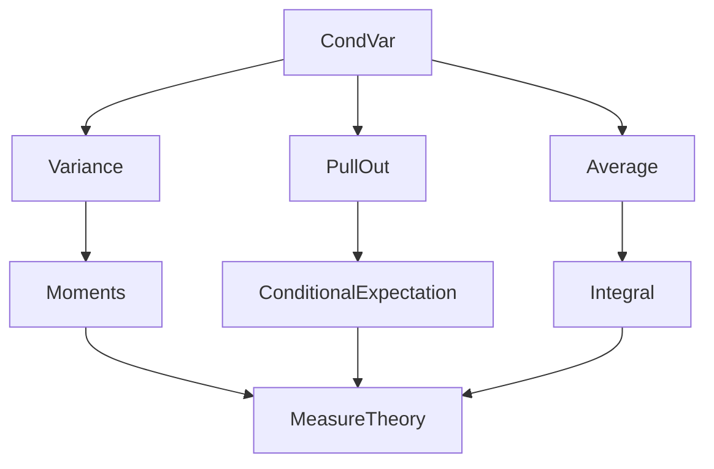
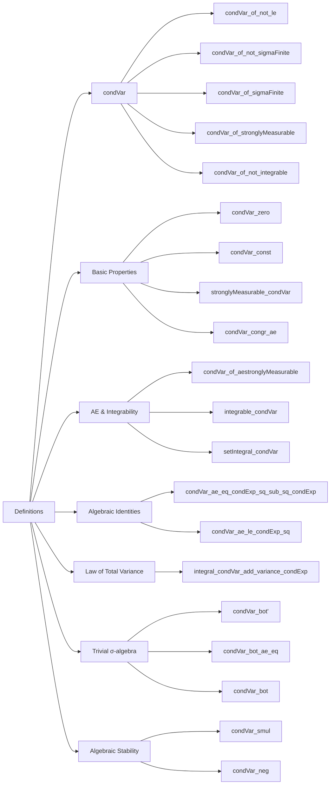

### Technical Brief: `CondVar.lean`

---

#### **1. Key Definitions & Theorems**

| Name | Type / Signature | Purpose |
|------|------------------|---------|
| `condVar` | `condVar (m X μ) : Ω → ℝ` | Defines conditional variance as the conditional expectation of the squared deviation from the conditional expectation: `μ[(X - μ[X | m])^2 | m]`. Returns `0` if conditions for conditional expectation fail. |
| `Var[· ; · | ·]` | Notation for `condVar` | Syntactic sugar for conditional variance w.r.t. a measure `μ` and σ-algebra `m`. |
| `Var[· | ·]` | Notation for `condVar` with `volume` | Special case using Lebesgue measure (`volume`). |
| `condVar_of_not_le` | `¬m ≤ m₀ → Var[X; μ | m] = 0` | Handles case where `m` is not a sub-σ-algebra of `m₀`. |
| `condVar_of_not_sigmaFinite` | `¬SigmaFinite (μ.trim hm) → Var[X; μ | m] = 0` | Handles non-σ-finiteness of `μ` w.r.t. `m`. |
| `condVar_of_sigmaFinite` | `SigmaFinite (μ.trim hm) → ...` | Gives explicit form of `condVar` under σ-finiteness. |
| `condVar_of_stronglyMeasurable` | `StronglyMeasurable[m] X ∧ Integrable ((X - μ[X | m])^2) μ → Var[X; μ | m] = (X - μ[X | m])^2` | Simplifies to pointwise square when integrand is strongly measurable. |
| `condVar_of_not_integrable` | `¬Integrable ((X - μ[X | m])^2) μ → Var[X; μ | m] = 0` | Handles non-square-integrability. |
| `condVar_zero` | `Var[0; μ | m] = 0` | Variance of zero function is zero. |
| `condVar_const` | `Var[const c; μ | m] = 0` | Variance of constant is zero (under mild assumptions). |
| `stronglyMeasurable_condVar` | `StronglyMeasurable[m] (Var[X; μ | m])` | Conditional variance is `m`-measurable. |
| `condVar_congr_ae` | `X =ᵐ[μ] Y → Var[X; μ | m] =ᵐ[μ] Var[Y; μ | m]` | Conditional variance respects almost-everywhere equality. |
| `condVar_of_aestronglyMeasurable` | `AEStronglyMeasurable[m] X μ ∧ Integrable ((X - μ[X | m])^2) μ → Var[X; μ | m] =ᵐ[μ] (X - μ[X | m])^2` | AE version of the strongly measurable case. |
| `integrable_condVar` | `Integrable Var[X; μ | m] μ` | Conditional variance is integrable. |
| `setIntegral_condVar` | `∫ s, Var[X; μ | m] ∂μ = ∫ s, (X - μ[X | m])^2 ∂μ` | Integral of conditional variance over `m`-measurable set equals integral of squared deviation. |
| `condVar_ae_eq_condExp_sq_sub_sq_condExp` | `Var[X; μ | m] =ᵐ[μ] μ[X^2 | m] - μ[X | m]^2` | Key identity: conditional variance equals conditional second moment minus square of conditional first moment. |
| `condVar_ae_le_condExp_sq` | `Var[X; μ | m] ≤ᵐ[μ] μ[X^2 | m]` | Immediate corollary of above identity. |
| `integral_condVar_add_variance_condExp` | **Law of total variance**: `μ[Var[X | m]] + Var[μ[X | m]] = Var[X]` | Decomposes total variance into expected conditional variance + variance of conditional expectation. |
| `condVar_bot'` | `Var[X | ⊥] = fun _ ↦ ⨍ (X - ⨍ X)^2` | Conditional variance w.r.t. trivial σ-algebra equals (global) variance as a constant function. |
| `condVar_bot_ae_eq` | `Var[X | ⊥] =ᵐ[μ] fun _ ↦ ⨍ (X - ⨍ X)^2` | AE version of above. |
| `condVar_bot` | Under probability measure: `Var[X | ⊥] = fun _ ↦ Var[X]` | Simplifies to global variance. |
| `condVar_smul` | `Var[c • X | m] =ᵐ[μ] c^2 • Var[X | m]` | Scaling property (homogeneous of degree 2). |
| `condVar_neg` | `Var[-X | m] =ᵐ[μ] Var[X | m]` | Evenness under sign change. |

---

#### **2. Naming Conventions**

- **Prefixes**:
  - `condVar_`: Main prefix for lemmas about conditional variance.
  - `condExp_`: Reused from `ConditionalExpectation.PullOut`, inherited for conditional expectation properties used in proofs.
- **Suffixes**:
  - `_of_not_…`: Cases where definition collapses to `0`.
  - `_of_…`: Cases where extra assumptions simplify the expression.
  - `_congr_ae`: Congruence modulo almost-everywhere equality.
  - `_ae_eq_…`: Almost-everywhere equality lemmas.
  - `_sq`, `_sq_condExp`: For squared terms (note: `sq_` used exceptionally for readability).
- **Notation**:
  - `Var[X; μ | m]`: Full notation.
  - `Var[X | m]`: Shorthand with `volume`.
  - `μ[X | m]`: Conditional expectation notation.

---

#### **3. Tactic Stack**

Frequent tactics used in proofs:

| Tactic | Usage |
|--------|-------|
| `rw` / `congr` / `congr'` | Rewriting definitions, especially `condVar`, `condExp`, `variance_eq`. |
| `simp` / `simp only` | Simplifying using lemmas like `condVar_zero`, `condVar_const`, `integral_condExp`, etc. |
| `filter_upwards` | Proving AE equalities by reducing to pointwise equalities on a full-measure set. |
| `have` / `exact` / `apply` | Intermediate lemma introduction and application (e.g., integrability). |
| `ring` / `nlinarith` | Algebraic simplification and inequality solving (especially in `condVar_ae_eq_condExp_sq_sub_sq_condExp`). |
| `aesop` / `norm_num` | Not explicitly used here, but `nlinarith` suffices for arithmetic. |
| `cases` / `obtain` | Case analysis on `eq_or_ne`, `eq_zero_or_neZero`, etc. |
| `exact` / `refine` | For constructing proofs with `condExp_*` lemmas. |

---

#### **4. Proof Logic**

- **Structure**:
  - Most proofs follow a **definition → simplification → decomposition → algebraic manipulation** pattern.
  - Key steps:
    1. Unfold `condVar` as `condExp[(X - μ[X|m])^2 | m]`.
    2. Apply known lemmas about `condExp`: additivity, pull-out, square, integrability, AE-congruence.
    3. Use `filter_upwards` to reduce AE statements to pointwise ones.
    4. Use algebraic identities (`sub_sq`, `mul_pow`, `sq`) and ring simplification.
    5. For law of total variance: combine `condVar_ae_eq_condExp_sq_sub_sq_condExp` with `variance_eq_sub` and `integral_condExp`.

- **Induction**: Not used — all proofs are direct or case-based.
- **Case splits**: On measurability, integrability, σ-finiteness, equality of constants, or triviality of σ-algebra (`⊥`).
- **Measure-theoretic reasoning**: Heavy use of AE-equality, integrability conditions, and properties of conditional expectation.

---

#### **5. Imports**

| Import | Purpose |
|--------|---------|
| `Mathlib.MeasureTheory.Function.ConditionalExpectation.PullOut` | Core conditional expectation theory (definition, properties, `condExp_*` lemmas). |
| `Mathlib.MeasureTheory.Integral.Average` | For integrals over sets, average notation `⨍`, and properties. |
| `Mathlib.Probability.Moments.Variance` | Definition and properties of (unconditional) variance (`variance_eq`, `MemLp`, etc.). |

---

#### **6. Mermaid Diagrams**

##### **Dependency Graph (Module-Level)**

##### **Overview of File Structure**

---

#### **7. Theory Scope**

- **Domain**: Probability theory within measure theory.
- **Scope**: Conditional variance of real-valued random variables w.r.t. sub-σ-algebras.
- **Relation to other files**:
  - Builds on `ConditionalExpectation.PullOut` for foundational properties.
  - Uses `Average` for integrals over sets and global averages.
  - Uses `Variance` for global variance and `MemLp` spaces for integrability conditions.
- **Future work** (per TODO): Extend to Lebesgue conditional variance (via `GibbsMeasure`-style approach).

--- 

Let me know if you'd like a formalized dependency graph in `leanpkg` format or a summary of missing lemmas for completeness.
