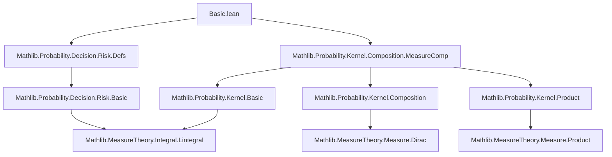
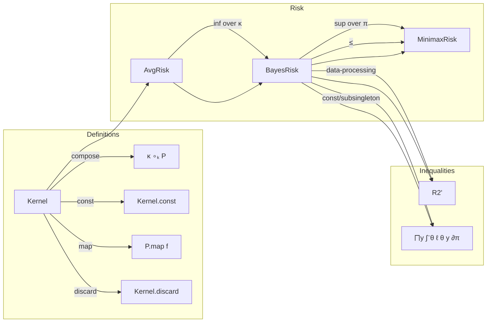

### Technical Brief: Basic Properties of Bayes Risk in Lean 4

---

#### **1. Key Definitions & Theorems**

| Name | Type | Purpose |
|------|------|---------|
| `avgRisk` | `ℓ : Θ → 𝓨 → ℝ≥0∞ → P : Kernel Θ 𝓧 → κ : Kernel 𝓧 𝓨 → π : Measure Θ → ℝ≥0∞` | Average risk of estimator (integrated loss over data and parameter space). |
| `bayesRisk` | `ℓ : Θ → 𝓨 → ℝ≥0∞ → P : Kernel Θ 𝓧 → π : Measure Θ → ℝ≥0∞` | Minimal average risk over all decision rules (i.e., kernels κ). |
| `minimaxRisk` | `ℓ : Θ → 𝓨 → ℝ≥0∞ → P : Kernel Θ 𝓧 → ℝ≥0∞` | Supremum over priors of Bayes risk (i.e., worst-case Bayes risk). |
| `Kernel.const` | `μ : Measure 𝓧 → Kernel Θ 𝓧` | Constant kernel (ignores θ). |
| `Kernel.discard` | `Kernel Θ Unit` | Discards data (maps everything to unit). |
| `Kernel.deterministic` | `f : Θ → 𝓧 → Kernel Θ 𝓧` | Deterministic kernel induced by measurable map f. |
| `Kernel.map` | `f : 𝓧 → 𝓧' → Kernel Θ 𝓧 → Kernel Θ 𝓧'` | Pushforward of kernel along measurable map. |
| `Kernel.comp` (`∘ₖ`) | `Kernel Θ 𝓧 → Kernel 𝓧 𝓨 → Kernel Θ 𝓨` | Composition of kernels (Bayes rule for data processing). |

**Main Theorems:**

| Name | Statement | Intuition |
|------|-----------|-----------|
| `avgRisk_le_iSup_risk` | `avgRisk ℓ P κ π ≤ ⨆ θ, ∫⁻ y, ℓ θ y ∂((κ ∘ₖ P) θ)` | Average risk bounded by sup over θ of pointwise risk. |
| `bayesRisk_le_avgRisk` | `bayesRisk ℓ P π ≤ avgRisk ℓ P κ π` | Bayes risk ≤ any average risk (by definition of infimum over κ). |
| `bayesRisk_le_minimaxRisk` | `bayesRisk ℓ P π ≤ minimaxRisk ℓ P` | Bayes risk for fixed π ≤ minimax risk. |
| `iSup_bayesRisk_le_minimaxRisk` | `⨆ π, bayesRisk ℓ P π ≤ minimaxRisk ℓ P` | **Maximal Bayes risk ≤ minimax risk** (standard inequality in decision theory). |
| `bayesRisk_le_bayesRisk_comp` | `bayesRisk ℓ P π ≤ bayesRisk ℓ (η ∘ₖ P) π` | **Data-processing inequality**: processing data cannot decrease Bayes risk. |
| `bayesRisk_le_bayesRisk_map` | `bayesRisk ℓ P π ≤ bayesRisk ℓ (P.map f) π` | Mapping data via measurable f cannot decrease Bayes risk. |
| `bayesRisk_le_iInf` | `bayesRisk ℓ P π ≤ ⨅ y, ∫⁻ θ, ℓ θ y ∂π` | Bayes risk bounded above by inf over y of prior-averaged loss. |
| `bayesRisk_const` | If `P = Kernel.const Θ μ`, then `bayesRisk ℓ P π = ⨅ y, ∫⁻ θ, ℓ θ y ∂π` | Constant kernel → no information → Bayes risk achieves upper bound. |
| `bayesRisk_of_subsingleton` | If `𝓧` is subsingleton, same equality holds. | No variation in data → no information → same bound. |
| `bayesRisk_compProd_le_bayesRisk` | `bayesRisk ℓ (P ⊗ₖ η) π ≤ bayesRisk ℓ P π` | Adding independent noise (via η) cannot improve Bayes risk. |
| `bayesRisk_le_mul` | If `ℓ ≤ C`, then `bayesRisk ℓ P π ≤ C` (under Markov/probability assumptions). | Bounded loss → bounded Bayes risk. |

---

#### **2. Naming Conventions**

- **Prefixes**:
  - `bayesRisk_`: properties of Bayes risk.
  - `avgRisk_`: properties of average risk (before minimizing over decision rules).
  - `iInf_`, `iSup_`: for infima/suprema over measures or parameters.
  - `const_`, `discard_`, `comp_`, `map_`: for specific kernel constructions.
  - `le_`: upper bounds (e.g., `le_iInf`, `le_mul`).
  - `eq_`: equalities under special conditions (e.g., `eq_iInf_measure_of_subsingleton`).

- **Suffixes**:
  - `'` (prime): variant with relaxed assumptions (e.g., `bayesRisk_le_iInf'` vs `bayesRisk_le_iInf`).
  - `of_`: special case under additional assumptions (e.g., `bayesRisk_const_of_neZero`).
  - `Prod`: for product kernels (e.g., `compProd_le_bayesRisk`).

---

#### **3. Tactic Stack**

Frequently used tactics in proofs:
- `simp` / `simp_rw`: simplify using definitions (`avgRisk`, `bayesRisk`, `Kernel.comp`, etc.).
- `gcongr`: for monotonicity of integrals (e.g., bounding integrands).
- `lintegral_lintegral_swap`: Fubini for non-negative integrals.
- `lintegral_dirac'`: evaluate integral w.r.t. Dirac measure.
- `iInf_le_of_le`, `le_iInf_iff`: handle infima over decision rules or measures.
- `iSup₂_le`, `iInf₂_mono`: manipulate suprema/infima over priors.
- `conv_lhs => ...`: for targeted rewriting in complex expressions.
- `fun_prop`: prove measurability goals (e.g., for kernels, measures).
- `rcases isEmpty_or_nonempty _`: case split on emptiness (common in simplifications).
- `rw [← Kernel.fst_eq, ...]`: rewrite using kernel identities.

---

#### **4. Proof Logic**

- **Structure**:
  - Most proofs follow a **two-step bounding strategy**:  
    `≤` via `iInf_le_of_le` (choose a specific κ or μ) and `≥` via `le_iInf_iff` (show any κ gives ≥ target).
  - **Induction/Case splits** on emptiness (`isEmpty_or_nonempty`) or subsingleness to simplify constants.
  - **Measurability** is handled via `fun_prop` and `have := ...; fun_prop`.
  - **Fubini-style swaps** (`lintegral_lintegral_swap`) used when switching order of integration.
  - **Equality proofs** often use `le_antisymm` after bounding both ways.

- **Typical flow**:
  1. Expand definitions (`avgRisk`, `bayesRisk`, `Kernel.comp`).
  2. Apply `iInf_le_of_le` or `le_iInf_iff`.
  3. Simplify using kernel algebra (`Kernel.const_comp`, `Kernel.comp_assoc`).
  4. Use monotonicity (`gcongr`) and integral properties (`lintegral_mul_const`, `lintegral_dirac'`).
  5. Handle edge cases (empty/finite/infinite measures) via `ENNReal` lemmas.

---

#### **5. Imports & Dependencies**

- **Core imports**:
  ```lean
  Mathlib.Probability.Decision.Risk.Defs
  Mathlib.Probability.Kernel.Composition.MeasureComp
  ```
- **Key underlying libraries**:
  - `MeasureTheory.Integral.Lintegral` (for `lintegral`, `lintegral_mul_const`, `lintegral_dirac'`)
  - `MeasureTheory.Measure.Dirac` (for `Measure.dirac`)
  - `MeasureTheory.Measure.SFinite`, `IsProbabilityMeasure`, `IsMarkovKernel`
  - `MeasureTheory.Kernel.Basic`, `Composition`, `Product`
  - `Mathlib.Data.ENNReal.Basic` (for `ENNReal.iInf_mul'`, `mul_lt_top_iff`)
  - `Mathlib.Data.Subsingleton` (for `Subsingleton.elim`)
  - `Mathlib.Data.Product.Basic` (for `Prod.fst`, `Prod.snd`, `Prod.map`)

---

#### **6. Mermaid Diagrams**

##### **Dependency Graph (Module-Level)**



##### **Overview of Theory Flow**



---

#### **7. Summary**

This file formalizes foundational properties of Bayes risk in statistical decision theory, emphasizing:
- **Monotonicity under data processing** (`bayesRisk_le_bayesRisk_comp`, `bayesRisk_le_bayesRisk_map`)
- **Equality cases** when data carries no information (`bayesRisk_const`, `bayesRisk_of_subsingleton`)
- **Upper bounds** for bounded loss (`bayesRisk_le_mul`, `bayesRisk_lt_top`)
- **General inequality** `iSup_bayesRisk_le_minimaxRisk`, foundational for minimax theory.

The formalization leverages kernel composition, measurable function spaces, and non-negative integrals (`ℝ≥0∞`), with careful handling of measure-theoretic subtleties (e.g., σ-finiteness, Dirac measures, Fubini).
