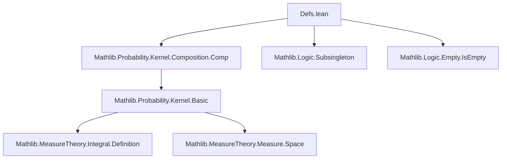

### Technical Brief: Risk Definitions in `Defs.lean`

---

#### **1. Key Definitions & Theorems**

| Name | Type | Purpose |
|------|------|---------|
| `avgRisk` | `(ℓ : Θ → 𝓨 → ℝ≥0∞) → (P : Kernel Θ 𝓧) → (κ : Kernel 𝓧 𝓨) → (π : Measure Θ) → ℝ≥0∞` | Computes the *average risk* of estimator `κ` w.r.t. prior `π`, as the prior expectation of the pointwise risk. |
| `bayesRisk` | `(ℓ : Θ → 𝓨 → ℝ≥0∞) → (P : Kernel Θ 𝓧) → (π : Measure Θ) → ℝ≥0∞` | The *Bayes risk*: infimum of `avgRisk ℓ P κ π` over all Markov kernels `κ`. |
| `minimaxRisk` | `(ℓ : Θ → 𝓨 → ℝ≥0∞) → (P : Kernel Θ 𝓧) → ℝ≥0∞` | The *minimax risk*: infimum over estimators `κ` of the worst-case (supremum over `θ`) risk. |

**Key Lemmas (Simplifications):**

| Lemma | Type | Purpose |
|-------|------|---------|
| `avgRisk_zero_left` | `avgRisk ℓ (0 : Kernel Θ 𝓧) κ π = 0` | Risk is zero if data kernel is zero. |
| `avgRisk_zero_right` | `avgRisk ℓ P (0 : Kernel 𝓧 𝓨) π = 0` | Risk is zero if estimator kernel is zero. |
| `avgRisk_zero_prior` | `avgRisk ℓ P κ 0 = 0` | Risk is zero if prior is zero. |
| `bayesRisk_zero_left` / `zero_right` | `bayesRisk ℓ (0 : Kernel Θ 𝓧) π = 0` / `bayesRisk ℓ P (0 : Measure Θ) = 0` | Bayes risk vanishes with zero data or zero prior. |
| `minimaxRisk_zero` | `minimaxRisk ℓ (0 : Kernel Θ 𝓧) = 0` | Minimax risk vanishes with zero data kernel. |
| `avgRisk_of_isEmpty` (×3) | `IsEmpty 𝓧`, `IsEmpty 𝓨`, `IsEmpty Θ` ⇒ `avgRisk = 0` | Risk is zero in degenerate measurable spaces. |
| `bayesRisk_of_isEmpty'` | `[Nonempty 𝓧] [IsEmpty 𝓨] ⇒ bayesRisk = ∞` | No valid estimator exists ⇒ Bayes risk is infinite. |
| `minimaxRisk_of_isEmpty'` | `[Nonempty 𝓧] [IsEmpty 𝓨] ⇒ minimaxRisk = ∞` | Same as above for minimax. |

---

#### **2. Naming Conventions**

- **Prefixes**:
  - `avgRisk_`, `bayesRisk_`, `minimaxRisk_`: for risk-related definitions/lemmas.
  - `zero_`: for lemmas involving zero kernels/measures.
  - `isEmpty_` / `isEmpty'_` / `isEmpty''_`: for lemmas about empty types (arity indicates which type is empty: `𝓧`, `𝓨`, or `Θ`).
- **Suffixes**:
  - `_left`, `_right`, `_prior`: indicate which argument is zero or degenerate.
  - `'`, `''`: disambigiate multiple `isEmpty` variants.

---

#### **3. Tactic Stack**

- **Core tactics**: `simp`, `simp only`, `simp_rw`, `aesop`, `exact`, `intro`, `cases`.
- **Specialized**:
  - `Subsingleton.elim`: to reduce kernels/measures to zero when domain/codomain is subsingleton.
  - `isEmpty_subtype`: to prove emptiness of subtype (e.g., of Markov kernels).
  - `iInf_subtype'`: simplifies infima over subtypes (used in `bayesRisk`/`minimaxRisk`).
  - `Kernel.not_isMarkovKernel_zero`: used to show no zero kernel is Markov (when codomain nonempty).

---

#### **4. Proof Logic**

- **Structure**:
  - Most proofs are *simplification-based*, leveraging:
    - `simp` with definitions (`avgRisk`, `bayesRisk`, `minimaxRisk`).
    - `Subsingleton.elim` for degenerate cases (empty or subsingleton types).
    - `isEmpty_subtype` + contradiction to show no Markov kernels exist (→ `∞`).
  - **Pattern**:
    1. Unfold definition.
    2. Apply `simp` with relevant lemmas (`Kernel.zero_comp`, `Measure.zero_apply`, etc.).
    3. Use `Subsingleton.elim` or `isEmpty_subtype` to reduce to `0` or `∞`.
    4. For `∞` cases: prove no Markov kernels exist, then simplify `iInf` over empty set.

---

#### **5. Imports & Dependencies**

- **Primary import**:
  ```lean
  Mathlib.Probability.Kernel.Composition.Comp
  ```
  - Provides composition of kernels (`∘ₖ`), essential for defining risk integrals.
- **Assumed infrastructure**:
  - `MeasureTheory`: for measures, integrals (`∫⁻`), measurable spaces.
  - `ENNReal` (`ℝ≥0∞`): extended nonnegative reals for loss/risk values.
  - `IsEmpty`, `Subsingleton`, `Nonempty`: typeclass logic for degenerate cases.

---

#### **8. Mermaid Diagrams**

##### **Dependency Graph (Module-Level)**



##### **Overview of Theory Flow**

```mermaid
flowchart LR
  subgraph Setup
    Θ[Parameter Space Θ]
    𝓧[Data Space 𝓧]
    𝓨[Estimate Space 𝓨]
    P[P : Kernel Θ 𝓧]
    ℓ[Loss ℓ : Θ → 𝓨 → ℝ≥0∞]
  end

  subgraph Estimators
    κ[Estimator κ : Kernel 𝓧 𝓨]
    IsMarkov[IsMarkovKernel κ]
  end

  subgraph Risk
    risk[Pointwise Risk: ∫⁻ y, ℓ θ y ∂((κ ∘ₖ P) θ)]
    avgRisk[Avg Risk: ∫⁻ θ, risk ∂π]
    bayesRisk[Bayes Risk: ⨅κ avgRisk]
    minimaxRisk[Minimax Risk: ⨅κ supθ risk]
  end

  Θ --> P
  P --> κ
  κ --> risk
  ℓ --> risk
  π --> avgRisk
  avgRisk --> bayesRisk
  avgRisk --> minimaxRisk
```

##### **Proof Strategy Flow (Example: `avgRisk_zero_left`)**

```mermaid
flowchart LR
  A[avgRisk ℓ (0 : Kernel Θ 𝓧) κ π] --> B[unfold avgRisk]
  B --> C[∫⁻ θ, ∫⁻ y, ℓ θ y ∂((κ ∘ₖ 0) θ) ∂π]
  C --> D[κ ∘ₖ 0 = 0 by Kernel.comp_zero]
  D --> E[integral w.r.t. zero measure = 0]
  E --> F[simp concludes]
```

---

This module formalizes foundational concepts in statistical decision theory using measure-theoretic kernels, with careful handling of degenerate cases (empty/zero objects) and extended nonnegative reals. The naming and proof patterns reflect Lean’s idiomatic use of typeclasses and simplification.
