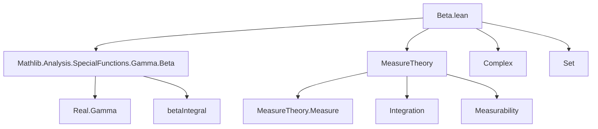
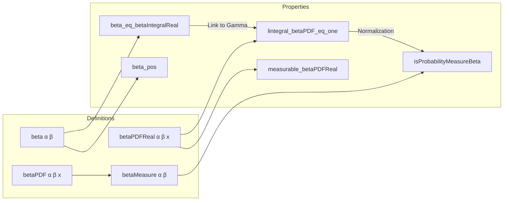

**Technical Brief: `Beta.lean` — Formalization of Beta Distribution over ℝ**

---

### 1. **Key Definitions & Theorems**

| Name | Type / Signature | Purpose |
|------|------------------|---------|
| `beta α β` | `ℝ → ℝ → ℝ` | Normalizing constant: $\frac{\Gamma(\alpha)\Gamma(\beta)}{\Gamma(\alpha+\beta)}$ |
| `beta_pos` | `0 < α → 0 < β → 0 < beta α β` | Positivity of the beta normalizing constant |
| `beta_eq_betaIntegralReal` | `0 < α → 0 < β → beta α β = (βIntegral α β).re` | Relates `beta` to the real part of the complex beta integral |
| `betaPDFReal α β x` | `ℝ → ℝ → ℝ → ℝ` | Real-valued PDF: $(1/\beta(\alpha,\beta)) x^{\alpha-1}(1-x)^{\beta-1}$ on $(0,1)$, else $0$ |
| `betaPDF α β x` | `ℝ → ℝ → ℝ → ℝ≥0∞` | ENNReal-valued PDF: `ENNReal.ofReal (betaPDFReal α β x)` |
| `betaPDF_eq` | definitionally equal to piecewise expression | Simplifies `betaPDF` to explicit form |
| `betaPDF_eq_zero_of_nonpos`, `betaPDF_eq_zero_of_one_le` | `x ≤ 0` / `1 ≤ x ⇒ betaPDF = 0` | Support characterization |
| `betaPDF_of_pos_lt_one` | `0 < x < 1 ⇒ betaPDF = ...` | Explicit value on interior of support |
| `lintegral_betaPDF` | equality of lintegral over ℝ and over `Ioo 0 1` | Reduces integration to support |
| `betaPDFReal_pos` | `0 < x < 1 ∧ 0 < α, β ⇒ 0 < betaPDFReal ...` | Positivity of PDF on interior |
| `measurable_betaPDFReal`, `stronglyMeasurable_betaPDFReal` | measurability properties | Ensures integrability and measure-theoretic validity |
| `lintegral_betaPDF_eq_one` | `0 < α, β ⇒ ∫⁻ betaPDF = 1` | PDF integrates to 1 — confirms it's a valid density |
| `betaMeasure α β` | `Measure ℝ` | Measure defined via density w.r.t. Lebesgue measure |
| `isProbabilityMeasureBeta` | `0 < α, β ⇒ IsProbabilityMeasure (betaMeasure α β)` | Confirms `betaMeasure` is a probability measure |

---

### 2. **Naming Conventions**

- **Prefixes**:
  - `beta` — core module prefix for all definitions/lemmas.
  - `betaPDFReal` / `betaPDF` — distinction between real-valued and ENNReal-valued PDFs.
  - `isProbabilityMeasure...` — standard Lean/MeasureTheory pattern for probability measure proofs.
- **Suffixes**:
  - `_pos`, `_eq_zero`, `_of_pos_lt_one` — describe domain conditions.
  - `_measurable`, `_stronglyMeasurable` — measurability properties.
  - `_eq_one`, `_eq_zero` — normalization or vanishing results.
- **Constants**:
  - `alpha`, `beta`, `x` — standard parameter names for shape parameters and variable.

---

### 3. **Tactic Stack**

Frequently used tactics in this file:

| Tactic | Role |
|--------|------|
| `rw` / `simp_rw` | Rewriting definitions, especially `beta`, `betaPDF_eq`, `betaPDFReal` |
| `simp` | Simplifying conditionals (`if ... then ... else ...`), using lemmas like `betaPDF_eq_zero_of_nonpos` |
| `field_simp` | Simplifying division expressions, especially with `beta_pos` |
| `linarith` | Handling linear arithmetic for inequalities (e.g., positivity of $x$, $1-x$, $\alpha$, $\beta$) |
| `norm_cast` | Moving between `ℝ`, `ℝ≥0∞`, `ℂ` via coercion |
| `convert` + `using 1` | Matching goals up to definitional equality (e.g., positivity → ≤ 1) |
| `fun_prop` | Proving measurability of functions built from measurable primitives |
| `aesop` (implicit via `linarith`, `simp`, etc.) | Not explicitly used, but similar automation via `linarith`/`norm_num` |
| `intervalIntegral.integral_of_le`, `setIntegral_congr_fun`, `setLIntegral_congr_fun` | Measure-theoretic integral manipulations |
| `RCLike.re_to_complex`, `Complex.re_mul_ofReal`, `← integral_re` | Bridging real and complex analysis (via `betaIntegral`) |

---

### 4. **Proof Logic Flow**

The core proof structure follows this pattern:

1. **Define** `beta`, `betaPDFReal`, `betaPDF`.
2. **Establish support properties** (`betaPDF = 0` outside $(0,1)$).
3. **Show positivity** of `betaPDFReal` on $(0,1)$ using `Real.rpow_pos_of_pos`.
4. **Prove measurability** of `betaPDFReal` via `Measurable.ite` and `fun_prop`.
5. **Reduce integral** over ℝ to integral over `Ioo 0 1` using `lintegral_betaPDF`.
6. **Normalize**: Show $\int \text{betaPDF} = 1$:
   - Use `← ENNReal.toReal_eq_one_iff` to reduce to real integral.
   - Apply `integral_const_mul`, `field_simp`, and `beta_eq_betaIntegralReal`.
   - Use `betaIntegral` convergence and equality with Gamma ratio.
   - Handle complex-to-real translation via `← integral_re`, `RCLike.re_to_complex`.
7. **Define `betaMeasure`** as `volume.withdensity betaPDF`.
8. **Verify** it's a probability measure via `isProbabilityMeasureBeta`.

Induction is not used; the proofs rely on:
- Case analysis on support (`if ... then ... else ...`)
- Measurability and integrability lemmas from `MeasureTheory`
- Properties of `Gamma`, `betaIntegral`, and `rpow` from `Mathlib.Analysis.SpecialFunctions.Gamma.Beta`

---

### 5. **Imports & Dependencies**

| Import | Role |
|--------|------|
| `Mathlib.Analysis.SpecialFunctions.Gamma.Beta` | Provides `Real.Gamma`, `betaIntegral`, `beta_eq_betaIntegralReal`, convergence lemmas |
| `MeasureTheory` | `lintegral`, `withDensity`, `measurable`, `aestronglyMeasurable`, `setLIntegral`, `intervalIntegral` |
| `Complex`, `Set` | For complex analysis and set operations (e.g., `Ioo`, `Ioc`) |
| `ENNReal`, `NNReal` (scoped) | For extended nonnegative reals in PDF definition |

---

### 6. **Mermaid Diagrams**

#### **Dependency Graph (Module-Level)**

#### **Overview of Theory Flow**

---

### Summary

This file formalizes the **beta distribution** on $\mathbb{R}$, including:
- Its **PDF** (both real and ENNReal versions),
- **Measurability** and **positivity**,
- **Normalization** (integral = 1),
- And the induced **probability measure**.

It leverages deep connections between the **beta function**, **gamma function**, and **complex analysis**, and is fully compatible with Lean’s `MeasureTheory` library. The naming and structure follow Lean’s standard conventions for probability theory formalizations.
