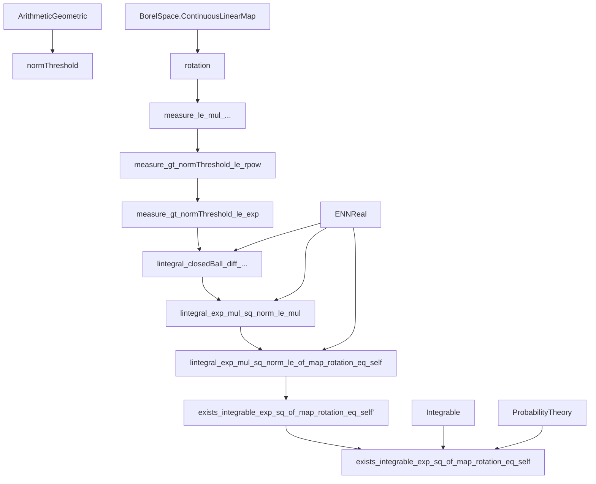

Here is the **technical metadata extraction** for the `Fernique.lean` file:

---

### 1. **Key Definitions & Theorems**

| Name | Type / Signature | Purpose |
|------|------------------|---------|
| `ContinuousLinearMap.rotation (θ : ℝ)` | `E × E →L[ℝ] E × E` | Rotation by angle `θ` in the product space `E × E`. |
| `normThreshold (a : ℝ)` | `ℕ → ℝ` | Threshold sequence defined via arithmetic–geometric recurrence: `t₀ = a`, `tₙ₊₁ = √2 · tₙ + a`. Used to partition space into annuli. |
| `logRatio (c : ℝ≥0∞)` | `ℝ` | `log(c / (1 − c)) / (8(1 + √2)²)`; appears in exponent of integrability bound. |
| `measure_le_mul_measure_gt_le_of_map_rotation_eq_self` | `μ {‖x‖ ≤ a} * μ {b < ‖x‖} ≤ μ {(b−a)/√2 < ‖x‖}²` | Core inequality derived from rotation invariance of `μ × μ`. |
| `measure_gt_normThreshold_le_rpow` | `μ {tₙ < ‖x‖} ≤ c · ((1−c)/c)^{2ⁿ}` | Exponential decay bound on tail measures using recurrence and induction. |
| `measure_gt_normThreshold_le_exp` | `μ {tₙ < ‖x‖} ≤ c · exp(−log(c/(1−c))·2ⁿ)` | Refinement using `exp` and `logRatio`. |
| `lintegral_closedBall_diff_exp_logRatio_mul_sq_le` | Bound on integral over annulus `{tₙ < ‖x‖ ≤ tₙ₊₁}` | Key step: bounding contribution per annulus using previous tail bounds. |
| `lintegral_exp_mul_sq_norm_le_mul` | `∫⁻ exp(C·‖x‖²) dμ ≤ c·(exp(logRatio c') + Σₙ exp(−½ log(c'/(1−c'))·2ⁿ))` | Intermediate integrability bound for probability measures. |
| `lintegral_exp_mul_sq_norm_le_of_map_rotation_eq_self` | `∫⁻ exp(logRatio c·a⁻²·‖x‖²) dμ ≤ exp(logRatio c) + Σₙ exp(−½ log(c/(1−c))·2ⁿ)` | Main intermediate result: uniform bound (independent of `a`). |
| `exists_integrable_exp_sq_of_map_rotation_eq_self'` | `∃ C > 0, integrable(exp(C·‖x‖²), μ)` | Existence of integrable Gaussian-type function under extra assumptions (`0 < a`, `½ < μ(Bₐ) < 1`). |
| `exists_integrable_exp_sq_of_map_rotation_eq_self` | `∃ C > 0, integrable(exp(C·‖x‖²), μ)` | **Fernique’s theorem**: for any finite `μ` with `μ×μ` rotation-invariant. |

---

### 2. **Naming Conventions**

- **Prefixes**:
  - `measure_...`: lemmas about measure inequalities (e.g., `measure_le_mul_measure_gt_le_of_map_rotation_eq_self`)
  - `normThreshold_...`: properties of the threshold sequence
  - `logRatio_...`: properties of `logRatio`, e.g., positivity, monotonicity
  - `lintegral_...`: integral bounds (often using `ENNReal.ofReal` and `rexp`)
  - `exists_...`: existence results (e.g., `exists_integrable_exp_sq_of_map_rotation_eq_self`)
- **Suffixes**:
  - `_le`, `_lt`, `_eq`: inequality direction or equality condition
  - `_of_map_rotation_eq_self`: condition that `μ × μ` is invariant under rotation by `−π/4`
  - `_of_isProbabilityMeasure`, `_of_isFiniteMeasure`: assumptions on `μ`
- **Variables**:
  - `a`, `b`: radii / thresholds
  - `c`, `c'`: lower bounds on `μ(Bₐ)`
  - `n`: natural index for sequence `tₙ`
  - `C`: integrability constant

---

### 3. **Tactic Stack**

Frequently used tactics in this file:

| Tactic | Role |
|--------|------|
| `simp` / `simp only` | Simplification of set expressions, measure definitions, arithmetic |
| `gcongr` | Monotonicity reasoning for inequalities involving `≤`, `*`, `^`, `ENNReal.ofReal`, `rexp` |
| `rw` / `congr` / `congr!` | Rewriting equalities, especially in set expressions and function bounds |
| `field_simp`, `ring`, `norm_num` | Algebraic simplifications (especially for `√2`, powers, logs) |
| `calc` / `trans` | Chain of inequalities/equalities (core proof structure) |
| `induction` | Induction on `n` for tail decay bounds |
| `by_cases` / `by_contra` | Case splits (e.g., `μ(Bₐ) = 1`, `a = 0`) |
| `filter_upwards`, `ae_iff_prob_eq_one` | Almost-everywhere reasoning |
| `fun_prop`, `measurableSet_...` | Measurability proofs |
| `lintegral_const`, `lintegral_mono`, `lintegral_iUnion_le` | Properties of extended integral (`∫⁻`) |
| `ENNReal.*` lemmas (`inv_mul_cancel`, `tsum_mul_left`, etc.) | ENNReal arithmetic manipulations |

---

### 4. **Proof Logic**

The proof follows a **structured decomposition**:

1. **Reduction to probability case**:
   - If `μ` is finite but not probability, rescale to `μ' = μ / μ(E)`.

2. **Two regimes**:
   - **Case A**: There exists `a > 0` with `½ < μ(Bₐ) < 1`.  
     → Use sequence `tₙ`, annuli decomposition, and exponential decay of `μ({tₙ < ‖x‖})`.
   - **Case B**: No such `a` exists ⇒ `∃b, μ(B_b) = 1`.  
     → Then `exp(‖x‖²)` is essentially bounded ⇒ integrable with `C = 1`.

3. **Core argument (Case A)**:
   - Use rotation invariance to derive inequality:
     $$
     μ(B_a)·μ(\{b < \|x\|\}) ≤ μ\left(\left\{\frac{b-a}{\sqrt{2}} < \|x\|\right\}\right)^2
     $$
   - Define `tₙ` so that this yields recurrence:
     $$
     μ(B_a)·μ(\{t_{n+1} < \|x\|\}) ≤ μ(\{t_n < \|x\|\})^2
     $$
   - Solve recurrence to get exponential decay:
     $$
     μ(\{t_n < \|x\|\}) ≤ c·\left(\frac{1−c}{c}\right)^{2^n}
     $$
   - Bound integral over annulus `{tₙ < ‖x‖ ≤ tₙ₊₁}` using:
     - Supremum of `exp(C·‖x‖²)` on the annulus (`≈ exp(C·tₙ₊₁²)`)
     - Measure bound above
   - Sum over `n`: geometric-like decay in `2ⁿ` ensures convergence.

4. **Conclusion**:
   - Derive explicit bound on `∫⁻ exp(C·‖x‖²) dμ` in terms of `c = μ(B_a)`, independent of `a`.
   - Conclude existence of some `C > 0` with integrability.

---

### 5. **Imports & Dependencies**

| Module | Purpose |
|--------|---------|
| `Mathlib.Analysis.SpecificLimits.ArithmeticGeometric` | Defines `arithGeom` sequence and its properties (monotonicity, growth). |
| `Mathlib.MeasureTheory.Constructions.BorelSpace.ContinuousLinearMap` | Measurability of linear maps, pushforwards, Borel structure. |
| `Mathlib.MeasureTheory.Function.L1Space.Integrable` | Integrability criteria, `HasFiniteIntegral`, `Integrable`. |

Also uses:
- `MeasureTheory.Measure.Prod` (via `μ.prod μ`)
- `MeasureTheory.Measure.Restrict`, `lintegral`, `ENNReal`
- `Topology.Basic`, `MetricSpace`, `NormedSpace`, `SecondCountableTopology`
- `Real`, `Complex`, `NNReal`, `ENNReal`, `ProbabilityTheory`

---

### 6. **Mermaid Diagrams**

#### **Dependency Graph (High-Level)**

#### **Overview of File Structure**

---

Let me know if you'd like a **dependency graph of theorems** (e.g., which lemmas depend on which), or a **proof outline diagram** with proof steps.
