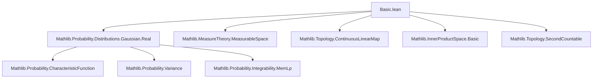
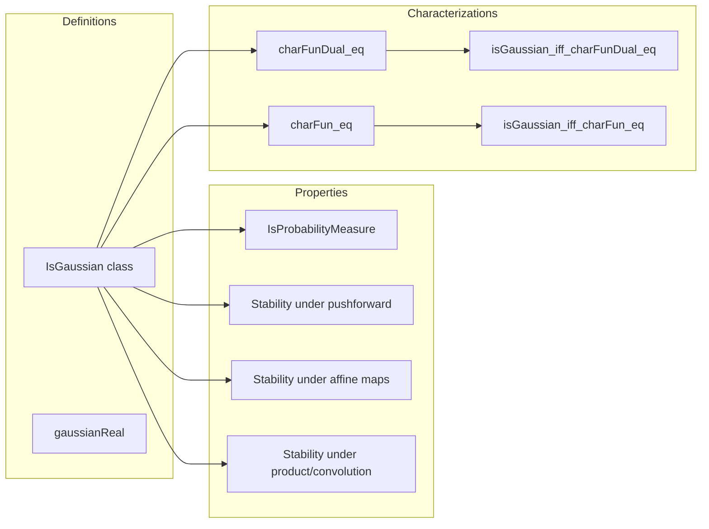

Here is a structured technical brief extracted from the provided Lean 4 file `Basic.lean`, focusing on formal metadata for building a domain-specific AI agent.

---

### **1. Key Definitions & Theorems**

| Name | Type / Signature | Purpose |
|------|------------------|---------|
| `IsGaussian` | `class IsGaussian (μ : Measure E) : Prop` | Defines a measure `μ` on a Banach space `E` as *Gaussian* if for every continuous linear functional `L : StrongDual ℝ E`, the pushforward `μ.map L` is a real Gaussian measure `gaussianReal (μ[L]) (Var[L; μ]).toNNReal`. |
| `IsGaussian.toIsProbabilityMeasure` | `instance` | Shows any Gaussian measure is a probability measure (i.e., total mass = 1). |
| `isGaussian_gaussianReal` | `instance` | Real Gaussian measures `gaussianReal m v` are Gaussian in the abstract sense. |
| `IsGaussian.eq_gaussianReal` | `lemma` | Characterizes Gaussian measures on `ℝ` as exactly `gaussianReal`. |
| `isGaussian_of_isGaussian_map` | `lemma` | Sufficient condition: if all pushforwards by continuous linear forms are Gaussian, then the original measure is Gaussian. |
| `isGaussian_of_map_eq_gaussianReal` | `lemma` | Alternative sufficient condition: if each pushforward is *some* real Gaussian, then the measure is Gaussian. |
| `isGaussian_map_of_measurable` | `lemma` | Pushforward of a Gaussian measure by a *measurable* continuous linear map is Gaussian. |
| `isGaussian_map` | `instance` | Pushforward by any continuous linear map (no measurability assumption needed, assuming Borel space structure). |
| `isGaussian_map_equiv` | `instance` | Pushforward by a continuous linear equivalence is Gaussian. |
| `isGaussian_map_equiv_iff` | `lemma` | Equivalence: `μ` is Gaussian iff `μ.map L` is Gaussian for a continuous linear equivalence `L`. |
| `IsGaussian.charFunDual_eq` | `lemma` | Characteristic functional of a Gaussian measure: `charFunDual μ L = exp(μ[L]·i − Var[L;μ]/2)`. |
| `isGaussian_iff_charFunDual_eq` | `theorem` | Characterization: finite `μ` is Gaussian iff its characteristic functional has the above exponential form for all `L`. |
| `IsGaussian.charFun_eq` | `lemma` | Specialization of `charFunDual_eq` to inner product spaces using `⟪t, x⟫`. |
| `isGaussian_iff_charFun_eq` | `lemma` | In complete inner product spaces, Gaussianity ⇔ characteristic function has the above form for all `t ∈ E`. |
| `isGaussian_conv` | `instance` | Convolution of two Gaussian measures is Gaussian (requires second countability). |
| `isGaussian_map_add_const`, `isGaussian_map_neg`, `isGaussian_map_sub_const`, etc. | `instance` | Stability under translations, reflections, and affine transformations. |
| `isGaussian_prod` | `instance` | Product of Gaussian measures (on product space with `SecondCountableTopologyEither`) is Gaussian. |

---

### **2. Naming Conventions**

- **Predicates / Properties**:
  - `isGaussian_*`: predicates or instances asserting Gaussianity.
  - `*_map_*`: pushforwards under maps.
  - `*_conv`, `*_prod`: convolution and product operations.
  - `*_add_const`, `*_sub_const`, `*_neg`: affine transformations.

- **Functional Analysis**:
  - `StrongDual ℝ E`: dual space of continuous linear forms.
  - `E →L[ℝ] F`: continuous linear maps.
  - `E ≃L[ℝ] F`: continuous linear equivalences.

- **Measure-Theoretic**:
  - `μ[L]`: expectation of `L` under `μ`, i.e., `∫ x, L x ∂μ`.
  - `Var[L; μ]`: variance of `L` under `μ`.
  - `gaussianReal m v`: real Gaussian distribution with mean `m` and variance `v`.

- **Functional Characterizations**:
  - `charFunDual`: characteristic functional (Fourier transform on dual space).
  - `charFun`: characteristic function (Fourier transform on the space itself, in inner product case).

- **Suffixes**:
  - `_dual`: refers to dual space / continuous linear forms.
  - `_map`: pushforward.
  - `_equiv`: equivalence / invertible map.
  - `_conv`, `_prod`: convolution / product.

---

### **3. Tactic Stack**

Frequently used tactics in proofs:

| Tactic | Usage |
|--------|-------|
| `rw` | Rewriting definitions (e.g., `IsGaussian.map_eq_gaussianReal`, `charFunDual_eq_charFun_map_one`). |
| `simp` / `simp only` | Simplifying using lemmas about pushforwards, integrals, variance, Gaussian laws. |
| `congr` | Proving equality of expressions by congruence (e.g., after `exp` or `integral`). |
| `field_simp` | Simplifying field expressions (e.g., division, multiplication by inverses). |
| `norm_cast` | Moving between `ℝ`, `ℝ≥0`, `ℝ≥0∞`, and complex scalars. |
| `ring` | Simplifying polynomial expressions in reals. |
| `fun_prop` | Proving measurability / continuity of maps (e.g., `Measurable L`, `Measurable (L ∘ f)`). |
| `have`, `suffices`, `exact`, `apply` | Standard proof structuring. |
| `convert` | Matching goals up to definitional equality (e.g., with `memLp_id_gaussianReal`). |
| `ext` | Extensionality for measures (via characteristic functions). |
| `rw [Measure.map_map, Measure.map_apply]` | Rewriting pushforward compositions. |
| `calc` | Chain of equalities (e.g., in `charFunDual_eq`). |

---

### **4. Proof Logic**

- **Structure of Gaussianity proofs**:
  1. **Definitional reduction**: Use `IsGaussian.map_eq_gaussianReal` to reduce to verifying pushforwards are real Gaussians.
  2. **Pushforward calculus**: Use lemmas like `Measure.map_map`, `integral_map`, `variance_map`, `gaussianReal_map_continuousLinearMap`.
  3. **Characteristic functional approach**: For equivalence proofs (`isGaussian_iff_*`), show:
     - `→`: Use `charFunDual_eq` + definition.
     - `←`: Use `Measure.ext_of_charFun` + explicit computation of `charFun` of pushforward.
  4. **Stability properties**:
     - *Affine invariance*: Translate or reflect → use `variance_add_const`, `integral_add`, etc.
     - *Product/convolution*: Use factorization of integrals over product spaces, variance additivity, and `gaussianReal_conv_gaussianReal`.

- **Induction / recursion**: Not used — all arguments are direct or rely on measure-theoretic uniqueness (e.g., via characteristic functions).

- **Key logical pattern**:
  ```lean
  refine ⟨fun h ↦ ?, fun h ↦ ⟨fun L ↦ Measure.ext_of_charFun ?_⟩⟩
  ```
  i.e., prove biconditionals by splitting into two directions, using characteristic functions for the nontrivial direction.

---

### **5. Imports & Dependencies**

- **Primary import**:
  ```lean
  import Mathlib.Probability.Distributions.Gaussian.Real
  ```
  Provides `gaussianReal`, `charFun_gaussianReal`, `integral_gaussianReal`, `variance_gaussianReal`, etc.

- **Core dependencies**:
  - `MeasureTheory`: `Measure`, `map`, `conv`, `prod`, `integral`, `MemLp`, `Integrable`, `variance`.
  - `Complex`: `exp`, `I`, `ofReal`.
  - `TopologicalSpace`, `AddCommMonoid`, `Module ℝ`: for Banach space structure.
  - `StrongDual`, `ContinuousLinearMap`, `ENNReal`, `NNReal`: functional analysis.
  - `InnerProductSpace`, `BorelSpace`, `SecondCountableTopology`: for inner product and topological refinements.

- **Notable submodules used**:
  - `MeasureTheory.Measure.Map`
  - `MeasureTheory.Measure.Convolution`
  - `MeasureTheory.Measure.ProbabilityMeasure`
  - `Mathlib.Probability.CharacteristicFunction`

---

### **6. Mermaid Diagrams**

#### **Dependency Graph (Module-Level)**



#### **Overview of Theory Flow**



---

Let me know if you'd like a **Lean-specific AI agent prompt** or a **proof strategy recommender** based on this metadata.
