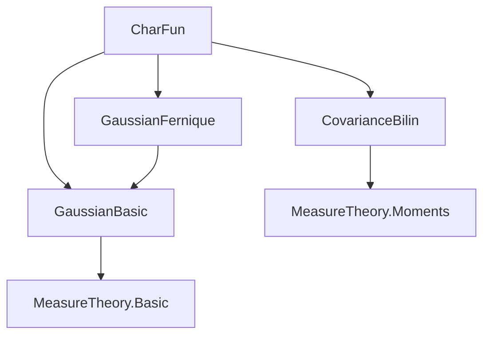
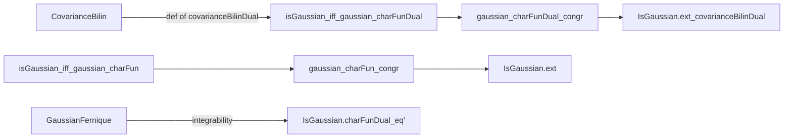

### Technical Brief: `CharFun.lean`

---

#### **1. Key Definitions & Theorems**

| Name | Type / Signature | Purpose |
|------|------------------|---------|
| `IsGaussian.charFunDual_eq'` | `[IsGaussian μ] → charFunDual μ L = exp ((L μ[id]) * I - covarianceBilinDual μ L L / 2)` | Computes the dual characteristic function of a Gaussian measure explicitly in terms of its mean and dual covariance. |
| `isGaussian_iff_gaussian_charFunDual` | `[IsFiniteMeasure μ] → IsGaussian μ ↔ ∃ m f, f.toBilinForm.IsPosSemidef ∧ ∀ L, charFunDual μ L = exp (L m * I - f L L / 2)` | Characterizes Gaussian measures via their dual characteristic functions: existence of a mean $m$ and positive semidefinite bilinear form $f$ such that the characteristic function has Gaussian form. |
| `gaussian_charFunDual_congr` | `[IsFiniteMeasure μ] → (∀ L, charFunDual μ L = exp (L m * I - f L L / 2)) → m = ∫ x, x ∂μ ∧ f = covarianceBilinDual μ` | Uniqueness: if a finite measure has Gaussian dual characteristic function, then its parameters must be the actual mean and dual covariance. |
| `IsGaussian.ext_covarianceBilinDual` | `[IsGaussian μ] [IsGaussian ν] → μ[id] = ν[id] → covarianceBilinDual μ = covarianceBilinDual ν → μ = ν` | Two Gaussian measures are equal if they share the same mean and dual covariance. |
| `IsGaussian.ext_iff_covarianceBilinDual` | `[IsGaussian μ] [IsGaussian ν] → μ = ν ↔ μ[id] = ν[id] ∧ covarianceBilinDual μ = covarianceBilinDual ν` | Equivalence version of the above: equality of Gaussian measures is equivalent to equality of mean and dual covariance. |
| `IsGaussian.charFun_eq'` | `[InnerProductSpace ℝ E] [IsGaussian μ] → charFun μ t = exp (⟪t, μ[id]⟫ * I - covarianceBilin μ t t / 2)` | Hilbert-space version of the dual formula: characteristic function in terms of inner product with mean and covariance bilinear form. |
| `isGaussian_iff_gaussian_charFun` | `[InnerProductSpace ℝ E] [IsFiniteMeasure μ] → IsGaussian μ ↔ ∃ m f, f.toBilinForm.IsPosSemidef ∧ ∀ t, charFun μ t = exp (⟪t, m⟫ * I - f t t / 2)` | Hilbert-space analog of `isGaussian_iff_gaussian_charFunDual`. |
| `gaussian_charFun_congr` | `[InnerProductSpace ℝ E] [IsFiniteMeasure μ] → (∀ t, charFun μ t = exp (⟪t, m⟫ * I - f t t / 2)) → m = ∫ x, x ∂μ ∧ f = covarianceBilin μ` | Uniqueness in Hilbert space: Gaussian characteristic function implies parameters are expectation and covariance. |
| `IsGaussian.ext` / `IsGaussian.ext_iff` | `[InnerProductSpace ℝ E] [IsGaussian μ] [IsGaussian ν]` | Hilbert-space specialization of extensionality via covariance. |

---

#### **2. Naming Conventions**

- **Prefixes**:
  - `isGaussian_`: iff-characterizations of Gaussianity.
  - `gaussian_`: uniqueness/congruence lemmas for Gaussian forms.
  - `IsGaussian.`: properties of *already known* Gaussian measures.
- **Suffixes**:
  - `_dual`: statements in terms of the strong dual space (Banach setting).
  - No suffix (e.g., `charFun_eq'`, `covarianceBilin`): Hilbert space setting.
- **Bilinear forms**:
  - `covarianceBilinDual μ`: dual covariance (on `StrongDual ℝ E`).
  - `covarianceBilin μ`: covariance (on `E`, via Riesz representation in Hilbert case).
- **Mean**:
  - `μ[id]`: expectation (Bochner integral of identity function).

---

#### **3. Tactic Stack**

Frequent tactics used:
- `rw`, `simp_rw`, `simp`: rewriting and simplification using definitions and lemmas.
- `exact`, `refine`, `apply`: constructing proofs via lemmas.
- `ext`: extensionality for functions/measures.
- `field_simp`, `ring`, `norm_cast`: arithmetic simplifications over ℂ/ℝ.
- `fun_prop`: proving continuity in topological contexts.
- `choose`, `have`, `let`: local proof construction.
- `congrm`, `congr`: congruence reasoning.
- `Int.cast_inj`, `Complex.ext_iff`, `sub_re`, `mul_re`, etc.: component-wise reasoning over ℂ.

---

#### **4. Proof Logic**

- **Structure of main proofs**:
  - **`isGaussian_iff_gaussian_charFunDual`**:
    - *→*: Use known formula `IsGaussian.charFunDual_eq'` to witness $m = \mu[id]$, $f = \text{covarianceBilinDual}~\mu$.
    - *←*: Show that if the characteristic function matches a Gaussian one, then the pushforward by any dual vector $L$ is a real Gaussian measure (via `isGaussian_of_map_eq_gaussianReal`), then apply `Measure.ext_of_charFun`.
  - **`gaussian_charFunDual_congr`**:
    - Use `isGaussian_iff_gaussian_charFunDual.2` to deduce Gaussianity.
    - Compare two expressions for `charFunDual μ L`, use injectivity of `exp` up to $2\pi i \mathbb{Z}$ to get a continuous integer-valued function → constant → zero.
    - Extract real/imag parts to recover equality of mean and covariance.
  - **Hilbert case**:
    - Reduce to dual case via `InnerProductSpace.toDualMap` / `toDual`, using Riesz representation.
    - Use `bilinearComp` to transport bilinear forms between $E$ and its dual.

- **Induction**: Not used.
- **Cases**: Rare; mostly functional extensionality and bilinear form extensionality.

---

#### **5. Imports & Dependencies**

| Import | Role |
|--------|------|
| `Mathlib.Probability.Distributions.Gaussian.Basic` | Core definitions: Gaussian measures, mean, covariance. |
| `Mathlib.Probability.Moments.CovarianceBilin` | Covariance bilinear forms (dual and primal). |
| `Mathlib.Probability.Distributions.Gaussian.Fernique` | Fernique’s theorem (used implicitly for integrability/finite moments). |

---

#### **6. Mermaid Diagrams**

##### **Dependency Graph (Module-Level)**



##### **Overview of Theory Flow**

```mermaid
flowchart LR
  A[Measure μ on Banach space E] --> B{Is μ Gaussian?}
  B -->|Yes| C[charFunDual μ L = exp(L m i - f L L / 2)]
  B -->|No| D[No such m,f]
  C --> E[m = ∫x x dμ, f = covarianceBilinDual μ]
  E --> F[Uniqueness & Extensionality]
  C --> G[Same for Hilbert: charFun μ t = exp(⟨t,m⟩i - f t t / 2)]
  G --> H[covarianceBilin instead of dual]
```

##### **Logical Dependencies (Key Lemmas)**



---

#### **7. Summary**

This file establishes a **complete characterization** of Gaussian measures via their characteristic functions, both in the general Banach space setting and in Hilbert spaces. It proves:

- **Existence**: A finite measure is Gaussian iff its characteristic function has the standard Gaussian exponential form.
- **Uniqueness**: The parameters $m$ and $f$ are uniquely determined and equal to the expectation and covariance.
- **Extensionality**: Two Gaussian measures are equal iff their means and covariances agree.

The proofs rely heavily on:
- Properties of Bochner integrals,
- Continuity and linearity of dual maps,
- Injectivity of the complex exponential modulo $2\pi i \mathbb{Z}$,
- Riesz representation in Hilbert spaces.

It serves as a foundational bridge between measure-theoretic Gaussianity and analytic properties of characteristic functions.
