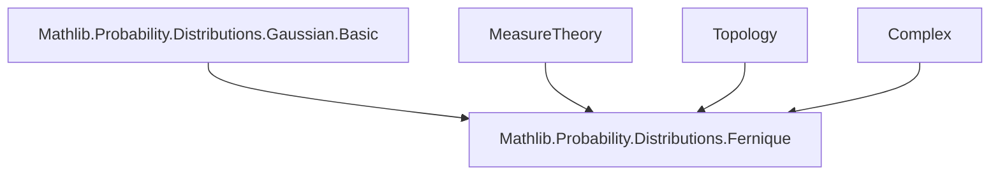
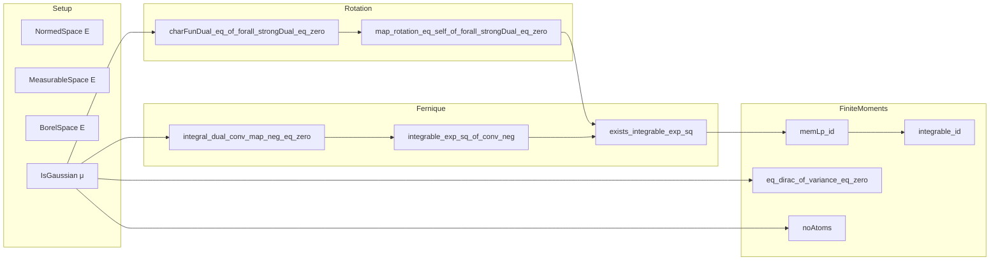

### Technical Brief: `Fernique.lean`

---

#### **1. Key Definitions & Theorems**

| Name | Type / Signature | Purpose |
|------|------------------|---------|
| `charFunDual_eq_of_forall_strongDual_eq_zero` | `∀ L, μ[L] = 0 → charFunDual μ L = exp (-Var[L; μ] / 2)` | Computes the characteristic functional of a centered Gaussian measure via strong dual integrals. |
| `map_rotation_eq_self_of_forall_strongDual_eq_zero` | `[SecondCountableTopology E] [CompleteSpace E] → (∀ L, μ[L] = 0) → μ.prod μ` is rotation-invariant | Shows product of centered Gaussian measure with itself is rotationally invariant. |
| `integral_dual_conv_map_neg_eq_zero` | `(μ ∗ μ.map neg)[L] = 0` | Proves convolution of `μ` with its reflection is centered. |
| `integrable_exp_sq_of_conv_neg` | `Integrable (rexp (C * ‖·‖²)) (μ ∗ μ.map neg) ⇒ Integrable (rexp (C' * ‖·‖²)) μ` for `0 < C' < C` | Key step: transfers integrability of exponential square from centered convolution back to `μ`. |
| `exists_integrable_exp_sq` (**Fernique’s theorem**) | `∃ C > 0, Integrable (rexp (C * ‖·‖²)) μ` | Main result: existence of exponential square integrability for Gaussian measures on separable Banach spaces. |
| `memLp_id` | `MemLp id p μ` for all finite `p` | Gaussian measures have finite moments of all orders. |
| `eq_dirac_of_variance_eq_zero` | `∀ L, Var[L; μ] = 0 ⇒ μ = dirac (∫ x, x ∂μ)` | Characterizes Dirac measures among Gaussians via zero variance. |
| `noAtoms` | `¬∃ x, μ ≠ dirac x ⇒ NoAtoms μ` | Non-Dirac Gaussian measures are atomless. |
| `charFunDual_eq_of_integral_eq_zero` | `μ[id] = 0 ⇒ charFunDual μ L = exp(-Var[L; μ]/2)` | Simplified version of the characteristic functional when first moment exists and vanishes. |
| `map_rotation_eq_self` | `μ[id] = 0 ⇒ μ.prod μ` is rotation-invariant | Same as above but using `μ[id] = 0` instead of strong dual condition. |

---

#### **2. Naming Conventions**

- **Prefixes**:
  - `charFunDual_`: characteristic functional-related lemmas.
  - `map_`: pushforward/measure transformation lemmas.
  - `integral_`: integrals over dual spaces or under Gaussian measures.
  - `integrable_`: integrability conditions (especially exponential).
  - `memLp_`: membership in $L^p$ spaces.
  - `variance_`, `covariance_`: variance/covariance identities.

- **Suffixes**:
  - `_eq_zero`: hypotheses or conclusions involving zero integrals/variances.
  - `_of_`: conditional versions (e.g., `of_forall_strongDual_eq_zero`, `of_conv_neg`).
  - `_self`: invariance under some operation (e.g., `map_rotation_eq_self`).
  - `_id`: identity map-related (e.g., `memLp_id`, `integral_dual`).

- **General pattern**: `action_subject_condition` or `result_condition`.

---

#### **3. Tactic Stack**

Frequently used tactics in this file:

| Tactic | Usage |
|--------|-------|
| `simp_rw` | Rewriting with simplification (e.g., simplifying compositions and maps). |
| `rw` | Standard rewriting using equalities. |
| `congr` / `congr'` | Congruence reasoning (especially for functional equalities). |
| `norm_cast` | Cast simplifications between real/complex/extended reals. |
| `grind` / `gcongr` | Goal-directed simplification and monotonicity reasoning (custom or derived from `grw`). |
| `ring` | Algebraic simplification of polynomial expressions. |
| `grw` | Goal-directed rewriting (likely a custom tactic for normed spaces). |
| `filter_upwards` | Filtering almost-everywhere statements. |
| `convert` | Goal-directed unification with leeway. |
| `fun_prop` | Proving measurability/finiteness for integration (e.g., `by fun_prop`). |
| `aesop` | Not explicitly used here, but `grind`/`grw` likely serve similar roles. |
| `simp only [...]` | Precise simplification with explicit lemmas. |

---

#### **4. Proof Logic**

The logical flow follows a **two-stage strategy**:

1. **Rotation Invariance & Centered Convolution**:
   - Show that for centered Gaussian `μ`, the product `μ × μ` is rotation-invariant.
   - Use characteristic functions to reduce to algebraic identities involving variance and covariance.
   - Prove that the convolution `μ ∗ μ ∘ neg` is centered.

2. **Fernique’s Theorem via Approximation**:
   - Use rotation invariance to apply a known version of Fernique’s theorem for centered measures (via `exists_integrable_exp_sq_of_map_rotation_eq_self`).
   - Transfer integrability from the centered convolution back to `μ` using a clever inequality (based on Young’s inequality / convexity).
   - Derive finite moments via exponential integrability and properties of the integrable exponential set.

3. **Finite Moments & Structure Theory**:
   - Use `memLp_id` to deduce all $L^p$-integrability of the identity.
   - Derive structural properties: Dirac characterization, atomlessness, integral formula for dual elements.

---

#### **5. Imports & Dependencies**

| Module | Role |
|--------|------|
| `Mathlib.Probability.Distributions.Fernique` | Main module being formalized. |
| `Mathlib.Probability.Distributions.Gaussian.Basic` | Core Gaussian measure theory: definitions, variance, characteristic functions. |
| `MeasureTheory`, `ProbabilityTheory`, `Complex` | Measure-theoretic foundations, complex analysis for characteristic functions. |
| `ENNReal`, `NNReal`, `Real`, `Topology` | Extended reals for integrability bounds, topology for Borel structures. |

---

#### **6. Mermaid Diagrams**

##### **Dependency Graph (High-Level)**

##### **Overview of `Fernique.lean`**

---

#### **7. Summary**

This file formalizes **Fernique’s theorem** in Lean 4: for any Gaussian measure `μ` on a second-countable Banach space, there exists $C > 0$ such that $x \mapsto e^{C\|x\|^2}$ is $\mu$-integrable. The proof leverages:
- **Rotation invariance** of `μ × μ` for centered `μ`,
- **Convolution symmetry** (`μ ∗ μ ∘ neg` is centered),
- **Convexity-based inequalities** to lift integrability from the convolution to `μ`,
- **Exponential integrability** to deduce finite moments of all orders.

The formalization is highly structured, with clear separation of:
- **Rotation theory** (characteristic functions, invariance),
- **Fernique’s argument** (convolution trick),
- **Consequences** (moments, atomlessness, Dirac characterization).

It exemplifies modern Lean 4 proof engineering: leveraging `MeasureTheory`, `ProbabilityTheory`, and `Topology` libraries with careful tactic orchestration.
