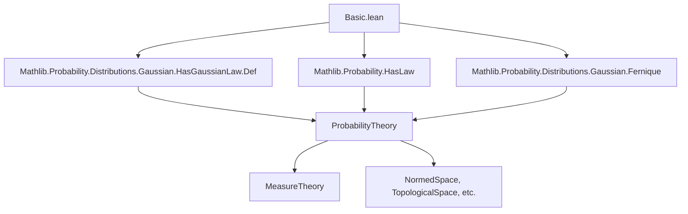
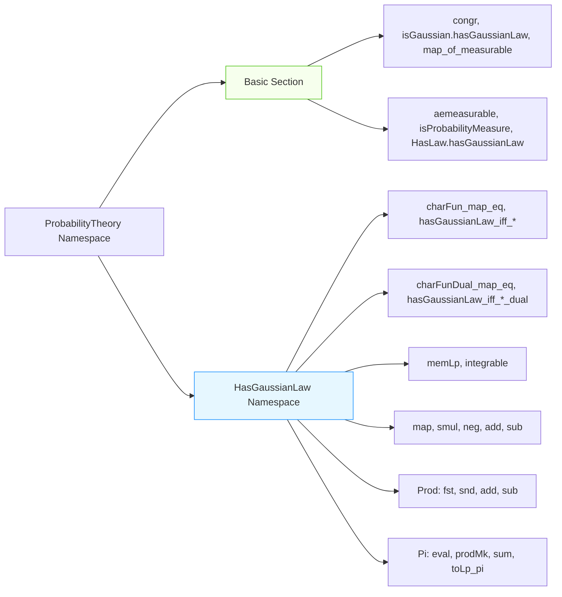

### Technical Brief: `Basic.lean` — Gaussian Random Variables in Lean 4

---

#### **1. Key Definitions & Theorems**

| Name | Type / Signature | Purpose |
|------|------------------|---------|
| `HasGaussianLaw` | `Structure` | A random variable `X : Ω → E` has a *Gaussian law* under measure `P` if its pushforward measure `P.map X` is Gaussian. Encapsulated as `isGaussian_map : IsGaussian (P.map X)`. |
| `IsGaussian` | `Class` | A measure `μ` is Gaussian if all its one-dimensional projections have Gaussian distributions (i.e., characteristic function has the standard Gaussian form). |
| `HasGaussianLaw.congr` | `HasGaussianLaw X P → X =ᵐ[P] Y → HasGaussianLaw Y P` | Equality almost everywhere preserves Gaussianity. |
| `IsGaussian.hasGaussianLaw` | `[IsGaussian (P.map X)] → HasGaussianLaw X P` | If the pushforward is Gaussian, then `X` has a Gaussian law. |
| `HasGaussianLaw.map_of_measurable` | `(L : E →L[ℝ] F) → Measurable L → HasGaussianLaw X P → HasGaussianLaw (L ∘ X) P` | Linear continuous image of a Gaussian RV is Gaussian. |
| `charFun_map_eq` | `t : E → charFun (P.map X) t = exp(…)` | Characteristic function of Gaussian law has explicit exponential form involving mean and variance. |
| `hasGaussianLaw_iff_charFun_map_eq` | `AEMeasurable X P → (HasGaussianLaw X P ↔ ∀ t, …)` | Characterization of Gaussian RVs via characteristic functions (iff). |
| `charFunDual_map_eq` | `L : StrongDual ℝ E → charFunDual (P.map X) L = exp(…)` | Dual-space version of the characteristic function formula. |
| `hasGaussianLaw_iff_charFunDual_map_eq` | `AEMeasurable X P → (HasGaussianLaw X P ↔ ∀ L, …)` | Dual-space characterization. |
| `memLp`, `memLp_two`, `integrable` | `HasGaussianLaw X P → MemLp X p P`, etc. | Gaussian RVs have finite moments of all orders (up to ∞), in particular square-integrable and integrable. |
| `add`, `fun_add`, `sub`, `fun_sub`, `smul`, `neg`, etc. | Various closure properties under linear operations | Closure of Gaussian RVs under addition, subtraction, scalar multiplication, etc., often duplicated for syntactic flexibility (e.g., `add` vs `fun_add`). |
| `eval`, `prodMk`, `sum`, `toLp_pi`, etc. | Projecting, pairing, summing families of Gaussian RVs | Closure under finite products, sums, and coordinate projections. |

---

#### **2. Naming Conventions**

- **Prefixes**:
  - `hasGaussianLaw_`: Lemmas about `HasGaussianLaw` (e.g., `hasGaussianLaw_iff_charFun_map_eq`).
  - `isGaussian_`: Lemmas about `IsGaussian` measures (e.g., `isGaussian_map_of_measurable`).
  - `charFun_`, `charFunDual_`: Characteristic function and dual characteristic function.
  - `memLp_`, `integrable`: Moment/integrability properties.

- **Suffixes**:
  - `_map`: Pertains to pushforward measure (e.g., `charFun_map_eq`, `hasGaussianLaw_iff_charFun_map_eq`).
  - `_dual`: Pertains to dual space (e.g., `charFunDual_map_eq`).
  - `_fun`: Functional notation version (e.g., `fun_add`, `fun_smul`, `fun_neg`) — syntactic variant of non-`_fun` lemmas.
  - `_equiv`: Via continuous linear equivalence (e.g., `map_equiv`, `toLp_prodMk`).
  - `_of_measurable`: When measurability of the map must be shown separately.

- **Pattern**:  
  `HasGaussianLaw.[property]` and `HasGaussianLaw.[property]_fun` are duplicated for dot-notation rewriting flexibility (see implementation note).

---

#### **3. Tactic Stack**

Frequent tactics used in proofs:

| Tactic | Usage |
|--------|-------|
| `rw` | Rewriting using lemmas like `charFun_map_eq`, `integral_map`, `variance_map`. |
| `rwa` | Rewrite + assumption (e.g., `rwa [Measure.map_id]`). |
| `convert` | To reduce goal to known lemma (e.g., `convert hX.map (∑ i, .proj i)`). |
| `simp` / `simp only` | Simplifying expressions (e.g., `simp` after `convert`). |
| `fun_prop` | Propagating measurability/functoriality assumptions (used heavily in `map_of_measurable`, `map`, etc.). |
| `aesop` | Not present — likely avoided due to precision needs in analysis. |
| `ring`, `norm_num` | For algebraic simplifications (e.g., `norm_num` in `memLp_two`). |
| `exact`, `refine`, `intro` | Standard proof construction. |
| `rfl` | For definitional equalities (e.g., after `rfl` in `charFun_map_eq`). |
| `all_goals` | Applied after `refine` to discharge remaining goals uniformly. |

---

#### **4. Proof Logic**

- **Structure of proofs**:
  - Most proofs follow a *“reduce to known Gaussian property”* pattern:
    1. Use `rw [hX.isGaussian_map.lemma]` to rewrite using the Gaussian assumption.
    2. Apply change-of-variables lemmas: `integral_map`, `variance_map`.
    3. Simplify using `integral_complex_ofReal`, `rfl`.
    4. Use `fun_prop` to verify measurability/continuity conditions.

- **Common proof patterns**:
  - **IFF characterizations** (`hasGaussianLaw_iff_*`):
    - `mp`: Use `h.charFun_map_eq`.
    - `mpr`: Use `isGaussian_iff_*`.2 and rewrite both sides to match hypothesis.
  - **Closure under operations**:
    - Reduce to `map_of_measurable` or `map` + `measurable_*` facts (e.g., `measurable_fst`, `measurable_snd`).
    - For sums/products: use `map (∑ i, .proj i)` or `map (.prod ...)`.

- **Induction**: Not used — finite sums/products handled via `Finset.sum`, `PiLp.continuousLinearEquiv`, etc.

---

#### **5. Imports & Dependencies**

| Import | Role |
|--------|------|
| `Mathlib.Probability.Distributions.Gaussian.HasGaussianLaw.Def` | Core definition of `HasGaussianLaw`. |
| `Mathlib.Probability.HasLaw` | `HasLaw` (law of a RV w.r.t. a measure), used in `HasLaw.hasGaussianLaw`. |
| `Mathlib.Probability.Distributions.Gaussian.Fernique` | Fernique’s theorem (not used directly here, but likely related in broader theory). |
| `MeasureTheory`, `ENNReal`, `WithLp`, `Complex` | Basic measure theory, extended reals, $L^p$ spaces, complex numbers. |
| `RealInnerProductSpace`, `NormedAddCommGroup`, `NormedSpace`, `TopologicalSpace`, `BorelSpace`, `SecondCountableTopology` | Functional-analytic context for Gaussian RVs in Banach/Hilbert spaces. |

---

#### **6. Mermaid Diagrams**

##### **Dependency Graph (Module-Level)**

##### **Overview of File Structure**

---

#### **7. Theory Scope**

- **Scope**: Foundations of Gaussian random variables in abstract measurable spaces valued in Banach/Hilbert spaces.
- **Key features**:
  - Equivalence between Gaussian law and characteristic function form.
  - Closure under linear operations, finite products, sums, and projections.
  - Moment properties (all $L^p$ for $p < \infty$).
  - Dual-space formulation (useful for infinite-dimensional settings).
- **Not covered**:
  - Central limit theorems, conditional Gaussianity, or infinite divisibility.
  - SDEs or stochastic calculus.
  - Non-Gaussian limit theorems.

---

#### **8. Design Notes**

- **Duplicated lemmas** (`add` vs `fun_add`, `smul` vs `fun_smul`, etc.) enable syntactic rewriting via dot notation (e.g., `hX.add` vs `hX.fun_add`) depending on whether the user writes `X + Y` or `(fun ω ↦ X ω + Y ω)`.
- **`fun_prop`** is critical for discharging measurability of maps like `(X, Y)`, `L ∘ X`, etc.
- **`charFunDual_map_eq`** is preferred in infinite dimensions (e.g., separable Banach spaces), where dual functionals are more natural than inner products.
- **Assumptions** like `SecondCountableTopology`, `CompleteSpace`, `BorelSpace` ensure regularity for disintegration, $L^p$ theory, and Gaussian classification.

--- 

Let me know if you'd like a formalized dependency graph (e.g., for `leanproject`), or a summary of related files (e.g., `Gaussian.lean`, `Fernique.lean`).
