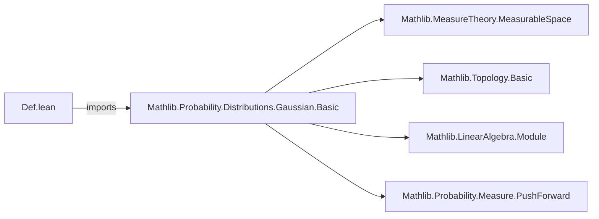

**Technical Brief: `Def.lean` — Gaussian Random Variables in Lean 4**

---

### 1. Key Definitions & Theorems

| Name | Type / Signature | Purpose |
|------|------------------|---------|
| `ProbabilityTheory.HasGaussianLaw` | `{Ω E : Type*} → [MeasurableSpace Ω] → [TopologicalSpace E] → [AddCommMonoid E] → [Module ℝ E] → [MeasurableSpace E] → (X : Ω → E) → (P : Measure Ω) → Prop` | Predicate stating that random variable `X` has a Gaussian distribution under probability measure `P`, i.e., the pushforward measure `P.map X` is Gaussian (`IsGaussian`). |
| `isGaussian_map` | `P.map X ∈ IsGaussian` (witnessed by this field) | The sole constructor field: asserts that the law (distribution) of `X` under `P` is Gaussian. |

> **Note**: No named theorems appear in this file; it only defines the predicate.

---

### 2. Naming Conventions

- **Prefix**: `HasGaussianLaw` follows Lean/Mathlib convention of `HasX` for predicates (e.g., `HasSum`, `HasBoundedVariation`).
- **Structure field**: `isGaussian_map` uses `is_` + `property` + `_map`, indicating it verifies a property (`IsGaussian`) of a mapped measure (`P.map X`).
- **Module-level tag**: `fun_prop` indicates this is a *function property* (used by `fun_prop`-aware tactics like `fun_prop?` or `infer_instance` for measurable function reasoning).

---

### 3. Tactic Stack

- **None used in this file** (definition-only).
- Expected tactics in downstream proofs (in related files) would likely include:
  - `simp` / `simp_rw` (for measure-theoretic simplifications),
  - `aesop` (for measurable space / topology goals),
  - `exact`, `constructor`, `apply` (for structure introduction),
  - `change`, `rw [map_apply]` (for pushforward measure manipulations),
  - `apply IsGaussian.of_charact` or similar (if invoking characterizations of Gaussian measures).

---

### 4. Proof Logic

- **Not applicable** — this file contains only a definition.
- Future proofs involving `HasGaussianLaw` will likely follow this pattern:
  1. Unfold `HasGaussianLaw` → obtain `h : IsGaussian (P.map X)`.
  2. Use properties of `IsGaussian` (e.g., closure under affine maps, stability under convolution, etc.).
  3. Reconstruct via `⟨h⟩` or `constructor` to reintroduce `HasGaussianLaw`.

---

### 5. Imports

| Import | Role |
|--------|------|
| `Mathlib.Probability.Distributions.Gaussian.Basic` | Provides core Gaussian measure theory: `IsGaussian`, basic lemmas (e.g., `IsGaussian.of_charact`, `IsGaussian.smul`, `IsGaussian.add`, etc.). This is the foundational module for Gaussian measures on topological vector spaces. |

> **No other imports** — minimal dependency footprint.

---

### 6. Theory Context & Dependencies

- **Underlying setting**:  
  - `Ω` is a measurable space (sample space),  
  - `E` is a topological additive commutative monoid, equipped with a real vector space structure and measurable space structure (e.g., `E = ℝⁿ`, `E = HilbertSpace ℝ`).
- **Random variable**: Measurable map `X : Ω → E`.
- **Law of `X` under `P`**: Pushforward measure `P.map X` on `E`.
- **Gaussian law**: `IsGaussian (P.map X)` — meaning the measure is Gaussian in the sense of Mathlib (e.g., all nontrivial linear functionals pull back to 1D Gaussians, or equivalently, its characteristic function has the standard Gaussian form).

---

### 7. Mermaid Diagrams

#### Dependency Graph (Module-Level)



#### Overview of File Structure

```mermaid
flowchart TD
  subgraph "Def.lean"
    D[Def] --> S[ProbabilityTheory.HasGaussianLaw]
    S --> F[isGaussian_map : IsGaussian (P.map X)]
  end

  subgraph "Mathlib.Probability.Distributions.Gaussian.Basic"
    G[IsGaussian] --> H[Characterization lemmas]
    G --> I[Stability properties]
  end

  D -->|uses| G
```

---

### 8. Summary

This file introduces the foundational predicate `HasGaussianLaw` for expressing that a random variable has a Gaussian distribution under a given probability measure. It leverages the existing `IsGaussian` predicate from `Mathlib.Probability.Distributions.Gaussian.Basic`, ensuring compatibility with the broader measure-theoretic and functional-analytic infrastructure in Mathlib. The design is minimal, extensible, and aligned with Lean’s category-theoretic and type-theoretic conventions.
