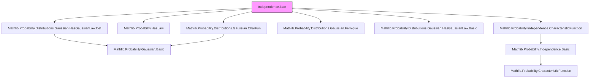
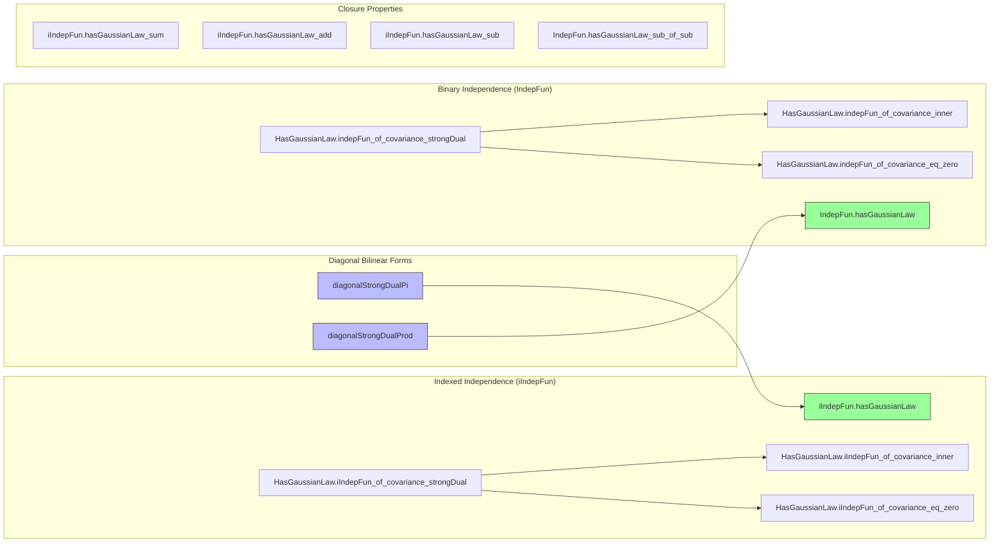

### Technical Brief: `Independence.lean`

---

#### **1. Key Definitions & Theorems**

| Name | Type / Signature | Purpose |
|------|------------------|---------|
| `diagonalStrongDualPi` | `(L : (i : ι) → StrongDual ℝ (E i) →L[ℝ] StrongDual ℝ (E i) →L[ℝ] ℝ) → StrongDual ℝ (Π i, E i) →L[ℝ] StrongDual ℝ (Π i, E i) →L[ℝ] ℝ` | Constructs a block-diagonal continuous bilinear form on the dual of a product space; used to encode covariance structure for families of Gaussian RVs. |
| `diagonalStrongDualProd` | `(L₁ : StrongDual ℝ E →L[ℝ] StrongDual ℝ E →L[ℝ] ℝ) → (L₂ : StrongDual ℝ F →L[ℝ] StrongDual ℝ F →L[ℝ] ℝ) → StrongDual ℝ (E × F) →L[ℝ] StrongDual ℝ (E × F) →L[ℝ] ℝ` | Same as above but for binary products; used in binary joint Gaussian case. |
| `iIndepFun.hasGaussianLaw` | `∀ i, HasGaussianLaw (X i) P → iIndepFun X P → HasGaussianLaw (fun ω ↦ (X · ω)) P` | Independent Gaussian RVs are jointly Gaussian (indexed version). |
| `IndepFun.hasGaussianLaw` | `HasGaussianLaw X P → HasGaussianLaw Y P → X ⟂ᵢ[P] Y → HasGaussianLaw (fun ω ↦ (X ω, Y ω)) P` | Independent Gaussian RVs are jointly Gaussian (binary version). |
| `HasGaussianLaw.iIndepFun_of_covariance_strongDual` | `HasGaussianLaw (fun ω i ↦ X i ω) P → (∀ i ≠ j, ∀ L₁ L₂, cov[L₁ ∘ X i, L₂ ∘ X j; P] = 0) → iIndepFun X P` | Uncorrelated jointly Gaussian RVs are independent (strong dual version). |
| `HasGaussianLaw.iIndepFun_of_covariance_inner` | Same as above but with inner products instead of dual elements. | Specialization to inner product spaces via Riesz representation. |
| `HasGaussianLaw.iIndepFun_of_covariance_eq_zero` | `HasGaussianLaw (fun ω ↦ (X · ω)) P → (∀ i ≠ j, cov[X i, X j; P] = 0) → iIndepFun X P` | Real-valued case: uncorrelated ⇒ independent. |
| `HasGaussianLaw.indepFun_of_covariance_strongDual` | `HasGaussianLaw (X, Y) P → (∀ L₁ L₂, cov[L₁ ∘ X, L₂ ∘ Y; P] = 0) → IndepFun X Y P` | Binary case: uncorrelated ⇒ independent (strong dual). |
| `HasGaussianLaw.indepFun_of_covariance_inner` | Same as above with inner products. | Real inner product specialization. |
| `HasGaussianLaw.indepFun_of_covariance_eq_zero` | `HasGaussianLaw (X, Y) P → cov[X, Y; P] = 0 → IndepFun X Y P` | Real-valued binary case. |
| `iIndepFun.hasGaussianLaw_sum`, `add`, `sub`, etc. | Various sum/add/sub lemmas for Gaussian RVs under independence. | Closure properties of Gaussian laws under linear combinations of independent RVs. |

---

#### **2. Naming Conventions**

- **Prefixes:**
  - `diagonalStrongDual*`: Implementation details for bilinear forms on duals of product/pi spaces.
  - `hasGaussianLaw.*`: Lemmas about Gaussian laws and their preservation or characterization.
  - `iIndepFun.*`, `IndepFun.*`: Lemmas about indexed and binary independence, respectively.
  - `covariance_*`: Lemmas involving covariance bilinear forms (`covarianceBilinDual`, `covariance_self`, etc.).
- **Suffixes:**
  - `_of_covariance_*`: Implication from zero covariance to independence.
  - `_of_covariance_strongDual`, `_of_covariance_inner`, `_of_covariance_eval`: Variants depending on how covariance is tested (dual pairing, inner product, evaluation at coordinates).
  - `_sum`, `_add`, `_sub`: Closure under linear operations.

---

#### **3. Tactic Stack**

Frequent tactics used in proofs:
- `simp_rw`, `simp only`, `simp`: Simplification with rewrite rules and definitional equalities.
- `grw`: Goal-directed rewriting (from `Mathlib.Tactic.GrW`).
- `gcongr`: Goal-directed congruence reasoning (for norm estimates).
- `intro`, `refine`, `exact`, `apply`: Basic proof construction.
- `congr`: Congruence step for functional extensionality or integral equalities.
- `rw [charFunDual_*]`, `rw [covariance_*]`: Rewriting using key lemmas about characteristic functions and covariance.
- `have`, `set`, `let`: Local definitions and intermediate claims.
- `fun_prop`: Proving measurability/continuity goals automatically.
- `grw [norm_sum_le, sum_mul]`, `gcongr`: Norm estimates in bilinear forms.
- `ext`: Extensionality for functions/sets.
- `grw [le_opNorm₂, opNorm_comp_le]`: Operator norm manipulations.

---

#### **4. Proof Logic**

The logical flow across most theorems follows this pattern:

1. **Reduction to characteristic functions**:
   - Use `isGaussian_iff_gaussian_charFunDual` or `iIndepFun_iff_charFunDual_pi`, `indepFun_iff_charFunDual_prod` to reduce to equality of characteristic functions.

2. **Decomposition of linear functionals**:
   - For product/pi spaces, decompose a dual element $L$ into components using `single`, `inl`, `inr`, or `sum_repr` (e.g., via orthonormal basis in Euclidean case).

3. **Apply independence assumption**:
   - Use `iIndepFun_iff_charFunDual_pi` or `indepFun_iff_charFunDual_prod` to factor the joint characteristic function into a product.

4. **Compute each factor**:
   - Use `HasGaussianLaw.charFunDual_map_eq` to replace each marginal characteristic function with its Gaussian form.
   - Use `covarianceBilinDual_self_eq_variance` to simplify exponent terms.

5. **Handle cross-terms**:
   - If zero covariance is assumed, cross-terms vanish (e.g., via `sum_eq_single_of_mem`, `sum_eq_zero`, or `covariance_const_mul_left/right`).
   - In inner product cases, reduce to coordinate-wise covariance via basis expansion.

6. **Conclude via exponential identities**:
   - Use `exp_sum`, `exp_add`, `sub_add_sub_comm`, etc., to match the Gaussian characteristic function form.

7. **Verify integrability & $L^2$ conditions**:
   - Use `memLp_two`, `integrable`, and `aemeasurable` lemmas for Gaussian RVs.

---

#### **5. Imports & Dependencies**

**Core imports**:
- `Mathlib.Probability.Distributions.Gaussian.HasGaussianLaw.Def`
- `Mathlib.Probability.HasLaw`
- `Mathlib.Probability.Distributions.Gaussian.CharFun`
- `Mathlib.Probability.Distributions.Gaussian.Fernique`
- `Mathlib.Probability.Distributions.Gaussian.HasGaussianLaw.Basic`
- `Mathlib.Probability.Independence.CharacteristicFunction`

**Key underlying theories**:
- Measure theory (`MeasureTheory`)
- Normed/inner product spaces (`NormedSpace`, `InnerProductSpace`)
- Dual spaces and continuous linear maps (`ContinuousLinearMap`, `StrongDual`)
- Characteristic functions and Gaussian laws (`HasGaussianLaw`, `charFunDual`)
- Independence via characteristic functions (`iIndepFun`, `IndepFun`, `indepFun_iff_charFunDual_*`)

---

#### **6. Mermaid Diagrams**

##### **Dependency Graph (High-Level)**

##### **Overview of File Structure**

---

#### **7. Theory Summary**

This file formalizes the classical equivalence between *uncorrelatedness* and *independence* for Gaussian random variables, in increasing generality:
- From real-valued RVs → Banach/Hilbert-valued families.
- From indexed families → binary pairs.
- From independence ⇒ joint Gaussianity → joint Gaussianity + uncorrelated ⇒ independence.

It leverages:
- Characteristic function characterizations of Gaussian laws.
- Bilinear forms on dual spaces to encode covariance.
- Functional-analytic tools (operator norms, continuity, completeness).
- Measure-theoretic tools (integrability, $L^p$-spaces, measurability).

The structure mirrors standard probability theory proofs, but with careful attention to:
- Topological vector space structure (Borel, complete, second countable).
- Measurability of maps into infinite-dimensional spaces.
- Uniform control over families via `Fintype`, `Finite`, `PiLp`, etc.

--- 

Let me know if you'd like a formalized dependency graph (e.g., for `leanproject`), or a summary of lemmas by use-case (e.g., "for proving CLT", "for Gaussian processes").
