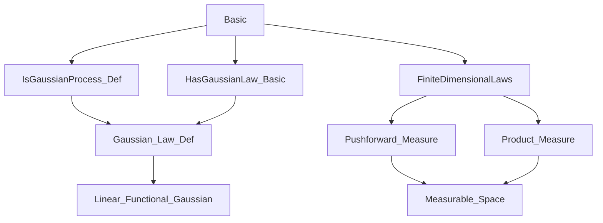

### Technical Brief: `Basic.lean` — Gaussian Processes in Lean 4

---

#### **1. Key Definitions & Theorems**

| Name | Type / Signature | Purpose |
|------|------------------|---------|
| `IsGaussianProcess` | `class (X : T → Ω → E) → (P : Measure Ω) → Prop` | Defines a stochastic process `X` to be *Gaussian* if all its finite-dimensional marginals have Gaussian laws. |
| `hasGaussianLaw` | `class (f : Ω → E) → (P : Measure Ω) → Prop` | `f` has a Gaussian law under `P` iff its pushforward measure is Gaussian (i.e., image under any continuous linear functional is real Gaussian). |
| `isProbabilityMeasure` | `IsGaussianProcess X P → IsProbabilityMeasure P` | Shows that if `X` is Gaussian, then `P` must be a probability measure (used to ensure normalization). |
| `aemeasurable` | `IsGaussianProcess X P → AEMeasurable (X t) P` | Each coordinate `X t` is almost everywhere measurable. |
| `congr` | `IsGaussianProcess X P → (∀ t, X t =ᵐ[P] Y t) → IsGaussianProcess Y P` | Gaussianity is preserved under almost-everywhere modifications. |
| `hasGaussianLaw_eval` | `IsGaussianProcess X P → HasGaussianLaw (X t) P` | Single-coordinate marginals are Gaussian. |
| `hasGaussianLaw_prodMk` | `IsGaussianProcess X P → HasGaussianLaw (fun ω ↦ (X s ω, X t ω)) P` | Pairwise joint distributions are Gaussian. |
| `hasGaussianLaw_add/sub/sum` | `HasGaussianLaw (X s + X t) P`, etc. | Closure under linear combinations (add, sub, finite sum). |
| `hasGaussianLaw_increments` | `HasGaussianLaw (fun ω i ↦ X (t i.succ) ω - X (t i.castSucc) ω) P` | Increments over a finite chain are jointly Gaussian. |
| `of_isGaussianProcess` | Main theorem: `IsGaussianProcess X P → (∀ s, ∃ I, L, Y s = L ∘ X|_I) → IsGaussianProcess Y P` | If each `Y s` is a linear image of finitely many `X`-values, then `Y` is Gaussian. |
| `comp_right` | `IsGaussianProcess X P → IsGaussianProcess (X ∘ f) P` | Precomposition with a function preserves Gaussianity. |
| `comp_left` | `IsGaussianProcess X P → IsGaussianProcess (fun t ↦ L t ∘ X t) P` | Pointwise linear transformation of a Gaussian process is Gaussian. |
| `smul` | `IsGaussianProcess X P → IsGaussianProcess (fun t ↦ c t • X t) P` | Scalar multiplication by a deterministic function preserves Gaussianity. |
| `shift` | `IsGaussianProcess X P → IsGaussianProcess (fun t ↦ X (t₀ + t) - X t₀) P` | Time-shifted centered process is Gaussian. |
| `restrict` | `IsGaussianProcess X P → IsGaussianProcess (X ∘ subtype.val) P` | Restricting the index set preserves Gaussianity. |

---

#### **2. Naming Conventions**

- **Prefixes**:
  - `is_`: e.g., `isProbabilityMeasure`, `isGaussianProcess` — predicates.
  - `has_`: e.g., `hasGaussianLaw` — existence of a property (here, Gaussian law).
  - `aemeasurable`: almost-everywhere measurable.
- **Suffixes**:
  - `_map`: pushforward under a measurable/continuous linear map.
  - `_prodMk`, `_add`, `_sub`, `_sum`, `_increments`: derived operations on Gaussian processes.
  - `_restrict`, `_shift`, `_comp_right`, `_comp_left`: structural transformations.
- **Variables**:
  - `X`, `Y`: processes (`T → Ω → E`, `S → Ω → F`)
  - `I`, `J`: finite index sets (`Finset`)
  - `L`, `K`: continuous linear maps (`→L[ℝ]`)
  - `t`, `s`: indices (`T`, `S`)

---

#### **3. Tactic Stack**

| Tactic | Usage Frequency | Purpose |
|--------|-----------------|---------|
| `simp` | Very High | Simplify expressions involving `restrict`, `Pi.add`, `Pi.smul`, `Finset.restrict_def`, etc. |
| `exact` | High | Directly apply lemmas (e.g., `exact (hX.hasGaussianLaw I).map L`). |
| `convert` | Medium | Match goals up to definitional equality (e.g., `convert hX.hasGaussianLaw_sum`). |
| `ext` + `simp` | Medium | Prove extensionality of functions (e.g., `ext ω; simp`). |
| `abel` | Low-Medium | Simplify additive expressions in abelian groups/modules. |
| `fun_prop` | Medium | Prove continuity/measurability of function-space maps. |
| `classical` | Medium | Enable classical logic for existence proofs (e.g., `choose J L hL using h`). |
| `rw` | Medium | Rewrite using equalities (e.g., `rw [this]`). |

---

#### **4. Proof Logic**

- **Structure**: Most proofs follow a *constructive pattern*:
  1. **Existential witness extraction** (e.g., `choose J L hL using h`).
  2. **Construction of a linear map** `K` that factors the target process through a finite subfamily of `X`.
  3. **Equality proof** (via `ext` + `simp`) showing the target process is `K ∘ (X restricted to some finite set)`.
  4. **Application of `map` lemma**: `HasGaussianLaw (X|_I) P → HasGaussianLaw (K ∘ X|_I) P`.
- **Induction is not used** — all arguments are *finite*, leveraging `Finset` and finite linear combinations.
- **Key logical flow** in `of_isGaussianProcess`:
  ```text
  Given: Y s = L_s (X restricted to I_s)
  Want:  (Y restricted to I) = K (X restricted to ⋃_{s ∈ I} I_s)
  Construct K as the product of L_s over s ∈ I, composed with restriction/projection.
  Then apply map to Gaussian law of X on the union.
  ```

---

#### **5. Imports & Dependencies**

| Module | Role |
|--------|------|
| `Mathlib.Probability.Distributions.Gaussian.IsGaussianProcess.Def` | Core definition of `IsGaussianProcess`. |
| `Mathlib.Probability.Distributions.Gaussian.HasGaussianLaw.Basic` | Basic theory of `HasGaussianLaw`, including closure under linear maps. |
| `Mathlib.Probability.Process.FiniteDimensionalLaws` | Tools for finite-dimensional marginals, pushforwards, and product constructions. |

**Key underlying libraries**:
- `MeasureTheory`: Measurability, pushforward measures, a.e. equality.
- `Topology`: Second countability, Borel spaces, continuity.
- `Algebra`: `AddCommMonoid`, `Module ℝ`, `NormedSpace ℝ`, linear maps (`→L[ℝ]`).
- `Data.Finset`: Finite subsets, unions, restrictions.

---

#### **6. Mermaid Diagrams**

##### **Dependency Graph (Module Level)**



##### **Overview of `Basic.lean`**

```mermaid
flowchart LR
  A[IsGaussianProcess X P] --> B[Finite marginals have Gaussian laws]
  B --> C[Single eval: X t ~ N]
  B --> D[Joint: (X s, X t) ~ N]
  B --> E[Linear combos: X s + X t, etc.]
  B --> F[Increments: X(t_{i+1}) - X(t_i) ~ N]

  A --> G[Preservation under:]
  G --> H[Modification (a.e. equality)]
  G --> I[Precomposition (X ∘ f)]
  G --> J[Pointwise linear map (L t ∘ X t)]
  G --> K[Scalar multiplication]
  G --> L[Shift & center]
  G --> M[Restriction to subset]

  A --> N[Main closure: of_isGaussianProcess]
  N --> O[If Y s = L_s(X|_{I_s}), then Y is Gaussian]
```

---

#### **7. Summary**

This file establishes foundational closure properties of Gaussian processes in Lean 4. It leverages the *finite-dimensional law* characterization and shows that Gaussianity is preserved under:
- almost-everywhere modification,
- precomposition,
- pointwise linear transformations,
- scalar multiplication,
- shifts,
- restrictions,
- and crucially, **any process built as a finite linear combination of values of a Gaussian process** (`of_isGaussianProcess`).

The proofs are highly uniform: construct a linear factorization, then apply the `map` lemma for `HasGaussianLaw`. This reflects the *algebraic* nature of Gaussian processes: they are closed under finite linear operations, and the theory is built around finite subsets of the index set.

--- 

Let me know if you'd like a formalized dependency graph (e.g., for `leanproject`), or a summary of the `IsGaussianProcess` class definition itself.
