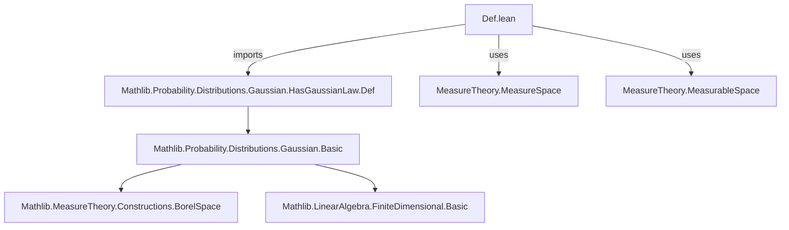
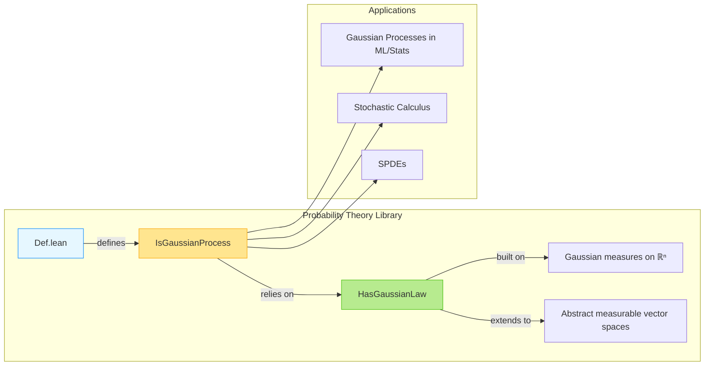

**Technical Brief: `Def.lean` — Gaussian Process Definition in Lean 4**

---

### 1. **Key Definitions & Theorems**

| Name | Type | Purpose |
|------|------|---------|
| `ProbabilityTheory.IsGaussianProcess` | `structure` | Defines a stochastic process `X : T → Ω → E` to be *Gaussian* under measure `P` if every finite-dimensional marginal (indexed by a finite subset `I ⊆ T`) has a Gaussian law. |
| `HasGaussianLaw` | imported from `Mathlib.Probability.Distributions.Gaussian.HasGaussianLaw.Def` | A predicate asserting that a random variable (or vector-valued map) follows a multivariate Gaussian distribution w.r.t. the given measure. |

**Structure fields:**
- `hasGaussianLaw : ∀ I : Finset T, HasGaussianLaw (fun ω ↦ I.restrict (X · ω)) P`  
  → For every finite index set `I`, the random vector obtained by restricting `X` to `I` (i.e., mapping `ω ↦ (X t ω)_{t ∈ I}`) has a Gaussian law under `P`.

**Note:** The `@[fun_prop]` attribute indicates this is a *functorial property*—suitable for use in typeclass inference or propagation lemmas.

---

### 2. **Naming Conventions**

- **Prefixes:**
  - `is_`: Predicate-style naming for properties (`IsGaussianProcess`).
  - `has_`: Existential-style for structural properties (`HasGaussianLaw`).
- **Suffixes:**
  - `Law`: Used for distributional properties (`HasGaussianLaw`).
- **Indexing:**
  - `I : Finset T`: Standard for finite index subsets.
  - `restrict`: Standard Mathlib notation for restricting a function to a finite set.

---

### 3. **Tactic Stack**

- `volume_tac`: Used in the default argument `(P : Measure Ω := by volume_tac)` to infer a probability measure when none is given (common in probability theory files).
- Likely tactics in proofs involving this definition (not explicit in `Def.lean`, but standard in related files):
  - `aesop`, `simp`, `simp_rw`, `ring`, `norm_num`, `apply_fun`, `congr`, `ext`, `funext`.

---

### 4. **Proof Logic**

- **General proof pattern** (for lemmas about `IsGaussianProcess`):
  1. Unfold `IsGaussianProcess` → introduce arbitrary `I : Finset T`.
  2. Apply `hasGaussianLaw` hypothesis.
  3. Reduce to verifying Gaussianity of a finite-dimensional map.
  4. Use properties of `HasGaussianLaw` (e.g., closure under linear maps, product structure, etc.).
- **Induction** is *not* used in the definition itself, but may appear in derived lemmas (e.g., over `I`’s cardinality or inclusion chains).

---

### 5. **Imports**

| Import | Role |
|--------|------|
| `Mathlib.Probability.Distributions.Gaussian.HasGaussianLaw.Def` | Core definition of Gaussian law for vector-valued random variables; foundational for `IsGaussianProcess`. |
| `MeasureTheory` (via `open MeasureTheory`) | Provides measurable space, measure, and integration infrastructure. |
| Implicit assumptions: `MeasurableSpace`, `TopologicalSpace`, `AddCommMonoid`, `Module ℝ` | Ensure `E` is a nice measurable vector space (e.g., `ℝⁿ`, separable Banach space). |

---

### 8. **Mermaid Diagrams**

#### **Dependency Graph (Module-Level)**

#### **Overview of File & Theory Context**

---

**Summary**: This file introduces the foundational definition of a Gaussian process in Lean’s `Mathlib` framework, leveraging the existing theory of Gaussian laws (`HasGaussianLaw`) for vector-valued random variables. It assumes a measurable vector space structure on the codomain and quantifies over finite index subsets to enforce Gaussianity of all finite-dimensional distributions. The design aligns with standard probabilistic practice and supports future development of stochastic process theory in Lean.
