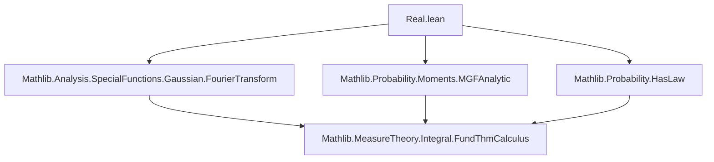
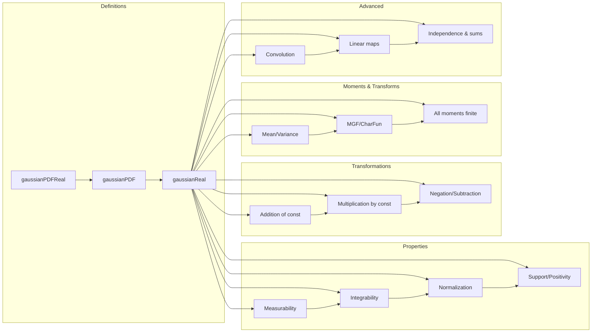

### Technical Brief: Gaussian Distributions over ℝ in Lean 4 (Real.lean)

---

#### **1. Key Definitions & Theorems**

| Name | Type / Signature | Purpose |
|------|------------------|---------|
| `gaussianPDFReal` | `μ : ℝ → v : ℝ≥0 → x : ℝ → ℝ` | Probability density function (PDF) of Gaussian with mean `μ`, variance `v`. Defined as $ \frac{1}{\sqrt{2\pi v}} e^{-(x-\mu)^2/(2v)} $. |
| `gaussianPDF` | `μ : ℝ → v : ℝ≥0 → x : ℝ → ℝ≥0∞` | `ENNReal`-valued PDF: `ofReal ∘ gaussianPDFReal`. Used for measure construction. |
| `gaussianReal` | `μ : ℝ → v : ℝ≥0 → Measure ℝ` | Gaussian *measure*: `dirac μ` if `v = 0`, else `volume.withDensity (gaussianPDF μ v)`. |
| `gaussianReal_map_add_const` | `(gaussianReal μ v).map (· + y) = gaussianReal (μ + y) v` | Translation invariance: shifting a Gaussian shifts its mean. |
| `gaussianReal_map_const_mul` | `(gaussianReal μ v).map (c * ·) = gaussianReal (c * μ) (c² * v)` | Scaling: multiplying a Gaussian scales mean by `c`, variance by `c²`. |
| `integral_id_gaussianReal` | `∫ x, x ∂gaussianReal μ v = μ` | Mean of the distribution equals parameter `μ`. |
| `variance_id_gaussianReal` | `Var[id; gaussianReal μ v] = v` | Variance equals parameter `v`. |
| `complexMGF_id_gaussianReal` | `complexMGF id (gaussianReal μ v) z = cexp (z * μ + v * z² / 2)` | Complex MGF of Gaussian. |
| `charFun_gaussianReal` | `charFun (gaussianReal μ v) t = cexp (t * μ * I - v * t² / 2)` | Characteristic function. |
| `gaussianReal_conv_gaussianReal` | `(gaussianReal m₁ v₁) ∗ (gaussianReal m₂ v₂) = gaussianReal (m₁ + m₂) (v₁ + v₂)` | Convolution of independent Gaussians adds means and variances. |
| `gaussianReal_ext_iff` | `gaussianReal μ₁ v₁ = gaussianReal μ₂ v₂ ↔ μ₁ = μ₂ ∧ v₁ = v₂` | Uniqueness: Gaussian measures are uniquely determined by mean and variance. |

---

#### **2. Naming Conventions**

- **Prefixes**:
  - `gaussianPDFReal_`, `gaussianPDF_`, `gaussianReal_`: core definitions and lemmas.
  - `integral_`, `variance_`, `mgf_`, `charFun_`, `complexMGF_`: moment/transform-related.
  - `memLp_`, `integrable_`, `aemeasurable_`: functional-analytic properties.
- **Suffixes**:
  - `_real`: real-valued objects (e.g., `gaussianPDFReal`).
  - `_ennreal`/`_ofReal`: ENNReal-valued or via `ofReal`.
  - `_map_`, `_comap_`, `_add_const`, `_const_mul`: transformation lemmas.
  - `_zero_var`: special case `v = 0`.
- **Logical suffixes**:
  - `_pos`, `_nonneg`, `_lt_top`, `_ne_top`: positivity/top-boundedness.
  - `_aemeasurable`, `_stronglyMeasurable`: measurability.
  - `_absolutelyContinuous`, `_rnDeriv_`: absolute continuity/Radon–Nikodym.

---

#### **3. Tactic Stack**

| Tactic | Frequency | Role |
|--------|-----------|------|
| `simp` / `simp_rw` | Very High | Simplification of definitions, `if`-cases, `ENNReal`, `NNReal`, arithmetic. |
| `rw` | High | Rewriting using lemmas (e.g., `gaussianPDFReal_def`, `gaussianReal_of_var_ne_zero`). |
| `by_cases` | High | Splitting on `v = 0` or `c = 0`. |
| `congr` / `congr_arg` | Medium | Proving equality of functions or expressions. |
| `field` / `ring` | Medium | Field/ring simplifications (especially in MGF/characteristic function proofs). |
| ` positivity` | Medium | Proving nonnegativity/positivity of expressions. |
| `have` / `suffices` | Medium | Intermediate claims (e.g., integral identities). |
| `convert` | Low | Matching goals up to definitional equality. |
| `ext` | Medium | Extensionality for measures/functions. |
| `push_cast` | Low | Casting between `ℝ`, `ℂ`, `ENNReal`. |
| `norm_cast` | Low | Normalizing casts. |
| `aesop` | Not used | Not present in this file. |

---

#### **4. Proof Logic**

- **Structure**:
  - **Case analysis** on `v = 0` (degenerate vs. non-degenerate Gaussian).
  - **Induction not used** — proofs rely on direct computation, change of variables, and known integral identities (e.g., Gaussian integral).
- **Common proof patterns**:
  1. **PDF normalization**: Show `∫ gaussianPDFReal = 1` using substitution and `integral_gaussian`.
  2. **Transformation lemmas**: Use `MeasurableEquiv.gaussianReal_map_symm_apply` + change of variables (Jacobian).
  3. **Moment calculations**: Differentiate MGF/characteristic function at 0.
  4. **Uniqueness**: Use characteristic functions (`charFun_ext`) or moments (`integral_id`, `variance_id`).
  5. **Convolution**: Use `charFun_conv` + uniqueness via injectivity of Fourier transform.

---

#### **5. Imports & Dependencies**

| Module | Purpose |
|--------|---------|
| `Mathlib.Analysis.SpecialFunctions.Gaussian.FourierTransform` | Gaussian integral, Fourier transform tools. |
| `Mathlib.Probability.HasLaw` | Definition of `HasLaw` (random variable law). |
| `Mathlib.Probability.Moments.MGFAnalytic` | Complex MGF, characteristic functions, cumulant-generating functions. |
| `MeasureTheory` (via `open MeasureTheory`) | Measures, densities, pushforward/comap, Radon–Nikodym, integrals. |

---

#### **6. Mermaid Diagrams**

##### **Dependency Graph (Module-Level)**

##### **Overview of File Structure**

##### **Theory Context**

- **Core theory**: Probability measures on `ℝ`, especially absolutely continuous w.r.t. Lebesgue.
- **Bridge to analysis**: Gaussian integrals, Fourier analysis (via `charFun`), complex analysis (MGF analyticity).
- **Bridge to probability**: Laws of random variables, independence, convolution, central limit-type results.

---

#### **7. Summary**

This file formalizes the foundational theory of real-valued Gaussian distributions in Lean 4, covering:
- PDFs (`gaussianPDFReal`, `gaussianPDF`)
- Measure construction (`gaussianReal`)
- Transformation laws (affine maps)
- Moment calculations (mean, variance, all $L^p$-moments)
- Analytic tools (MGF, characteristic function, cumulant-generating function)
- Convolution and sums of independent Gaussians.

It leverages `MeasureTheory`, `Analysis`, and `Probability` libraries extensively, with heavy use of `ENNReal` for measure-theoretic rigor and `Complex` for transform methods. The proofs are constructive and rely on classical analysis (e.g., Gaussian integral, Fourier inversion), but remain fully formalized in Lean 4.
