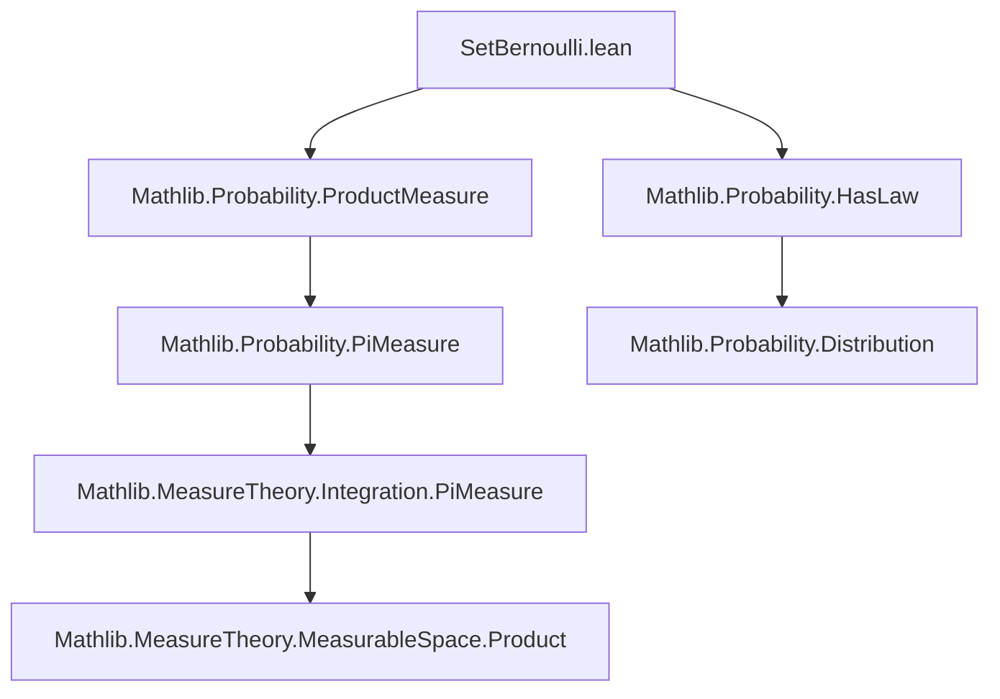
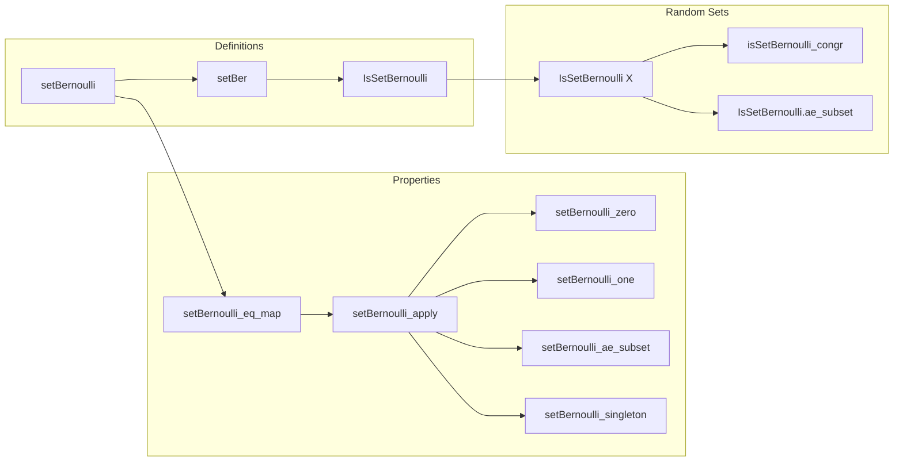

### Technical Brief: `SetBernoulli.lean`

---

#### **1. Key Definitions & Theorems**

| Name | Type / Signature | Purpose |
|------|------------------|---------|
| `setBernoulli` | `setBernoulli (u : Set ι) (p : I) : Measure (Set ι)` | Defines the product measure on subsets of `ι`, where elements of `u` are included independently with probability `p`, and elements outside `u` are never included. |
| `setBer` | Notation: `setBer(u, p)` | Shorthand for `setBernoulli u p`. |
| `setBernoulli_eq_map` | `setBer(u, p) = .map (fun p ↦ {i | p i}) (infinitePi …)` | Expresses `setBer` as the pushforward (map) of an infinite product measure over functions `ι → Prop`. |
| `setBernoulli_apply` / `setBernoulli_apply'` | `setBer(u, p) S = …` | Gives explicit formula for measure of a set of subsets `S : Set (Set ι)`, via preimage or image under characteristic function. |
| `setBernoulli_zero` | `setBer(u, 0) = dirac ∅` | At `p = 0`, only the empty set occurs. |
| `setBernoulli_one` | `setBer(u, 1) = dirac u` | At `p = 1`, only the full set `u` occurs. |
| `setBernoulli_ae_subset` | `∀ᵐ s ∂setBer(u, p), s ⊆ u` | Almost surely, a random set under `setBer(u, p)` is a subset of `u`. |
| `setBernoulli_singleton` | `setBer(u, p) {s} = p^|s| * (1−p)^{|u \ s|}` (for finite `u`) | Probability mass function: probability of exactly `s ⊆ u`. |
| `IsSetBernoulli` | `abbrev IsSetBernoulli (X : Ω → Set ι) := HasLaw X (setBer(u, p) P)` | `X` is a `p`-Bernoulli random set on `u` w.r.t. measure `P`. |
| `isSetBernoulli_congr` | `X =ᵐ[P] Y ⇒ IsSetBernoulli X ↔ IsSetBernoulli Y` | Distributional equivalence preserves Bernoulli property. |
| `IsSetBernoulli.ae_subset` | `IsSetBernoulli X ⇒ X ω ⊆ u` a.e. | Random sets under `IsSetBernoulli` are a.s. subsets of `u`. |

---

#### **2. Naming Conventions**

- **Prefixes**:
  - `setBer(...)`: Short for *set Bernoulli*.
  - `isSetBernoulli`: Predicate naming for distributional properties.
- **Suffixes**:
  - `_apply`, `_apply'`: Measure evaluation lemmas.
  - `_eq_map`, `_eq_comap`: Structural characterizations.
  - `_zero`, `_one`: Special cases at boundary parameters.
- **Variables**:
  - `u`, `s`: Subsets (`Set ι`).
  - `p`, `q`: Parameters in `I` (unit interval).
  - `X`, `Y`: Random sets (`Ω → Set ι`).
  - `P`: Probability measure on `Ω`.

---

#### **3. Tactic Stack**

Frequently used tactics in proofs:
- `simp` / `simp only`: Simplify using definitions, especially `setBernoulli_eq_map`, `infinitePi`, `dirac`, `toNNReal`.
- `rw`: Rewrite using lemmas like `setBernoulli_apply'`, `Finset.prod_ite`, etc.
- `congr!`: Congruence with extensionality.
- `ext`: Extensionality for functions/sets.
- `calc`: Chain of equalities (e.g., in `setBernoulli_singleton`).
- `by_cases`: Case analysis on membership (`i ∈ u`).
- `lift u to Finset`: For finite sets, convert to `Finset` for combinatorial reasoning.
- `fun_prop`: Propagation of measurable functions / almost-everywhere properties.

---

#### **4. Proof Logic**

- **Structural approach**:
  - Define `setBer` via `comap` of a product measure over `ι` of Bernoulli measures on `{True, False}`.
  - Use `MeasurableEquiv.setOf` to identify subsets with functions `ι → Prop`.
- **Special cases** (`p = 0`, `p = 1`): Immediate simplifications using `dirac` and `σ` (complement in unit interval).
- **Almost-sure subset property**:
  - Reduce to showing singletons `{s | i ∈ s ∧ i ∉ u}` have measure zero.
  - Use `infinitePi_cylinder` and `dirac` evaluation.
- **PMF for finite `u`**:
  - Lift `u` to `Finset`.
  - Expand `setBernoulli_apply'` using product measure on cylinder sets.
  - Reduce to finite product over `u`, split into `s` and `u \ s`.
  - Use `Finset.prod_ite` and cardinality identities.

---

#### **5. Imports & Dependencies**

- **Core imports**:
  ```lean
  Mathlib.Probability.ProductMeasure
  Mathlib.Probability.HasLaw
  ```
- **Open scopes**:
  - `MeasureTheory`, `Measure`, `unitInterval`
  - `ENNReal`, `Finset`
- **Key dependencies**:
  - `MeasureTheory.Measure.Dirac`
  - `MeasureTheory.Measure.PiMeasure` (`infinitePi`)
  - `MeasureTheory.MeasurableSpace.MeasurableEquiv`
  - `ProbabilityTheory.HasLaw`
  - `UnitInterval` (for `p : I`, `σ p = 1 - p`)
  - `ENNReal` (for nonnegative extended reals, especially `toNNReal`)

---

#### **6. Mermaid Diagrams**

##### **Dependency Graph (Module-Level)**



##### **Conceptual Overview (File Structure)**



---

#### **7. Open Questions / TODOs**

- **Coercion design**: The repeated use of `toNNReal p` (from `unitInterval` to `ℝ≥0∞`) is verbose. Suggested:
  - Introduce `unitInterval.toNNReal` (non-dot notation).
  - Or define a coercion `[coe : I → ℝ≥0]` or `[coe : I → ENNReal]`.
- **Countability assumption**: Many lemmas require `[Countable ι]`. Could be relaxed or abstracted via `Fintype` + `DecidableEq`.

---

#### **8. Summary**

This module formalizes the *Bernoulli product measure on subsets* of a type `ι`, modeling random subsets where each element of a base set `u` is included independently with probability `p`. It provides:
- A clean measure-theoretic definition via `comap`/`map` of product measures.
- Explicit evaluation formulas.
- Special cases (`p = 0`, `1`) and a.s. subset containment.
- A predicate `IsSetBernoulli` for random sets, with stability under a.e. equality.

It serves as a foundational building block for discrete probability on sets, with potential applications in percolation, random graphs, and combinatorial probability.
