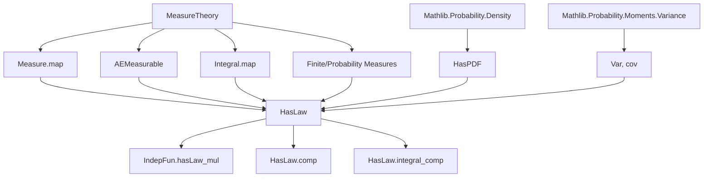
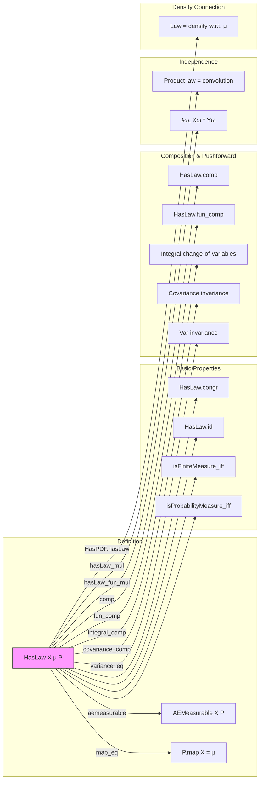

### Technical Brief: `HasLaw` in Lean 4 (Probability Theory)

---

#### **1. Key Definitions & Theorems**

| Name | Type / Signature | Purpose |
|------|------------------|---------|
| `HasLaw X μ P` | `Prop` | Predicate stating that random variable `X : Ω → 𝓧` has law (distribution) `μ` under measure `P`, i.e., `P.map X = μ`, *and* `X` is `P`-a.e. measurable. Ensures `P.map X` is well-behaved. |
| `HasLaw.congr` | `hX : HasLaw X μ P → Y =ᵐ[P] X → HasLaw Y μ P` | Allows replacing `X` with an almost-everywhere equal version `Y`. |
| `hasLaw_congr` | `X =ᵐ[P] Y → HasLaw X μ P ↔ HasLaw Y μ P` | Equivalence version of `congr`. |
| `MeasurePreserving.hasLaw` | `MeasurePreserving X P μ → HasLaw X μ P` | If `X` pushes `P` forward to `μ`, then `X` has law `μ`. |
| `HasLaw.measurePreserving` | `HasLaw X μ P → Measurable X → MeasurePreserving X P μ` | Converse under measurability. |
| `HasLaw.id` | `HasLaw id μ μ` | Identity map has law `μ` under `μ`. |
| `HasLaw.ae_iff` | `(∀ᵐ ω ∂P, p (X ω)) ↔ ∀ᵐ x ∂μ, p x` | Pulls back almost-everywhere statements along `X`. |
| `HasLaw.isFiniteMeasure_iff` / `isProbabilityMeasure_iff` | `IsFiniteMeasure P ↔ IsFiniteMeasure μ`, etc. | Transfer of finiteness/probability properties via law. |
| `HasLaw.comp` | `HasLaw Y ν μ → HasLaw X μ P → HasLaw (Y ∘ X) ν P` | Chain rule for laws under composition. |
| `IndepFun.hasLaw_mul` | `HasLaw X μ P → HasLaw Y ν P → X ⟂ᵢ[P] Y → HasLaw (X * Y) (μ ∗ₘ ν) P` | Law of product of independent random variables is multiplicative convolution. |
| `HasLaw.integral_comp` / `lintegral_comp` | `P[f ∘ X] = ∫ f ∂μ`, `∫⁻ f ∘ X ∂P = ∫⁻ f ∂μ` | Change-of-variables formula for integrals w.r.t. law. |
| `HasLaw.integral_eq` | `P[X] = ∫ x ∂μ` | Expectation of `X` equals integral of identity w.r.t. its law. |
| `HasLaw.covariance_comp` / `variance_eq` | `cov[f∘X, g∘X; P] = cov[f, g; μ]`, `Var[X; P] = Var[id; μ]` | Covariance and variance are invariant under pushforward. |
| `HasPDF.hasLaw` | `HasPDF X P μ → HasLaw X (μ.withDensity (pdf X P μ)) P` | If `X` has density, then its law is absolutely continuous w.r.t. `μ`. |

---

#### **2. Naming Conventions**

- **Predicate prefix**: `HasLaw` — standard Lean pattern for properties of objects (e.g., `HasPDF`, `HasMoment`).
- **Structure fields**: `aemeasurable`, `map_eq` — explicit, descriptive names for the two components.
- **Lemma prefixes**:
  - `HasLaw.*`: properties of the predicate itself.
  - `IndepFun.*`: properties under independence assumptions.
  - `hasLaw_congr`, `hasLaw_mul`, `hasLaw_fun_mul`: variant forms (e.g., `fun` versions for lambda syntax).
- **Suffixes**:
  - `_comp`: composition with measurable functions.
  - `_fun_*`: lambda-form versions (e.g., `fun ω ↦ ...`).
  - `_eq`: equalities involving expectations/integrals/variances.

---

#### **3. Tactic Stack**

Frequently used tactics in proofs:

| Tactic | Role |
|--------|------|
| `rw` | Rewriting using `map_eq`, `map_id`, `map_congr`, etc. |
| `simp` / `simp_rw` | Simplifying using `map_id`, `Function.id_comp`, `Function.comp_def`. |
| `aesop` / `fun_prop` | Propagation of measurability/aemeasurability goals (e.g., `aemeasurable` subgoals). |
| `rwa` | `rw` + `assumption` (e.g., after `rw [hX.map_eq]`, reapply `hY.map_eq`). |
| `exact` / `intro` | Basic proof structure. |
| `lintegral_map'`, `integral_map`, `covariance_map` | Apply known lemmas about pushforward measures. |
| `volume_tac` | Used in default argument for `P` in `HasLaw` definition. |

---

#### **4. Proof Logic**

- **Structure**: Most proofs follow a *two-step* pattern:
  1. **Measurability**: Use `fun_prop` to discharge `AEMeasurable` goals via composition rules and assumptions.
  2. **Equality**: Reduce to known pushforward identities (`map_eq`, `map_congr`, `map_mul_eq_map_mconv_map₀'`, etc.), then apply assumptions (`hX.map_eq`, `hY.map_eq`).
- **Common patterns**:
  - **Congruence**: Replace `X` by `Y` using `map_congr hXY` or `congr`.
  - **Change of variables**: Use `integral_map`/`lintegral_map'` + `hX.map_eq`.
  - **Independence**: Use `map_mul_eq_map_mconv_map₀'` for products; requires `SigmaFinite` and `MeasurableMul₂`.
  - **Transfer of properties**: Use `isFiniteMeasure_map_iff`, `isProbabilityMeasure_map_iff`, etc.

---

#### **5. Imports & Dependencies**

| Import | Purpose |
|--------|---------|
| `Mathlib.Probability.Density` | Provides `HasPDF`, `pdf`, `withDensity`, and related lemmas (e.g., `map_eq_withDensity_pdf`). |
| `Mathlib.Probability.Moments.Variance` | Provides `Var`, `cov`, `covariance_map`, etc., used in `HasLaw.variance_eq`, `covariance_comp`. |

Other implicit dependencies:
- `MeasureTheory.Measure.Map` (for `map`, `map_congr`, `map_id`, `map_mul_eq_map_mconv_map₀'`)
- `MeasureTheory.AEMeasurable` (for `AEMeasurable`, `aestronglyMeasurable`, `ae_map_iff`)
- `MeasureTheory.Integral.Map` (for `integral_map`, `lintegral_map'`)
- `MeasureTheory.Measure.Finite` (for `isFiniteMeasure`, `isProbabilityMeasure`)
- `MeasureTheory.Measure.SigmaFinite` (for convolution lemmas)

---

#### **6. Mermaid Diagrams**

##### **Dependency Graph (Core Concepts)**

##### **Overview of `HasLaw` Module**

---

#### **7. Summary**

The `HasLaw` predicate formalizes the *distribution* of a random variable in measure-theoretic probability. It is foundational for:
- Transfer of measure-theoretic properties (finiteness, probability),
- Integration and moment calculations via pushforward,
- Behavior under composition and independent multiplication,
- Connecting random variables to their densities.

Its design emphasizes *robustness* (via `AEMeasurable`) and *modularity* (via lemmas like `congr`, `comp`, `integral_comp`), making it suitable for higher-level probabilistic reasoning (e.g., limit theorems, concentration inequalities).
