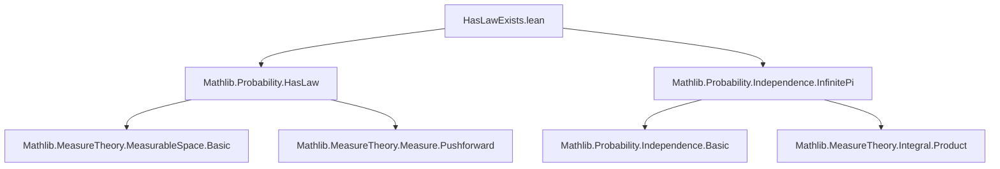
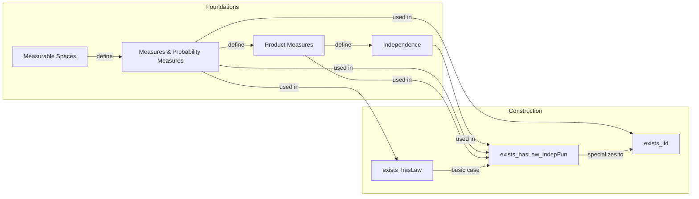

### Technical Brief: `HasLawExists.lean`

---

#### **1. Key Definitions & Theorems**

| Name | Type / Signature | Purpose |
|------|------------------|---------|
| `exists_hasLaw` | `∀ {𝓧 : Type u} {m𝓧 : MeasurableSpace 𝓧} (μ : Measure 𝓧), ∃ Ω, ∃ _, ∃ P, ∃ X, Measurable X ∧ HasLaw X μ P` | Constructs a random variable $X$ on some probability space $(\Omega, P)$ with prescribed law $\mu$. Uses identity map on $\mathcal{X}$. |
| `exists_hasLaw_indepFun` | `∀ {ι : Type v} (𝓧 : ι → Type u) {m𝓧 : ∀ i, MeasurableSpace (𝓧 i)} (μ : ∀ i, Measure (𝓧 i)), [∀ i, IsProbabilityMeasure (μ i)] → ∃ Ω, ∃ _, ∃ P, ∃ X, (∀ i, Measurable (X i)) ∧ (∀ i, HasLaw (X i) (μ i) P) ∧ iIndepFun X P ∧ IsProbabilityMeasure P` | Constructs a family of **mutually independent** random variables $(X_i)_{i \in \iota}$, each with law $\mu_i$, on a common probability space. Uses infinite product space $\prod_i \mathcal{X}_i$ with product measure $\bigotimes_i \mu_i$. |
| `exists_iid` | `∀ (ι : Type v) {𝓧 : Type u} {m𝓧 : MeasurableSpace 𝓧} (μ : Measure 𝓧) [IsProbabilityMeasure μ], ∃ Ω, ∃ _, ∃ P, ∃ X : ι → Ω → 𝓧, ...` | Special case of `exists_hasLaw_indepFun` where all target spaces and laws are identical — constructs an i.i.d. family of random variables with common law $\mu$. |

> **Notation**:  
> - `HasLaw X μ P` means $X_*P = \mu$, i.e., the pushforward of $P$ along $X$ equals $\mu$.  
> - `iIndepFun X P` denotes mutual independence of the family $X : \iota \to \Omega \to \mathcal{X}_i$ under measure $P$.  
> - `infinitePi μ` is the infinite product measure $\bigotimes_{i \in \iota} \mu_i$, defined in `Mathlib.Probability.Independence.InfinitePi`.

---

#### **2. Naming Conventions**

- **Prefixes**:
  - `exists_`: Indicates existential construction lemmas.
  - `_root_`: Used to open the lemma at the root namespace (`Measure.exists_hasLaw`).
- **Suffixes**:
  - `_indepFun`: Denotes independence of a family of functions (random variables).
  - `_iid`: Stands for *independent and identically distributed*.
- **Function names**:
  - `eval`: Standard projection from a product space: `eval i (x : Π i, X i) = x i`.
  - `id`: Identity function on $\mathcal{X}$.

---

#### **3. Tactic Stack**

| Tactic | Usage |
|--------|-------|
| `use` | To introduce witnesses for existential quantifiers (e.g., $\Omega = \prod_i \mathcal{X}_i$, $P = \bigotimes_i \mu_i$, $X = \text{eval}$). |
| `refine` | To construct proofs with holes to be filled later (e.g., `?_` for the independence goal). |
| `fun_prop` | Propagates measurability assumptions (from `MeasurableSpace` instances). |
| `rw` + `congr` + `funext` | To rewrite using extensionality and functional extensionality; used to match pushforwards with product measure components. |
| `infer_instance` | To discharge typeclass goals (e.g., `IsProbabilityMeasure P`). |
| `symm` | To reverse equalities (e.g., to match `map_eq` direction). |

No heavy automation (e.g., `aesop`, `ring`, `simp_rw`) is used — proofs are mostly constructive and rely on known lemmas from `Mathlib.Probability`.

---

#### **4. Proof Logic**

- **`exists_hasLaw`**:
  - Trivial construction: take $\Omega = \mathcal{X}$, $P = \mu$, $X = \mathrm{id}$.
  - Uses `measurable_id` and `.id` (the proof that $\mathrm{id}_*\mu = \mu$).

- **`exists_hasLaw_indepFun`**:
  1. Construct $\Omega = \prod_{i : \iota} \mathcal{X}_i$, with product measurable space and product measure $P = \bigotimes_i \mu_i$.
  2. Define $X_i(\omega) = \omega(i)$ (i.e., `eval i`).
  3. Show:
     - Each $X_i$ is measurable (`fun_prop`).
     - $X_i$ has law $\mu_i$: via `MeasurePreserving.hasLaw (measurePreserving_eval_infinitePi ...)`.
     - The family $(X_i)_i$ is independent: via `iIndepFun_iff_map_fun_eq_infinitePi_map`, reducing to equality of pushforwards and product measure — proven by `map_id'` and `measurePreserving_eval_infinitePi ... .map_eq`.
     - $P$ is a probability measure: via `infer_instance` (since each $\mu_i$ is probability and independence preserves probability).

- **`exists_iid`**:
  - Immediate corollary of `exists_hasLaw_indepFun` with constant family: $\mathcal{X}_i = \mathcal{X}$, $\mu_i = \mu$.

---

#### **5. Imports**

| Module | Role |
|--------|------|
| `Mathlib.Probability.HasLaw` | Defines `HasLaw`, pushforward, and basic properties. |
| `Mathlib.Probability.Independence.InfinitePi` | Provides infinite product measure (`infinitePi`), independence (`iIndepFun`), and key lemmas like `iIndepFun_iff_map_fun_eq_infinitePi_map`, `measurePreserving_eval_infinitePi`. |

These imports define the foundational objects: laws of random variables, independence, and infinite product constructions.

---

#### **6. Mermaid Diagrams**

##### **Dependency Graph (Module-Level)**

##### **Overview of Theoretical Flow**

---

#### **7. Summary**

This file formalizes the foundational *existence* results for random variables in probability theory:
- Any probability law can be realized as the distribution of some random variable.
- Any family of probability laws (indexed by a type) can be realized as the joint law of a mutually independent family of random variables.
- In particular, i.i.d. families exist for any given law.

The constructions are explicit and constructive (via product spaces), and rely on deep but standard results from measure theory (existence of infinite product measures, characterization of independence via product measures). The proofs are concise and leverage `Mathlib`’s high-level abstractions (e.g., `MeasurePreserving`, `iIndepFun`, `infinitePi`).
