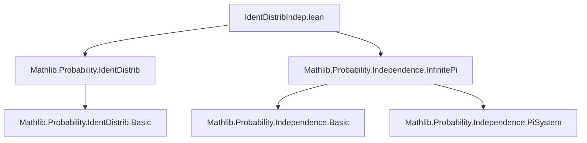
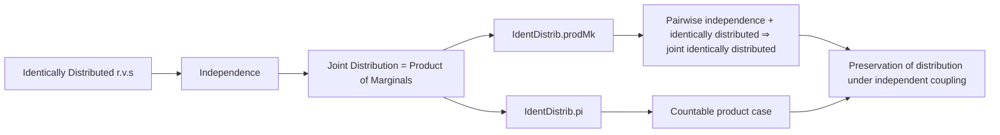

**Technical Brief: `IdentDistribIndep.lean`**

---

### 1. **Key Definitions & Theorems**

| Name | Type / Signature | Purpose |
|------|------------------|---------|
| `IdentDistrib` | `X ⟬ Y μ ν` (defined in `Mathlib.Probability.IdentDistrib`) | Random variables `X : Ω → E`, `Y : Ω' → E` are *identically distributed* w.r.t. measures `μ`, `ν` if `μ.map X = ν.map Y`. |
| `IdentDistrib.prodMk` | `IdentDistrib X Z μ ν → IdentDistrib Y W μ ν → X ⟂ᵢ[μ] Y → Z ⟂ᵢ[ν] W → IdentDistrib (ω ↦ (X ω, Y ω)) (ω' ↦ (Z ω', W ω')) μ ν` | Shows that if two *independent* pairs have identically distributed components, then the joint distributions are identically distributed. |
| `IdentDistrib.pi` | `[Countable ι] → (∀ i, IdentDistrib (X i) (Y i) μ ν) → iIndepFun X μ → iIndepFun Y ν → IdentDistrib (fun ω ↦ X · ω) (fun ω' ↦ Y · ω') μ ν` | Generalizes `prodMk` to countable products: if families of independent r.v.s have pairwise identically distributed components, then the product maps are identically distributed. |

---

### 2. **Naming Conventions**

- **Prefixes**:
  - `IdentDistrib.`: Module namespace for results about identically distributed random variables.
  - `aemeasurable_`: Properties of almost-everywhere measurable functions (e.g., `aemeasurable_fst`, `aemeasurable_snd`, `aemeasurable_pi_lambda`).
- **Suffixes**:
  - `_map_eq`: Refers to equality of pushforward measures (e.g., `hXZ.map_eq`).
  - `_ind`: Short for independence (e.g., `hXY : X ⟂ᵢ[μ] Y`, `hX_ind : iIndepFun X μ`).
- **Quantifier patterns**:
  - `fun ω ↦ (X ω, Y ω)` for product maps.
  - `fun ω ↦ X · ω` for π-type (dependent product) maps.

---

### 3. **Tactic Stack**

- `rw`: Rewriting using lemmas like `map_eq`, `indepFun_iff_map_prod_eq_prod_map_map`, `iIndepFun_iff_map_fun_eq_infinitePi_map₀'`.
- `congr with i`: To reduce goal to component-wise equality in π-types.
- `have : IsFiniteMeasure … := by …`: Local assumptions for finiteness (used to apply lemmas requiring finite measures).
- `infer_instance`: To derive typeclass instances (e.g., `IsFiniteMeasure (ν.map Z)`).
- `simp_rw`: Not explicitly used, but `rw` suffices due to careful lemma selection.

---

### 4. **Proof Logic**

- **`prodMk` proof**:
  1. Prove measurability of projections using `prodMk` on measurable components.
  2. Use independence equivalences (`indepFun_iff_map_prod_eq_prod_map_map`) to rewrite joint pushforwards as product measures.
  3. Replace using `map_eq` from identically distributed assumptions.

- **`pi` proof**:
  1. Use `aemeasurable_pi_lambda` for component-wise measurability.
  2. Apply infinite product independence equivalence (`iIndepFun_iff_map_fun_eq_infinitePi_map₀'`) to rewrite joint pushforwards as infinite product measures.
  3. Reduce to component-wise equality via `congr with i`, then apply `map_eq` per component.

- **Common pattern**:  
  *Independence + pairwise identically distributed ⇒ joint identically distributed*, via:
  - Measurability (component-wise),
  - Measure equality (via independence + component-wise equality).

---

### 5. **Imports & Dependencies**

| Import | Role |
|--------|------|
| `Mathlib.Probability.IdentDistrib` | Core definitions and basic lemmas about identically distributed r.v.s. |
| `Mathlib.Probability.Independence.InfinitePi` | Independence for families of r.v.s indexed by arbitrary (especially countable) types; includes `iIndepFun`, `indepFun_iff_map_prod_eq_prod_map_map`, `iIndepFun_iff_map_fun_eq_infinitePi_map₀'`. |

---

### 6. **Mermaid Diagrams**

#### **Dependency Graph (Module-Level)**

#### **Overview of Theoretical Flow**

---

### 7. **Key Lemmas Used (External)**

- `indepFun_iff_map_prod_eq_prod_map_map`: Equivalence between independence and product measure equality for two functions.
- `iIndepFun_iff_map_fun_eq_infinitePi_map₀'`: Equivalence for countable families: independence ⇔ pushforward = infinite product of pushforwards.
- `aemeasurable_pi_lambda`: Measurability of π-type functions.
- `Measure.isFiniteMeasure_of_map`: Derives finiteness of a measure from finiteness of its pushforward.

---

### 8. **Domain-Specific AI Agent Notes**

- **Focus area**: Probabilistic modeling with measure-theoretic foundations.
- **Typical tasks**: Proving distributional equivalences under independence assumptions.
- **Common proof patterns**:
  - Decompose joint distributions using independence.
  - Reduce to component-wise equalities via `congr`.
  - Use `map_eq` to propagate identically distributed assumptions.
- **Suggested AI capabilities**:
  - Automatic application of `prodMk`/`pi` lemmas when pattern matches independence + identically distributed assumptions.
  - Suggest `indepFun_iff_map_prod_eq_prod_map_map` or `iIndepFun_iff_map_fun_eq_infinitePi_map₀'` when joint distribution equality is needed.
  - Detect when countability is required (e.g., for `pi`) and suggest `Countable` instance hints.

--- 

*End of Technical Brief.*
