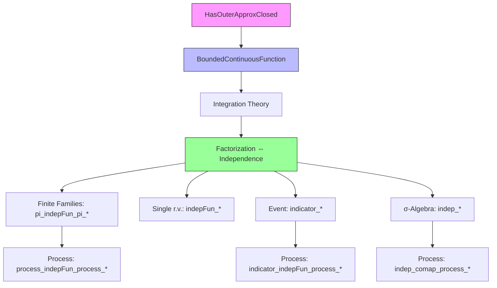
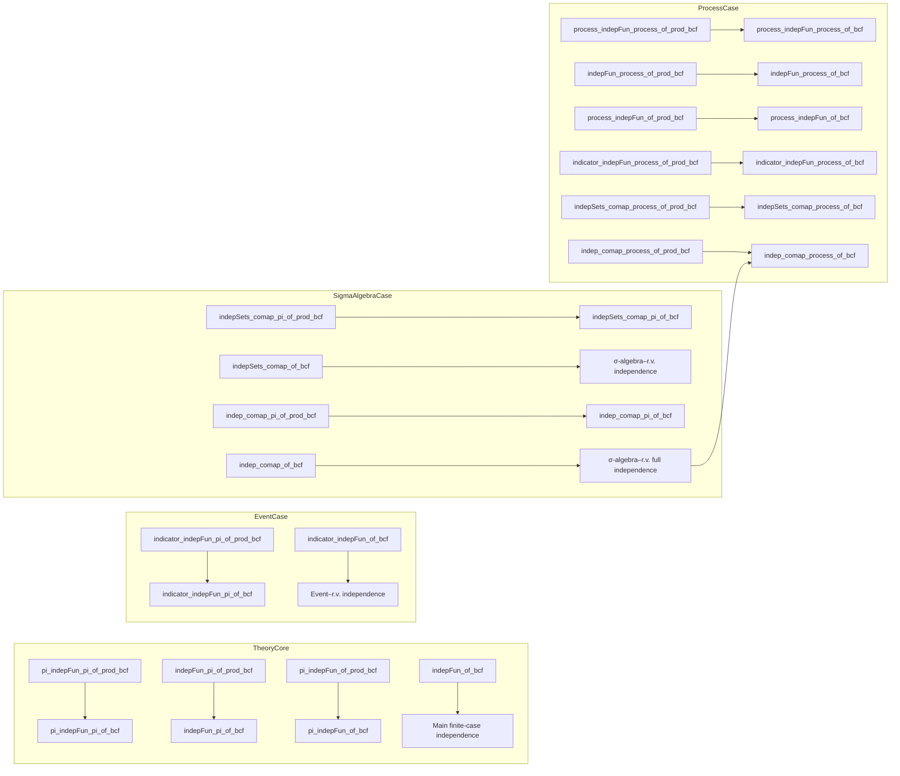

### Technical Brief: BoundedContinuousFunction.lean

---

#### **1. Key Definitions & Theorems**

| Name | Type / Signature | Purpose |
|------|------------------|---------|
| `pi_indepFun_pi_of_prod_bcf` | `IndepFun (λ ω s, X s ω) (λ ω t, Y t ω) P` | Characterizes independence of two *families* of random variables over product spaces using integrals of products of bounded continuous functions. |
| `pi_indepFun_pi_of_bcf` | `IndepFun (λ ω s, X s ω) (λ ω t, Y t ω) P` | Same as above but for general (non-product) target spaces, assuming finite index sets. |
| `indepFun_pi_of_prod_bcf` | `IndepFun Z (λ ω t, Y t ω) P` | Independence of a single r.v. $Z$ and a finite family $(Y_t)_{t \in T}$. |
| `indepFun_pi_of_bcf` | `IndepFun Z (λ ω t, Y t ω) P` | Same as above for general targets. |
| `pi_indepFun_of_prod_bcf` | `IndepFun (λ ω s, X s ω) U P` | Independence of a finite family $(X_s)_{s \in S}$ and a single r.v. $U$. |
| `pi_indepFun_of_bcf` | `IndepFun (λ ω s, X s ω) U P` | Same for general targets. |
| `indepFun_of_bcf` | `IndepFun Z U P` | Classical characterization: two r.v.s are independent iff integrals factor over bounded continuous test functions. |
| `indicator_indepFun_pi_of_prod_bcf` | `(A.indicator (1 : Ω → ℝ)) ⟂ᵢ[P] (λ ω s, X s ω)` | Independence of an event $A$ and a finite family $(X_s)_{s \in S}$ via integrals over $A$. |
| `indicator_indepFun_pi_of_bcf` | Same as above | Same for general targets. |
| `indicator_indepFun_of_bcf` | `(A.indicator (1 : Ω → ℝ)) ⟂ᵢ[P] Z` | Independence of event $A$ and single r.v. $Z$. |
| `indepSets_comap_pi_of_prod_bcf` | `IndepSets 𝒜 {A | MeasurableSet[π.comap (λ ω s, X s ω)] A} P` | Independence of a σ-algebra $\mathcal{A}$ and a finite family $(X_s)_{s \in S}$. |
| `indepSets_comap_pi_of_bcf` | Same as above | Same for general targets. |
| `indepSets_comap_of_bcf` | `IndepSets 𝒜 {A | MeasurableSet[comap Z] A} P` | Independence of $\mathcal{A}$ and single r.v. $Z$. |
| `indep_comap_pi_of_prod_bcf` | `Indep m (π.comap (λ ω s, X s ω)) P` | Full independence of σ-algebra $m$ and finite family $(X_s)_{s \in S}$. |
| `indep_comap_pi_of_bcf` | Same as above | Same for general targets. |
| `indep_comap_of_bcf` | `Indep m (comap Z) P` | Independence of $m$ and single r.v. $Z$. |
| `process_indepFun_process_of_prod_bcf` | `IndepFun (λ ω s, X s ω) (λ ω t, Y t ω) P` | Independence of two stochastic processes, using finite subfamilies. |
| `process_indepFun_process_of_bcf` | Same as above | Same for general targets. |
| `indepFun_process_of_prod_bcf` | `IndepFun Z (λ ω t, Y t ω) P` | Independence of a single r.v. and a process. |
| `indepFun_process_of_bcf` | Same as above | Same for general targets. |
| `process_indepFun_of_prod_bcf` | `IndepFun (λ ω s, X s ω) U P` | Independence of a process and a single r.v. |
| `process_indepFun_of_bcf` | Same as above | Same for general targets. |
| `indicator_indepFun_process_of_prod_bcf` | `IndepFun (A.indicator (1 : Ω → ℝ)) (λ ω s, X s ω) P` | Independence of event $A$ and a process. |
| `indicator_indepFun_process_of_bcf` | Same as above | Same for general targets. |
| `indepSets_comap_process_of_prod_bcf` | `IndepSets 𝒜 {A | MeasurableSet[π.comap (λ ω s, X s ω)] A} P` | Independence of σ-algebra and process. |
| `indepSets_comap_process_of_bcf` | Same as above | Same for general targets. |
| `indep_comap_process_of_prod_bcf` | `Indep m (π.comap (λ ω s, X s ω)) P` | Full independence of σ-algebra and process. |
| **Main Theorem** `indep_comap_process_of_bcf` | `Indep m (π.comap (λ ω s, X s ω)) P` | **Main result**: A σ-algebra $m$ is independent of a stochastic process $X$ iff integrals over $A \in m$ factor against integrals of bounded continuous functions of finite subfamilies of $X$. |

> All theorems use the abbreviation `bcf` for `boundedContinuousFunction`, e.g., `f : (s : S) → E s →ᵇ ℝ`.

---

#### **2. Naming Conventions**

- **Prefixes**:
  - `pi_`: for finite families indexed by a type `S` (product-like).
  - `process_`: for stochastic processes (indexed by possibly infinite `S`, using `Finset S`).
  - `indicator_`: for independence involving indicators of sets/events.
  - `indepFun_`, `indepSets_`, `indep_`: for increasing levels of abstraction (r.v.s → σ-algebras → processes).
- **Suffixes**:
  - `_of_bcf`: when hypothesis uses *arbitrary* bounded continuous functions on the full product.
  - `_of_prod_bcf`: when hypothesis uses *product* of functions (i.e., functions of the form $s \mapsto f_s \circ X_s$).
- **Other**:
  - `singleton_indepSets_of_indicator`: reduction from indicator independence to set independence.

---

#### **3. Tactic Stack**

| Tactic | Usage |
|--------|-------|
| `rw [...]` | Rewriting definitions (`indepFun_iff_map_prod_eq_prod_map_map`, `integral_map`, etc.) |
| `convert h ... <;> simp` | Matching hypothesis `h` and simplifying using `simp` (core pattern) |
| `fun_prop` | Proving measurability / aemeasurability goals (used repeatedly) |
| `aesop` | Not explicitly used here — replaced by `fun_prop` + `simp` |
| `ring` | Final simplification in scalar algebra (e.g., after measure computations) |
| `gcongr` | In integrability proofs, to bound norms |
| `split_ifs` | Case analysis on indicator functions |
| `have h : ... := ...` | Intermediate lemmas (e.g., algebraic identities for indicators) |
| `exact ...` | Closing simple goals (e.g., integrability, measurability) |

---

#### **4. Proof Logic**

- **High-level strategy**:
  1. **Reduce to product case** (`pi_indepFun_pi_of_prod_bcf`) where target spaces are products — avoids second-countability assumptions.
  2. **Lift to general case** via embedding via evaluation maps:  
     $f \mapsto \prod_s (f_s \circ \mathrm{eval}_s)$, using continuity and `compContinuous`.
  3. **Use integral factorization** as proxy for independence:
     - `eq_prod_of_integral_mul_boundedContinuousFunction` (or variants) converts integral factorization to independence.
  4. **Indicator case**: express indicator as piecewise constant, decompose integrals, use additivity and null-measurability.
  5. **σ-algebra case**: reduce to indicator case via `IndepFun.singleton_indepSets_of_indicator`.
  6. **Process case**: reduce to finite subfamilies using `Finset S`, then apply finite-case lemmas.

- **Induction pattern**: Not explicit induction — instead, *finite approximation* via `Finset` and `Fintype.ofFinite`.

- **Key logical flow**:
  ```
  Hypothesis: ∫ A (∏ f ∘ X) = P(A) ∫ (∏ f ∘ X)
  ⇒ (via decomposition) IndepFun / IndepSets / Indep
  ```

---

#### **5. Imports**

| Module | Role |
|--------|------|
| `Mathlib.MeasureTheory.Measure.HasOuterApproxClosedProd` | Ensures product spaces inherit `HasOuterApproxClosed`, needed for bounded continuous function integration theory. |
| `Mathlib.Probability.Independence.Process` | Defines independence for stochastic processes (`IndepFun.process_indepFun_process`, etc.). |
| `Mathlib.Probability.Notation` | Provides `P[...]`, `∫ ω in A, ...`, etc. |

---

#### **6. Mermaid Diagrams**

##### **Dependency Graph (High-Level)**



##### **Overview of File Structure**



---

#### **7. Summary**

This file provides a **unified framework** for characterizing independence via bounded continuous functions, covering:
- Finite families of r.v.s,
- Single r.v.s,
- Events (via indicators),
- σ-algebras,
- Stochastic processes (possibly infinite-indexed).

It avoids second-countability assumptions by working with product-type targets first, then lifting via evaluation maps. The core idea is:  
> **Factorization of integrals over products of bounded continuous functions ⇔ independence.**

The main theorem `indep_comap_process_of_bcf` gives a practical criterion for checking independence between a σ-algebra and a stochastic process — only finite-dimensional test functions are needed.

--- 

Let me know if you'd like a formalized dependency graph in `leanpkg` format or a proof sketch of `indep_comap_process_of_bcf`.
