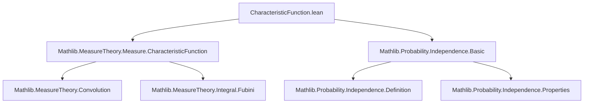
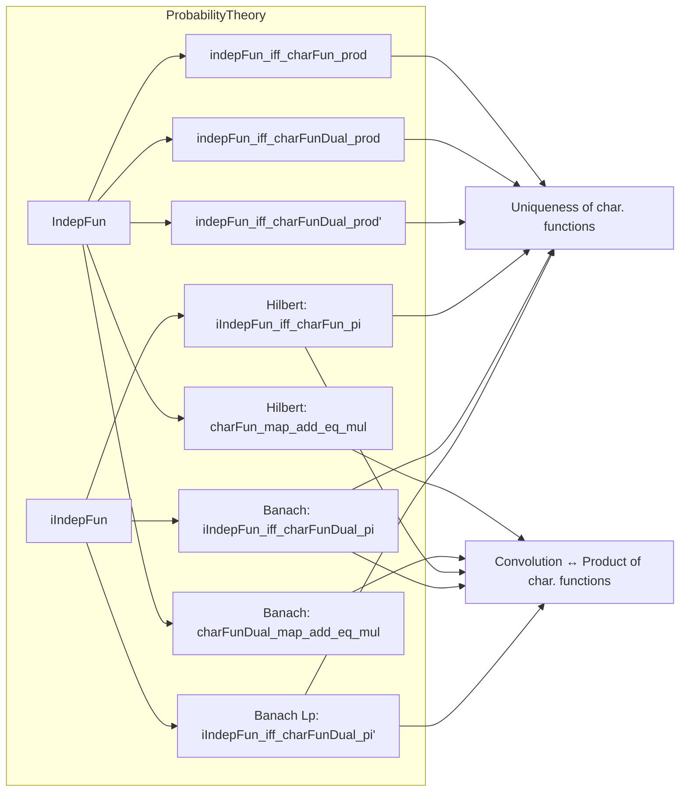
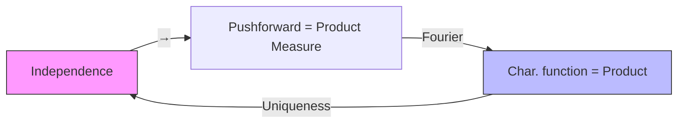

### Technical Brief: `CharacteristicFunction.lean`

---

#### **1. Key Definitions & Theorems**

| Name | Type / Signature | Purpose |
|------|------------------|---------|
| `charFun` | `Measure Ω → ℝ → ℂ` | Characteristic function of a measure: $ \phi_\mu(t) = \int e^{i \langle t, x \rangle} \, d\mu(x) $ |
| `charFunDual` | `Measure Ω → E → ℂ` | Dual characteristic function for Banach spaces: $ \phi_\mu(L) = \int e^{i L(x)} \, d\mu(x) $ |
| `IndepFun.charFun_map_add_eq_mul` | `X ⟂ᵢ[P] Y ⇒ charFun(P.map (X + Y)) = charFun(P.map X) * charFun(P.map Y)` | Independence ⇒ factorization of char. function of sum (Hilbert case) |
| `indepFun_iff_charFun_prod` | `X ⟂ᵢ[P] Y ↔ ∀ t, charFun(P.map (X,Y))(t) = charFun(P.map X)(t₁) * charFun(P.map Y)(t₂)` | iff characterization for Hilbert spaces (via product measure & `toLp 2`) |
| `IndepFun.charFunDual_map_add_eq_mul` | `X ⟂ᵢ[P] Y ⇒ charFunDual(P.map (X + Y)) = charFunDual(P.map X) * charFunDual(P.map Y)` | Independence ⇒ factorization of dual char. function (Banach case) |
| `indepFun_iff_charFunDual_prod` | `X ⟂ᵢ[P] Y ↔ ∀ L, charFunDual(P.map (X,Y))(L) = charFunDual(P.map X)(L∘inl) * charFunDual(P.map Y)(L∘inr)` | iff for Banach spaces (dual pairing with linear functionals) |
| `indepFun_iff_charFunDual_prod'` | Same as above but using `toLp p` and `prodContinuousLinearEquiv p` | General `L^p`-based version for Banach spaces |
| `iIndepFun_iff_charFun_pi` | `iIndepFun X P ↔ ∀ t, charFun(P.map (X ·))(t) = ∏ i, charFun(P.map (X i))(t i)` | Independence of finite family ⇔ factorization of joint char. function (Hilbert) |
| `iIndepFun_iff_charFunDual_pi` | `iIndepFun X P ↔ ∀ L, charFunDual(P.map (X ·))(L) = ∏ i, charFunDual(P.map (X i))(L ∘ single i)` | Dual version for Banach spaces |
| `iIndepFun_iff_charFunDual_pi'` | Same as above but with `toLp p` and `PiLp.continuousLinearEquiv` | `L^p`-based finite-family Banach version |

> **Note**: `AEMeasurable` = almost everywhere measurable; `P.map` = pushforward measure; `X ⟂ᵢ[P] Y` = independence w.r.t. $P$.

---

#### **2. Naming Conventions**

- **Prefixes**:
  - `charFun` / `charFunDual`: for (dual) characteristic functions.
  - `IndepFun.`: lemmas about independence of *two* random variables.
  - `iIndepFun.`: lemmas about independence of *finite families* (`ι → Ω → E i`).
- **Suffixes**:
  - `_map_add_eq_mul`: factorization of char. function of sum.
  - `_iff_*_prod`: iff characterizations for product/joint measures.
  - `_pi`: for finite families indexed by `ι`.
  - `'` (prime): variants using `toLp p` and `L^p`-equivalences (e.g., `prodContinuousLinearEquiv`, `PiLp.continuousLinearEquiv`).
- **Helper functions**:
  - `inl`, `inr`: injections into product.
  - `single i`: injection into pi-type.
  - `ofLp.1`, `ofLp.2`: projections from `toLp 2`.

---

#### **3. Tactic Stack**

Frequently used tactics in proofs:
- `ext`: extensionality (for function equality).
- `rw [...]`: rewriting using equivalences/lemmas.
- `fun_prop`: proves measurability/functorial properties.
- `simp_rw`: simplification + rewriting.
- `ring`: for algebraic simplifications (e.g., in ℂ).
- `apply`, `exact`, `refine`: standard proof construction.
- `prodContinuousLinearEquiv`, `PiLp.continuousLinearEquiv`: used via `.symm.toContinuousLinearMap`.

No heavy automation (e.g., `aesop`, `linarith`) — relies on measure-theoretic structure and algebraic properties.

---

#### **4. Proof Logic**

- **Structure**:
  1. **Forward direction** (`→`): Use independence (`hXY : X ⟂ᵢ[P] Y`) + known lemmas:
     - `hXY.map_add_eq_map_conv_map₀`: pushforward of sum = convolution of pushforwards.
     - `charFun_conv` / `charFunDual_conv`: char. function of convolution = product of char. functions.
  2. **Reverse direction** (`←`): Use:
     - `← charFun_eq_prod_iff` / `← charFunDual_eq_prod_iff`: uniqueness of measures via char. functions.
     - `indepFun_iff_map_prod_eq_prod_map_map`: equivalence between independence and product of pushforwards.
     - Measurability conditions (`AEMeasurable`) to justify pushforwards.

- **Finite families** (`iIndepFun`):
  - Use `iIndepFun_iff_map_fun_eq_pi_map` (independence ⇔ joint pushforward = product measure).
  - Apply `← charFun_eq_pi_iff` / `← charFunDual_eq_pi_iff`.
  - Use `Function.comp_def` to unpack compositions.

- **Key insight**: Characteristic functions uniquely determine measures (via Fourier inversion / Lévy’s continuity theorem), so equality of char. functions ⇔ equality of measures.

---

#### **5. Imports**

| Module | Role |
|--------|------|
| `Mathlib.MeasureTheory.Measure.CharacteristicFunction` | Core definitions: `charFun`, `charFunDual`, convolution, uniqueness lemmas (`charFun_eq_prod_iff`, etc.) |
| `Mathlib.Probability.Independence.Basic` | Independence definitions: `IndepFun`, `iIndepFun`, `map_prod_eq_prod_map`, `map_fun_eq_pi_map` |

> **No analysis-heavy imports** (e.g., no `Mathlib.Probability.CharacteristicFunction` — this is a *reformulation* in terms of measures, not random variables directly).

---

#### **6. Mermaid Diagrams**

##### **Dependency Graph**

##### **Overview of File Structure**

##### **Theoretical Flow**

---

#### **7. Summary**

This file establishes the **Fourier-theoretic characterization of independence** for random variables taking values in Hilbert and Banach spaces, both for:
- **Two variables** (via sums and product spaces),
- **Finite families** (via π-systems and `PiLp` constructions).

It leverages:
- The uniqueness of measures via characteristic functions,
- The convolution theorem (`charFun(conv μ ν) = charFun μ * charFun ν`),
- The equivalence between independence and factorization of pushforward measures.

The dual version (`charFunDual`) extends the result to general Banach spaces using continuous linear functionals, with `L^p`-refinements for flexibility in normed settings.

--- 

Let me know if you'd like a formalized summary in Lean syntax or a proof sketch for a specific lemma.
