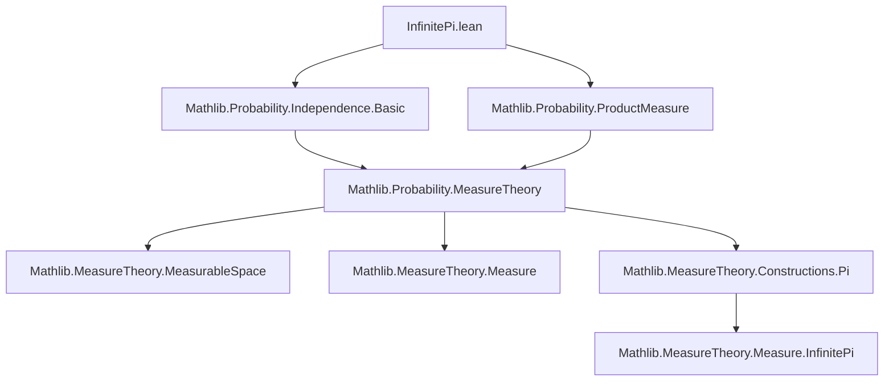
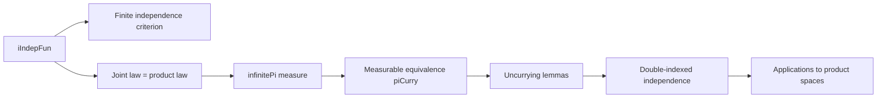
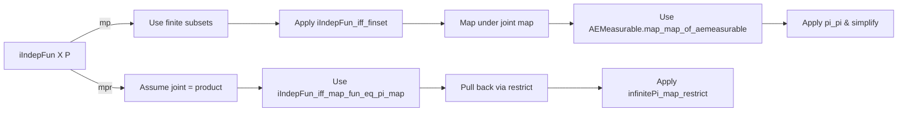

### Technical Brief: Independence of Infinite Families of Random Variables in Lean 4

---

#### **1. Key Definitions & Theorems**

| Name | Type / Signature | Purpose |
|------|------------------|---------|
| `iIndepFun` | `iIndepFun (X : Π i, Ω → 𝓧 i) (P : Measure Ω)` | Defines independence of a family of random variables $(X_i)_i$ w.r.t. measure $P$. |
| `infinitePi` | `infinitePi (μ : ι → Measure (𝓧 i))` | Constructs the product measure over an arbitrary (possibly uncountable) index set. |
| `AEMeasurable` | `AEMeasurable f P` | Measurability up to a $P$-null set. |
| `MeasurableEquiv.piCurry` | `MeasurableEquiv.piCurry 𝓧` | Measurable equivalence between curried and uncurried function spaces: $(\prod_i \prod_j X_{i,j}) \simeq \prod_{(i,j)} X_{i,j}$. |
| `iIndepFun_iff_map_fun_eq_infinitePi_map₀` | `iIndepFun X P ↔ P.map (fun ω i ↦ X i ω) = infinitePi (fun i ↦ P.map (X i))` | Core equivalence: independence ⇔ joint distribution = product of marginals, assuming *joint* a.e. measurability. |
| `iIndepFun_iff_map_fun_eq_infinitePi_map₀'` | Same as above, but under countability + per-coordinate a.e. measurability. | Extends the equivalence to the case where only each $X_i$ is a.e. measurable and $\iota$ is countable. |
| `iIndepFun_iff_map_fun_eq_infinitePi_map` | Same, but under full (not just a.e.) measurability. | Standard version used when all maps are measurable. |
| `iIndepFun_infinitePi` | `iIndepFun (fun i ω ↦ X i (ω i)) (infinitePi P)` | Standard coordinate projections on a product space are independent. |
| `iIndepFun_uncurry` | Under assumptions of independence of families and of the family-of-families, deduce independence of the fully uncurried family. | Generalizes independence under reindexing via $\Sigma$-types. |
| `iIndepFun_uncurry'` | Non-dependent version of `iIndepFun_uncurry`. | Same as above but for product index $\iota \times \kappa$. |
| `iIndepFun_uncurry_infinitePi` / `iIndepFun_uncurry_infinitePi'` | Independence of double-indexed random variables on a double product space. | Concrete application of uncurrying to infinite product measures. |

---

#### **2. Naming Conventions**

- **Prefixes**:
  - `iIndepFun_`: Indicates statements about *independence of families* of random variables (`i` for *indexed*).
  - `infinitePi_`: Pertains to the `infinitePi` product measure construction.
  - `map_`: Relates to pushforward (image) measures under measurable maps.
  - `uncurry_`: Concerned with reindexing families via currying/uncurrying.

- **Suffixes**:
  - `_₀`, `_₀'`: Variants relying on *a.e. measurability*; `_₀'` adds countability.
  - `_infinitePi`: Special case where the underlying space is a product space with `infinitePi` measure.
  - `'` (prime): Non-dependent version (e.g., `uncurry'` vs `uncurry`).

- **Function naming**:
  - `fun ω i ↦ X i ω`: Joint map $\omega \mapsto (X_i(\omega))_i$.
  - `fun (p : ι × κ) ω ↦ X p.1 p.2 ω`: Fully uncurried version.

---

#### **3. Tactic Stack**

The proofs rely heavily on:

- `fun_prop`: Propagates measurability assumptions (e.g., `Measurable`, `AEMeasurable`).
- `simp` / `simp only`: Simplifies using definitional equalities and lemmas like `pi_pi`, `map_map`, `infinitePi_map_pi`.
- `rw`: Rewriting using equivalences and lemmas (especially `iIndepFun_iff_*`).
- `congrm`: Congruence reasoning for equalities of measures or maps.
- `ext`: Extensionality for functions/sets.
- `have`: Local lemma introduction, often for measurability or probability measure facts.
- `exact`, `any_goals`: Fine-grained control over subgoals.

---

#### **4. Proof Logic**

The logical flow is highly structured and modular:

1. **Equivalence proofs** (`iIndepFun_iff_*`) follow a standard pattern:
   - **Forward direction (`mp`)**:
     - Assume independence (`iIndepFun`).
     - Reduce to finite subsets via `iIndepFun_iff_finset`.
     - Use properties of `map`, `infinitePi`, and `AEMeasurable.map_map_of_aemeasurable`.
     - Apply `pi_pi` to compute finite products.
   - **Backward direction (`mpr`)**:
     - Assume joint law = product law.
     - Use `iIndepFun_iff_map_fun_eq_pi_map` (finite version).
     - Pull back via restriction maps and apply `infinitePi_map_restrict`.

2. **Uncurrying lemmas**:
   - Use `MeasurableEquiv.piCurry` to relate curried and uncurried representations.
   - Apply the main equivalence (`iIndepFun_iff_map_fun_eq_infinitePi_map`) twice:
     - Once for the outer family (independence of families).
     - Once for each inner family (independence within each family).
   - Combine via chain of equalities involving `map_map`, `infinitePi_map_piCurry`, etc.

3. **Product space independence**:
   - Leverage `iIndepFun_infinitePi` as a base case.
   - Use `map_map` and `infinitePi_map_pi` to reduce to coordinate maps.

---

#### **5. Imports & Dependencies**

- **Core dependencies**:
  ```lean
  Mathlib.Probability.Independence.Basic
  Mathlib.Probability.ProductMeasure
  ```
- **Implicit dependencies** (via `MeasureTheory`, `ProbabilityTheory`):
  - `MeasureTheory.MeasurableSpace`
  - `MeasureTheory.MeasurableFunction`
  - `MeasureTheory.Integral.Basic`
  - `MeasureTheory.Measure.Product`
  - `MeasureTheory.Function.SimpleFunc`
  - `MeasureTheory.Constructions.Pi`
  - `MeasureTheory.MeasurableSpace.Pi`
  - `MeasureTheory.Measure.InfinitePi`
  - `MeasureTheory.MeasurableSpace.AEMeasurable`
  - `MeasureTheory.Measure.Map`
  - `MeasureTheory.Measure.IsProbabilityMeasure`
  - `Mathlib.Data.Set.Pi`
  - `Mathlib.Data.Equiv.Basic`
  - `Mathlib.Data.Sigma.Basic`
  - `Mathlib.Data.Countable.Basic`

---

#### **6. Mermaid Diagrams**

##### **Dependency Graph (Module-Level)**



##### **Overview of Theory Flow**



##### **Proof Structure for Core Equivalence**



---

#### **7. Summary**

This file formalizes the foundational characterization of independence for *arbitrary* families of random variables via product measures. It distinguishes between:
- Joint a.e. measurability (for arbitrary index sets),
- Coordinate-wise a.e. measurability + countability (to recover equivalence),
- Full measurability (most common case).

It also provides powerful tools for *reindexing* independent families (via uncurrying), which is essential for handling multi-indexed stochastic processes or hierarchical models.

The formalization is clean, modular, and leverages Lean’s powerful `MeasurableEquiv` and `infinitePi` infrastructure to handle uncountable products rigorously.
