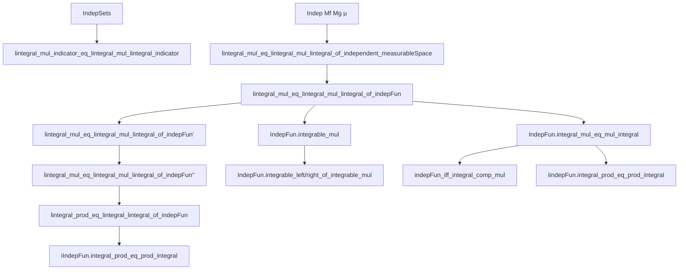
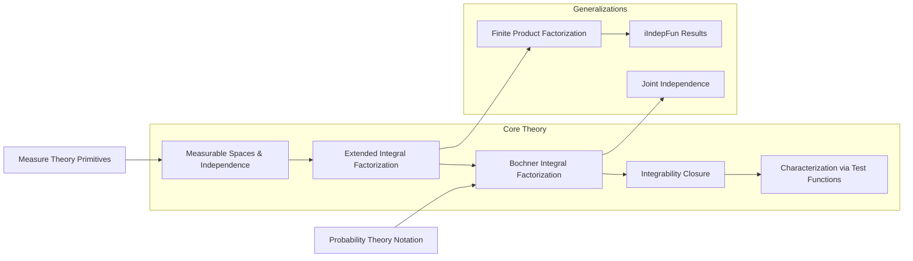

### Technical Brief: Integration in Probability Theory (Lean 4)

---

#### **1. Key Definitions & Theorems**

| Name | Type | Purpose |
|------|------|---------|
| `IndepSets` | `IndepSets (s₁ : Set (Set Ω)) (s₂ : Set (Set Ω)) (μ : Measure Ω)` | Independence of two collections of sets w.r.t. a measure. |
| `Indep` | `Indep (M₁ M₂ : MeasurableSpace Ω) (μ : Measure Ω)` | Independence of two sub-σ-algebras (measurable spaces). |
| `f ⟂ᵢ[μ] g` | `IndepFun (f g : Ω → β) (μ : Measure Ω)` | Independence of two random variables (functions). |
| `iIndepFun` | `iIndepFun (X : ι → Ω → β i) (μ : Measure Ω)` | Joint independence of a finite family of random variables. |
| `AEMeasurable` | `AEMeasurable (f : Ω → β) (μ : Measure Ω)` | Measurability up to a μ-null set. |
| `Integrable` | `Integrable (f : Ω → β) (μ : Measure Ω)` | Integrability of a function w.r.t. μ (finite ∫ ‖f‖). |
| `lintegral` | `∫⁻ (ω : Ω), f ω ∂μ` | Extended non-negative integral (ℒ¹⁺). |
| `integral` | `∫ (ω : Ω), f ω ∂μ` or `μ[f]` | Bochner integral (for integrable functions). |

**Key Theorems:**

| Name | Statement | Role |
|------|-----------|------|
| `lintegral_mul_indicator_eq_lintegral_mul_lintegral_indicator` | If `f` is `Mf`-measurable and independent of event `T`, then `∫⁻ f * 1_T = (∫⁻ f)(∫⁻ 1_T)` | Core lemma for indicator-based decomposition. |
| `lintegral_mul_eq_lintegral_mul_lintegral_of_independent_measurableSpace` | If `f`, `g` are measurable w.r.t. independent σ-algebras, then `∫⁻ f * g = (∫⁻ f)(∫⁻ g)` | Main result for extended non-negative functions via σ-algebra independence. |
| `lintegral_mul_eq_lintegral_mul_lintegral_of_indepFun` | If `f`, `g` are independent *functions*, then `∫⁻ f * g = (∫⁻ f)(∫⁻ g)` | Standard product rule for independent RVs (via `IndepFun`). |
| `lintegral_mul_eq_lintegral_mul_lintegral_of_indepFun'` | Same as above, but for *a.e. measurable* functions. | Extends to equivalence classes (essential measurability). |
| `lintegral_prod_eq_lintegral_lintegral_of_indepFun` | For finite families: `∫⁻ ∏_{i∈s} X_i = ∏_{i∈s} ∫⁻ X_i` | Generalization to finite products of independent RVs. |
| `IndepFun.integrable_mul` | If `X`, `Y` independent & integrable, then `X * Y` integrable | Closure under multiplication. |
| `IndepFun.integrable_left/right_of_integrable_mul` | If `X*Y` integrable, `X`, `Y` a.e. nonzero, then both integrable | Converse direction (nontrivial). |
| `IndepFun.integral_mul_eq_mul_integral` | If `X`, `Y` independent & a.e. measurable, then `E[XY] = E[X]E[Y]` | Fundamental expectation factorization. |
| `indepFun_iff_integral_comp_mul` | Characterization: `f ⟂ᵢ g` iff `E[φ∘f · ψ∘g] = E[φ∘f]E[ψ∘g]` for all measurable `φ,ψ` | Logical equivalence for independence via test functions. |
| `iIndepFun.integral_prod_eq_prod_integral` | For finite independent family: `E[∏ X_i] = ∏ E[X_i]` | Full generalization to multiple variables. |

---

#### **2. Naming Conventions**

- **Prefixes:**
  - `lintegral_...`: Extended non-negative integral results.
  - `integral_...`: Bochner integral results.
  - `indepFun_...`, `IndepFun_...`: Results about independent *functions*.
  - `iIndepFun_...`: Results about *jointly* independent families.
- **Suffixes:**
  - `_indicator`: Involves indicator functions.
  - `_mul`: Product of functions.
  - `_comp`: Composition with measurable maps.
  - `_prod`: Finite products.
  - `'`, `''`: Variants with relaxed assumptions (e.g., `indepFun'`, `indepFun''`).
- **Other:**
  - `_of_...`: Hypothesis-driven naming (e.g., `of_indepFun`, `of_independent_measurableSpace`).
  - `_aemeasurable`, `_aestronglyMeasurable`: A.e. measurability variants.

---

#### **3. Tactic Stack**

| Tactic | Usage Frequency | Purpose |
|--------|-----------------|---------|
| `simp_rw` | Very High | Rewriting with definitional equalities (e.g., `lintegral_const`, `mul_zero`). |
| `rw` | High | Applying lemmas, definitions, and equivalences. |
| `simp only` | High | Simplifying with explicit lemmas (e.g., `MeasurableSet.univ`, `Measure.restrict_apply`). |
| `apply` | High | Applying theorems to goals. |
| `intro` / `intro h` | Medium | Introducing hypotheses. |
| `have` / `obtain` | High | Intermediate lemma construction. |
| `convert` | Medium | Goal alignment via definitional equality. |
| `filter_upwards` | Medium | Handling almost-everywhere statements. |
| `fun_prop` | Medium | Proving measurability (from `MeasureTheory`). |
| `congr` | Low | Congruence reasoning (e.g., in `integral_fun_prod_comp`). |
| `change` | Medium | Changing goal to definitionally equal form. |
| `rwa`, `rfl`, `exact` | Medium | Rewriting + applying, reflexivity, exact proofs. |
| `by_cases` | Medium | Case analysis on measurable/a.e. statements. |
| `induction` | Medium | Induction on finite sets (`Finset.cons_induction`). |

---

#### **4. Proof Logic**

- **Structure:** Most proofs follow a *measurability induction* pattern:
  1. **Base case (simple functions):** Prove for indicators/characteristic functions using `IndepSets` or `Indep`.
  2. **Inductive step (addition):** Extend to finite sums using linearity of integral and distributivity.
  3. **Limit step (supremum):** Extend to arbitrary non-negative measurable functions via monotone convergence (`lintegral_iSup`).
- **Key logical flow:**
  - Use `Measurable.ennreal_induction` (or `measurable_induction`) to reduce to simple functions.
  - For Bochner integrals (`integral`), reduce to extended case via `enorm` and `hasFiniteIntegral_iff_enorm`.
  - Use `aemeasurable` and `ae_eq_mk` to handle equivalence classes.
  - For independence characterizations, apply `indepFun_iff` or `indepFun_iff_map_prod_eq_prod_map`.
- **Common sub-lemmas reused:**
  - `lintegral_congr_ae`, `integral_congr_ae`
  - `integral_map`, `integral_prod`
  - `enorm_mul`, `hasFiniteIntegral_iff_enorm`
  - `IndepFun.comp`, `IndepFun.comp₀`

---

#### **5. Imports & Dependencies**

| Module | Purpose |
|--------|---------|
| `Mathlib.MeasureTheory.Integral.Pi` | Product integrals, Fubini-type results. |
| `Mathlib.Probability.Independence.Integrable` | Independence + integrability interplay (companion file). |
| `Mathlib.Probability.Notation` | Notation for probability theory (`μ[X]`, `E[X]`, etc.). |
| `MeasureTheory` (open scoped) | Core integration theory (`lintegral`, `integral`, `AEMeasurable`, etc.). |
| `ENNReal` (open scoped) | Extended non-negative reals for extended integrals. |
| `RCLike` | Target space for random variables (e.g., `ℝ`, `ℂ`, `ℝ≥0∞`). |

---

#### **6. Mermaid Diagrams**

##### **Dependency Graph (Core Theorems)**

##### **Overview of File Structure**

---

#### **7. Summary**

This file formalizes the foundational *factorization of expectations* for independent random variables in Lean 4. It proceeds from:
- **Extended non-negative integrals** (`lintegral`) via σ-algebra independence,
- To **Bochner integrals** (`integral`) via a.e. measurability and integrability,
- To **finite products** and **joint independence**.

The proofs rely heavily on monotone class arguments (`Measurable.ennreal_induction`) and careful handling of null sets (`AEMeasurable`, `ae_eq_mk`). The results are central to probability theory, enabling rigorous justification of `E[XY] = E[X]E[Y]` under independence.

--- 

*End of Technical Brief.*
