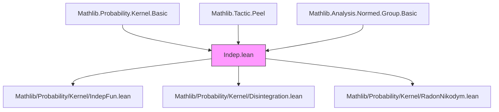
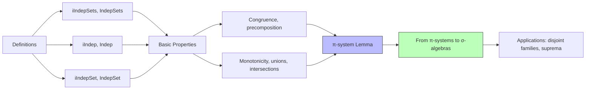

Here is the **technical metadata** extracted from the `Indep.lean` file, formatted as requested:

---

### 1. KEY DEFINITIONS & THEOREMS

| Name | Type / Signature | Purpose |
|------|------------------|---------|
| `iIndepSets` | `π : ι → Set (Set Ω) → Kernel α Ω → Measure α → Prop` | Defines independence of a family of *sets of sets* w.r.t. a kernel `κ` and measure `μ`. |
| `IndepSets` | `s₁ s₂ : Set (Set Ω) → Kernel α Ω → Measure α → Prop` | Binary variant: independence of two sets of sets. |
| `iIndep` | `(m : ι → MeasurableSpace Ω) → Kernel α Ω → Measure α → Prop` | Independence of a family of σ-algebras (via their measurable sets). |
| `Indep` | `m₁ m₂ : MeasurableSpace Ω → Kernel α Ω → Measure α → Prop` | Binary variant: independence of two σ-algebras. |
| `iIndepSet` | `(s : ι → Set Ω) → Kernel α Ω → Measure α → Prop` | Independence of a family of *single sets*, via generated σ-algebras (`generateFrom {s i}`). |
| `IndepSet` | `s t : Set Ω → Kernel α Ω → Measure α → Prop` | Binary variant: independence of two sets. |

#### Main Theorems

| Name | Type | Purpose |
|------|------|---------|
| `iIndepSets.iIndep` | `iIndepSets π κ μ → iIndep (fun x ↦ generateFrom (π x)) κ μ` | If π-systems are independent as sets of sets, then the σ-algebras they generate are independent. |
| `IndepSets.Indep` | `IndepSets s₁ s₂ κ μ → Indep (generateFrom s₁) (generateFrom s₂) κ μ` | Binary version of above for two π-systems. |
| `iIndep.indep` | `iIndep m κ μ → i ≠ j → Indep (m i) (m j) κ μ` | From full independence (`iIndep`) to pairwise independence (`Indep`). |
| `IndepSets.indep` | `IndepSets p₁ p₂ κ μ → Indep (generateFrom p₁) (generateFrom p₂) κ μ` | π-system lemma: independence of generating π-systems implies independence of generated σ-algebras. |
| `indep_iSup_of_directed_le`, `indep_iSup_of_monotone` | `Indep (⨆ i, m i) m' κ μ` under conditions | Extends pairwise independence to suprema of directed/monotone families of σ-algebras. |
| `iIndepSet.indep_generateFrom_of_disjoint` | `iIndepSet s κ μ → Disjoint S T → Indep (generateFrom (s '' S)) (generateFrom (s '' T)) κ μ` | Independence of σ-algebras generated by disjoint subfamilies of independent sets. |

---

### 2. NAMING CONVENTIONS

- **Prefixes**:
  - `iIndep*`: *indexed* (i.e., family over `ι`) versions.
  - `Indep*`: binary (two-argument) versions.
  - `indepSet*`, `indepSets*`: for sets and sets-of-sets.
  - `iIndepSet*`: for families of individual sets (via generated σ-algebras).
- **Suffixes**:
  - `congr`: congruence lemmas (w.r.t. a.e. equality of kernels).
  - `precomp`, `of_precomp`: behavior under precomposition with injective/surjective maps.
  - `of_le`, `le_of`: monotonicity w.r.t. σ-algebra inclusion.
  - `union`, `iUnion`, `biUnion`, `inter`, `iInter`, `bInter`: closure under set operations.
  - `indep_aux`, `indep'`: auxiliary or variant forms used in proofs.
  - `singleton_iff`: characterizations for singleton families.

---

### 3. TACTIC STACK

Frequently used tactics in this file:

| Tactic | Usage |
|--------|-------|
| `simp` / `simp_rw` | Simplification of measurable set conditions, intersections, products, etc. |
| `filter_upwards` | Reasoning about almost-everywhere statements w.r.t. `μ`. |
| `grind` | Automated simplification of measure-theoretic equalities (custom tactic from `Mathlib.Tactic`). |
| `aesop` / `intro` / `introv` | Basic logical reasoning. |
| `induction ... using induction_on_inter` | Structural induction on σ-algebras generated by π-systems (via `induction_on_inter`). |
| `rcases` / `obtain` / `cases` | Decomposition of hypotheses (e.g., `eq_zero_or_isMarkovKernel`, `Finset.mem_insert`, etc.). |
| `congr` / `ext1` / `ext` | Extensionality for sets/functions. |
| `rw [← ha]`, `rwa`, `convert` | Rewriting using a.e. equalities or congruences. |
| `have h : … := by …` + `exact` | Intermediate lemma construction. |

---

### 4. PROOF LOGIC

The logical flow in proofs follows a **measure-theoretic induction strategy**, especially for π-system → σ-algebra arguments:

1. **Reduction to π-systems**: Prove the property for generating π-systems (e.g., `IndepSets p₁ p₂`).
2. **Induction on σ-algebra generators**:
   - Use `induction_on_inter` to induct on measurable sets in `generateFrom p`, with cases:
     - `empty`
     - `basic` (sets in the π-system)
     - `compl`
     - `iUnion` (countable disjoint unions)
3. **A.e. reasoning**:
   - Use `filter_upwards` to lift pointwise identities to `μ`-a.e. statements.
   - Combine multiple a.e. facts using `filter_upwards [h₁, h₂, h₃]`.
4. **Kernel normalization**:
   - Split cases on `κ = 0` or `IsMarkovKernel κ` via `rcases eq_zero_or_isMarkovKernel`.
5. **Congruence & monotonicity**:
   - Use `congr` lemmas to replace kernels up to a.e. equality.
   - Use `of_le`/`le_of` lemmas to restrict or extend σ-algebras.

---

### 5. IMPORTS

| Module | Role |
|--------|------|
| `Mathlib.Probability.Kernel.Basic` | Core definitions of kernels, Markov kernels, conditional expectations. |
| `Mathlib.Tactic.Peel` | For automated handling of quantifiers in definitions like `iIndepSets`. |
| `Mathlib.Analysis.Normed.Group.Basic` | Basic analysis tools (used for measure-theoretic constructions). |

---

### 6. MERMAID DIAGRAMS

#### Dependency Graph (High-Level)

#### Overview of `Indep.lean`

---

Let me know if you'd like a formalized dependency graph (e.g., `.lean` imports tree) or a deeper dive into any specific proof pattern.
