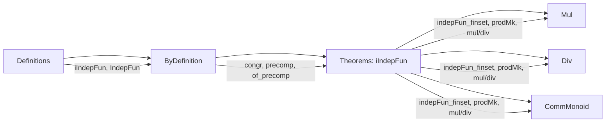
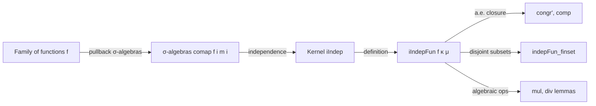

Here is the **technical metadata** extracted from the `IndepFun.lean` file, formatted as requested:

---

### **1. Key Definitions & Theorems**

| Name | Type / Signature | Purpose |
|------|------------------|---------|
| `iIndepFun` | `∀ {ι : Type*} {β : ι → Type*} [∀ i, MeasurableSpace (β i)], (∀ i, Ω → β i) → Kernel α Ω → Measure α → Prop` | Defines *independence of a family of functions* (random variables) w.r.t. a kernel `κ` and measure `μ`, via independence of the pullback σ-algebras. |
| `IndepFun` | `∀ {β γ}, (Ω → β) → (Ω → γ) → Kernel α Ω → Measure α → Prop` | Binary variant: independence of two functions. |
| `iIndepFun_congr` | `κ =ᵐ[μ] η → iIndepFun f κ μ ↔ iIndepFun f η μ` | Shows independence is invariant under almost-everywhere equality of kernels. |
| `iIndepFun.congr'` | `iIndepFun f κ μ → (∀ i, f i =ᵐ[κ a] g i) → iIndepFun g κ μ` | Allows replacing functions in an independent family by a.e.-equal ones. |
| `iIndepFun.comp` | `iIndepFun f κ μ → (∀ i, Measurable (g i)) → iIndepFun (g ∘ f) κ μ` | Closure under measurable transformations. |
| `iIndepFun.indepFun_finset` | `Disjoint S T → iIndepFun f κ μ → IndepFun (f ↾ S) (f ↾ T) κ μ` | Subfamilies over disjoint finite index sets are independent. |
| `iIndepFun.indepFun_prodMk` | `i ≠ k ∧ j ≠ k → IndepFun (fun ω ↦ (f i ω, f j ω)) (f k) κ μ` | Pair of independent variables is independent of a third. |
| `iIndepFun.indepFun_mul_left` | `i ≠ k ∧ j ≠ k → IndepFun (f i * f j) (f k) κ μ` | Product of two independent variables is independent of a third (under measurable multiplication). |
| `iIndepFun.indepFun_div_left` | `i ≠ k ∧ j ≠ k → IndepFun (f i / f j) (f k) κ μ` | Quotient of two independent variables is independent of a third. |
| `iIndepFun.indepFun_finset_prod_of_notMem` | `i ∉ s → IndepFun (∏_{j ∈ s} f j) (f i) κ μ` | Product over a finite set is independent of a variable outside the set. |
| `indepFun_iff_measure_inter_preimage_eq_mul` | `IndepFun f g κ μ ↔ ∀ s t, Measurable s → Measurable t → κ a (f⁻¹' s ∩ g⁻¹' t) = κ a (f⁻¹' s) * κ a (g⁻¹' t)` a.e. | Operational characterization: independence iff product rule for preimage intersections holds a.e. |
| `indepFun_iff_compProd_map_prod_eq_compProd_prod_map_map` | Equivalence between independence and equality of joint distributions: `μ ⊗ κ.map (ω ↦ (f ω, g ω)) = μ ⊗ (κ.map f ×ₖ κ.map g)` | Characterization via product measures and pushforwards. |

---

### **2. Naming Conventions**

- **Prefixes**:
  - `iIndepFun`: *indexed* independence of functions.
  - `IndepFun`: binary independence of functions.
  - `indepFun_*`: lemmas about binary independence (e.g., `indepFun_const_left`, `indepFun_neg_right`).
  - `iIndepFun.*`: lemmas about indexed independence (e.g., `iIndepFun.congr'`, `iIndepFun.comp`).
- **Suffixes**:
  - `_left`, `_right`: indicate which argument is transformed (e.g., `neg_left`, `mul_right`).
  - `_mul`, `_div`: indicate operations (multiplication/division).
  - `_prodMk`: product of components (e.g., `prodMk`, `prodMk_prodMk`).
  - `_₀`: variant for *almost-everywhere measurable* functions (e.g., `indepFun_mul_left₀`).
- **Other**:
  - `of_`, `precomp`, `congr`, `congr'`: structural properties (e.g., `of_precomp`, `precomp`, `congr'`).
  - `meas_*`: measure-theoretic consequences (e.g., `meas_biInter`, `meas_iInter`).

---

### **3. Tactic Stack**

Frequently used tactics in proofs:

| Tactic | Role |
|--------|------|
| `simp` / `simp_rw` | Simplification, especially for preimages, products, and measurable space constructions. |
| `filter_upwards` | Handles almost-everywhere statements by lifting events to full measure. |
| `ext` / `ext1` | Extensionality for sets/functions. |
| `rw` / `convert` | Rewriting using equalities, often with measure equalities. |
| `aesop` | Automated reasoning for set/disjointness goals (e.g., `Finset.disjoint_singleton_left.mpr`). |
| `have`, `replace`, `obtain` | Intermediate lemma introduction. |
| `congr` | Congruence for function/measurable space equalities. |
| `measurable_*` lemmas (e.g., `measurable_mul`, `measurable_div`) | Used in `comp`-style proofs. |
| `lintegral_congr_ae`, `measure_congr` | Measure-theoretic equality reasoning. |
| `Finset.prod_congr`, `Finset.prod_union` | Product manipulations over finite sets. |

---

### **4. Proof Logic**

- **General Flow**:
  1. **Reduction to σ-algebra independence**: Definitions use `iIndep` (for sets/σ-algebras), so proofs often reduce to known lemmas about `iIndep`.
  2. **A.E. reasoning**: Most properties are stated *almost everywhere* w.r.t. `μ`, so `filter_upwards` and `ae_*` lemmas dominate.
  3. **π-system arguments**: For independence of tuples over disjoint index sets, proofs construct π-systems of cylinder sets (boxes), then apply `IndepSets.indep`.
  4. **Closure under transformations**: Measurable functions preserve independence (`comp`, `comp₀`), often via `IndepFun.comp`.
  5. **Measurability assumptions**: Many lemmas require `Measurable` or `AEMeasurable` assumptions; `mk` is used to replace a.e.-measurable functions by measurable ones.
  6. **Product measure characterizations**: For equivalence with joint distributions, proofs use `Measure.ext_prod₃_iff` and integral equalities.

- **Typical Pattern**:
  ```lean
  have h := hf.indepFun_finset ...,
  refine IndepFun.congr' h ?_ ?_,
  · filter_upwards [ha] with a ha; filter_upwards [ha] with ω hω; simp [hω]
  · ...
  ```

---

### **5. Imports**

| Module | Purpose |
|--------|---------|
| `Mathlib.Probability.Independence.Kernel.Indep` | Core independence theory for sets/σ-algebras w.r.t. kernels. |
| `Mathlib.MeasureTheory.MeasurableSpace.Pi` | Measurable space structure on product types (`MeasurableSpace.pi`). |
| `Mathlib.Probability.ConditionalProbability` | Conditional expectation kernels (used for conditional independence). |
| `Mathlib.Probability.Kernel.Composition.MeasureComp` | Composition of kernels with measures (`∘ₘ`). |

---

### **6. Mermaid Diagrams**

#### **Dependency Graph (Module-Level)**

```mermaid
graph TD
  IndepFun --> Indep
  IndepFun --> PiMeasurableSpace
  IndepFun --> ConditionalProbability
  IndepFun --> KernelComposition

  Indep --> "Mathlib.Probability.Independence.Basic"
  PiMeasurableSpace --> "Mathlib.MeasureTheory.MeasurableSpace.Basic"
  ConditionalProbability --> "Mathlib.Probability.Kernel.Basic"
  KernelComposition --> "Mathlib.Probability.Kernel.Basic"
```

#### **Overview of File Structure**



#### **Conceptual Flow of Independence**



---

Let me know if you'd like a **formal specification** of `iIndepFun` in terms of its semantics (e.g., as a predicate on families of random variables), or a **proof strategy map** for key theorems.
