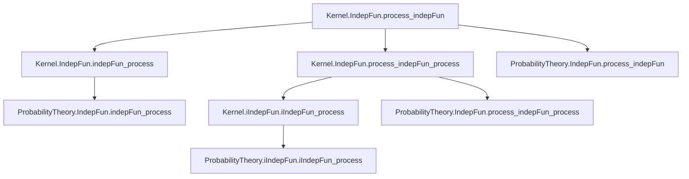
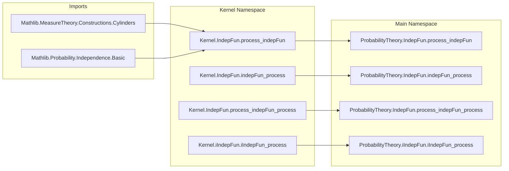
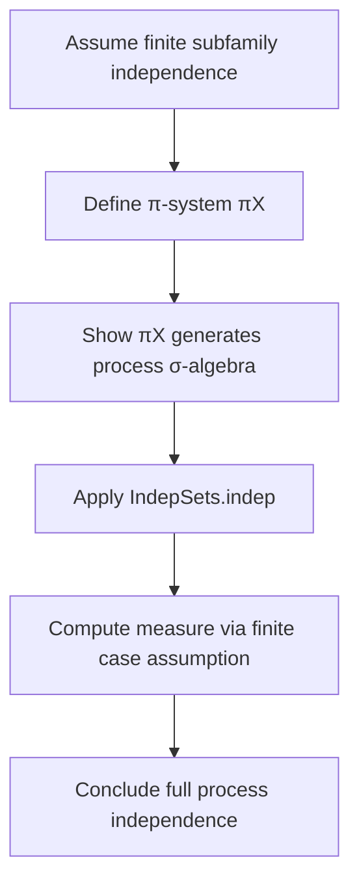

### Technical Brief: Independence of Stochastic Processes in Lean 4

---

#### **1. Key Definitions & Theorems**

| Name | Type | Purpose |
|------|------|---------|
| `IndepFun.process_indepFun` | `{X : (i : S) → Ω → 𝓧 i} → {Y : Ω → 𝓨} → (∀ i, Measurable (X i)) → Measurable Y → (∀ I : Finset S, IndepFun (fun ω (i : I) ↦ X i ω) Y κ P) → IndepFun (fun ω i ↦ X i ω) Y κ P` | Shows that a stochastic process $X$ is independent of a random variable $Y$ iff all finite subfamilies $(X_{s_1}, ..., X_{s_p})$ are independent of $Y$. |
| `IndepFun.indepFun_process` | Symmetric counterpart to `process_indepFun`, swapping roles of $X$ and $Y$. | Shows that a random variable $X$ is independent of a process $Y$ iff $X$ is independent of all finite subfamilies of $Y$. |
| `IndepFun.process_indepFun_process` | `{X : (i : S) → Ω → 𝓧 i} → {Y : (j : T) → Ω → 𝓨 j} → (∀ i j, Measurable (X i), Measurable (Y j)) → (∀ I J, IndepFun (X|_I) (Y|_J)) → IndepFun X Y` | Proves independence of two stochastic processes via finite-dimensional marginals. |
| `iIndepFun.iIndepFun_process` | `{X : (i : S) → (j : T i) → Ω → 𝓧 i j} → (∀ i j, Measurable (X i j)) → (∀ I J, iIndepFun (X|_{I,J})) → iIndepFun X` | Generalizes mutual independence to a family of stochastic processes indexed over dependent types. |
| `πX`, `π i` | Sets defined as preimages of square cylinders under process maps | Used as π-systems generating the product σ-algebra; key for applying the π-λ theorem. |
| `squareCylinders` | From `Mathlib.MeasureTheory.Constructions.Cylinders` | Standard π-system for product measurable spaces. |

---

#### **2. Naming Conventions**

- **Prefixes**:
  - `process_`: Relates to independence of stochastic processes.
  - `indepFun_`: Relates to independence of functions (random variables/processes).
  - `iIndepFun_`: For mutual independence of families of functions/processes.
- **Suffixes**:
  - `_process`: Indicates extension from finite-dimensional marginals to full process.
  - `_indepFun`: Standard for function/process independence lemmas.
- **Variables**:
  - `X`, `Y`: Processes or random variables.
  - `I`, `J`: Finite index sets (`Finset S`, `Finset T`).
  - `πX`, `π i`: π-systems used in proofs.

---

#### **3. Tactic Stack**

| Tactic | Usage |
|--------|-------|
| `simp` / `simp_rw` | Simplifying set-theoretic expressions, especially preimages and π-system definitions. |
| `rw` | Rewriting using measurable space equalities (e.g., `generateFrom_squareCylinders`). |
| `ext` | Extensionality for set equality (pointwise equality of functions/sets). |
| `filter_upwards` | Used with measure-theoretic inequalities (e.g., to lift almost-everywhere statements). |
| `congr` | Congruence for equality of measurable functions up to a.e. equivalence. |
| `exact` / `refine` | Applying known lemmas or constructing proofs with holes. |
| `obtain` / `choose!` | Extracting witnesses from existential quantifiers (e.g., cylinder representations). |
| `aesop` (implicit via `filter_upwards`) | Used in measure-theoretic simplifications (though not explicitly named, likely used in `filter_upwards` context). |

---

#### **4. Proof Logic**

The proofs follow a standard measure-theoretic pattern:

1. **Finite-dimensional reduction**: Assume independence holds for all finite subfamilies.
2. **π-system construction**: Define π-systems (e.g., `πX`) as preimages of square cylinders under process maps.
3. **σ-algebra generation**: Show that the π-system generates the relevant σ-algebra (via `MeasurableSpace.comap_generateFrom` and `generateFrom_squareCylinders`).
4. **Apply π-λ theorem**: Use `IndepSets.indep` or `iIndepSets.iIndep` to lift independence from the π-system to the full σ-algebra.
5. **Measure computation**: Use the assumption on finite marginals to compute measures of intersections (via `measure_inter_preimage_eq_mul`).
6. **A.e. equivalence handling**: In the second set of lemmas (outside `Kernel`), lift results from measurable functions to a.e.-measurable ones using `AEMeasurable.mk` and congruence.

Induction is not used; instead, the proofs rely on:
- **Set-theoretic manipulation** (preimages, products, intersections),
- **Measure-theoretic extension theorems** (π-λ),
- **Measurable space properties** (comap, pi, generateFrom).

---

#### **5. Imports**

| Module | Role |
|--------|------|
| `Mathlib.MeasureTheory.Constructions.Cylinders` | Provides `squareCylinders`, `generateFrom_squareCylinders`, and π-system properties for product σ-algebras. |
| `Mathlib.Probability.Independence.Basic` | Defines `IndepFun`, `iIndepFun`, `IndepSets`, and basic independence lemmas. |

---

#### **6. Mermaid Diagrams**

##### **Dependency Graph (Theorems)**

##### **Overview of File Structure**

##### **Proof Strategy Flow (for `process_indepFun`)**

---

#### **7. Summary**

This file formalizes a foundational result in probability theory: **independence of stochastic processes reduces to independence of all finite-dimensional marginals**. It leverages:
- The π-λ theorem via `IndepSets.indep`,
- Cylinder set constructions for product σ-algebras,
- A.e.-measurability handling via `AEMeasurable.mk`.

The structure is modular: first proven in the `Kernel` namespace (for Markov kernels), then lifted to probability measures using a.e.-equivalence. The naming and proof patterns are consistent with Lean’s `Mathlib` style, emphasizing reuse and abstraction.
