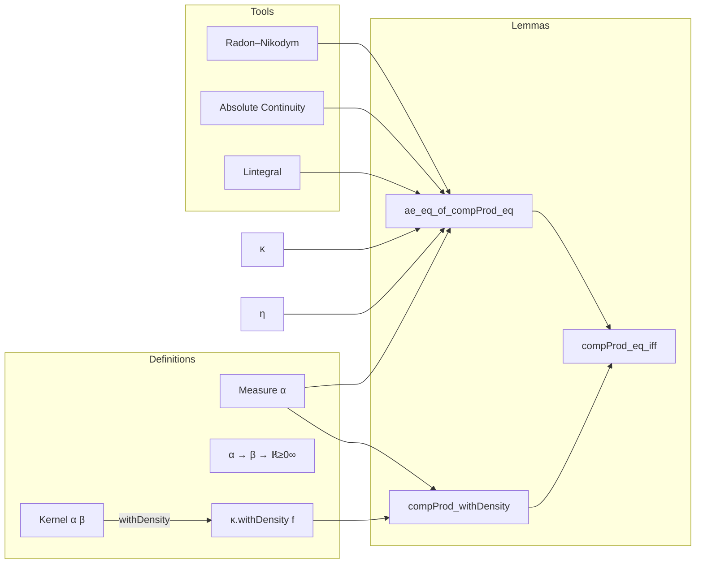

**Technical Brief: `CompProdEqIff.lean`**

---

### 1. **Key Definitions & Theorems**

| Name | Type / Statement | Purpose |
|------|------------------|---------|
| `compProd_withDensity` | `μ ⊗ₘ (κ.withDensity f) = (μ ⊗ₘ κ).withDensity (fun p ↦ f p.1 p.2)` | Relates composition-product with `withDensity` to `withDensity` of composition-product; key technical lemma for density propagation. |
| `ae_eq_of_compProd_eq` | `μ ⊗ₘ κ = μ ⊗ₘ η → κ =ᵐ[μ] η` | One direction of the main equivalence: equality of composition-products implies almost-everywhere equality of kernels. |
| `compProd_eq_iff` | `μ ⊗ₘ κ = μ ⊗ₘ η ↔ κ =ᵐ[μ] η` | Main theorem: characterizes `μ`-a.e. equality of finite kernels via equality of their composition-products with `μ`. |

All lemmas assume:
- `μ` is a finite measure (`[IsFiniteMeasure μ]`)
- `κ`, `η` are finite kernels (`[IsFiniteKernel κ]`, `[IsFiniteKernel η]`)
- Either `α` is countable or `β` is countably generated (`[MeasurableSpace.CountableOrCountablyGenerated α β]`)

---

### 2. **Naming Conventions**

- **Prefixes**:
  - `compProd_`: for lemmas about composition-product (`⊗ₘ`) of measures and kernels.
  - `ae_eq_of_`: for implications from equality (or other properties) to almost-everywhere equality.
- **Suffixes**:
  - `_iff`: for biconditional theorems.
  - `_congr`: for congruence lemmas (e.g., `Measure.compProd_congr`).
- **Function notation**:
  - `fun p ↦ f p.1 p.2`: uncurried version of `f : α → β → ℝ≥0∞`, used for product-space densities.

---

### 3. **Tactic Stack**

Frequently used tactics in proofs:
- `ext`: extensionality for measures (equality by testing on measurable sets).
- `rw [...]`: rewriting using lemmas like `compProd_apply`, `withDensity_apply`, `lintegral_compProd`.
- `filter_upwards`: for handling almost-everywhere statements (filtering null sets).
- `congr with a`: for lambda abstraction congruence.
- `simp only [...]`: simplification with precise control (e.g., eliminating constants, univ, restrict).
- `fun_prop`: for proving measurability/property propagation in probability theory.
- `calc`: chain of equalities (used in `ae_eq_of_compProd_eq`).
- `rw [h]`: substitution of hypothesis.

---

### 4. **Proof Logic**

The proof of `compProd_eq_iff` proceeds as follows:

1. **Right-to-left (`←`)**:  
   `Measure.compProd_congr` — if kernels are equal `μ`-a.e., then their composition-products with `μ` are equal.

2. **Left-to-right (`→`)**:  
   Prove `μ ⊗ₘ κ = μ ⊗ₘ η ⇒ κ =ᵐ[μ] η` via:
   - Use `absolutelyContinuous_of_eq` to get mutual absolute continuity `κ a ≪ η a` for `μ`-a.e. `a`.
   - Apply Radon–Nikodym: `κ a = η a.withDensity (κ.rnDeriv η a)`.
   - Reduce goal to showing `κ.rnDeriv η a b = 1` for `μ ⊗ₘ η`-a.e. `(a, b)`.
   - Use `ae_eq_of_forall_setLIntegral_eq_of_sigmaFinite` to reduce to integrals over measurable rectangles.
   - Compute integrals using `compProd_withDensity` and hypothesis `h : μ ⊗ₘ κ = μ ⊗ₘ η`.

The key idea: **equality of joint measures forces equality of conditional kernels almost everywhere**, via Radon–Nikodym derivatives and disintegration.

---

### 5. **Imports & Dependencies**

- **Core imports**:
  ```lean
  Mathlib.Probability.Kernel.Composition.AbsolutelyContinuous
  ```
- **Relevant modules used**:
  - `ProbabilityTheory.Kernel`
  - `MeasureTheory.Measure`
  - `MeasureTheory.Integral.LIntegral` (via `lintegral`)
  - `MeasureTheory.Measure.WithDensity`
  - `MeasureTheory.Measure.AbsoluteContinuity`
  - `MeasureTheory.Measure.RadonNikodym`

- **Assumptions on spaces**:
  - `MeasurableSpace.CountableOrCountablyGenerated α β`: ensures disintegration/RN derivative behaves well.

---

### 6. **Mermaid Diagrams**

#### **Dependency Graph (Top-Level)**


#### **Overview of Theory Flow**



---

### 7. **Summary**

This file establishes a foundational equivalence in measure-theoretic probability:  
> *Two finite kernels are equal almost everywhere w.r.t. a finite measure `μ` iff their composition-products with `μ` are equal.*

It leverages:
- `withDensity` calculus,
- Radon–Nikodym derivatives,
- properties of composition-product (`⊗ₘ`),
- and countability assumptions to ensure regularity.

The result is essential for reasoning about conditional distributions and disintegration in probabilistic programming and stochastic processes.
