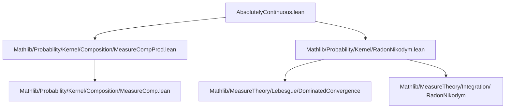
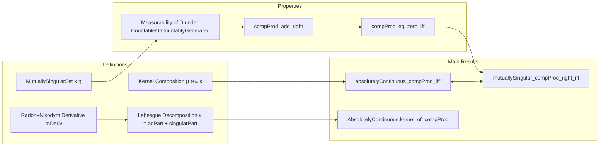

**Technical Brief: `AbsolutelyContinuous.lean`**

---

### 1. **Key Definitions & Theorems**

| Name | Type / Signature | Purpose |
|------|------------------|---------|
| `compProd_of_not_sfinite` | `μ ⊗ₘ κ = 0` if `μ` not σ-finite | Simplifies composition when measure is not σ-finite |
| `MutuallySingular.compProd_of_right` | `μ ⊗ₘ κ ⟂ₘ ν ⊗ₘ η` under `∀ᵐ a ∂μ, κ a ⟂ₘ η a` | Constructs mutual singularity of product kernels from pointwise singularity |
| `MutuallySingular.compProd_of_right'` | Same as above but assumes `∀ᵐ a ∂ν, κ a ⟂ₘ η a` | Symmetric variant using commutativity of `⟂ₘ` |
| `mutuallySingular_compProd_right_iff` | `μ ⊗ₘ κ ⟂ₘ μ ⊗ₘ η ↔ ∀ᵐ a ∂μ, κ a ⟂ₘ η a` | Characterizes mutual singularity of same-left product kernels |
| `AbsolutelyContinuous.kernel_of_compProd` | `μ ⊗ₘ κ ≪ ν ⊗ₘ η ⇒ ∀ᵐ a ∂μ, κ a ≪ η a` | Extracts absolute continuity of kernels from absolute continuity of compositions |
| `absolutelyContinuous_compProd_iff'` | `μ ⊗ₘ κ ≪ ν ⊗ₘ η ↔ μ ≪ ν ∧ ∀ᵐ a ∂μ, κ a ≪ η a` | Main equivalence: composition AC iff base AC and a.e. kernel AC |
| `absolutelyContinuous_compProd_right_iff` | `μ ⊗ₘ κ ≪ μ ⊗ₘ η ↔ ∀ᵐ a ∂μ, κ a ≪ η a` | Special case where left measure is same on both sides |

**Notation**:
- `μ ⊗ₘ κ`: composition of measure `μ` with kernel `κ`
- `κ a ⟂ₘ η a`: mutual singularity of kernels at point `a`
- `κ a ≪ η a`: absolute continuity of kernel at point `a`
- `rnDeriv`: Radon–Nikodym derivative
- `singularPart`: singular part in Lebesgue decomposition

---

### 2. **Naming Conventions**

- **Prefixes**:
  - `compProd_`: composition with product (measure × kernel)
  - `mutuallySingular_`: properties involving `⟂ₘ`
  - `absolutelyContinuous_`: properties involving `≪`
- **Suffixes**:
  - `_of_right`: assumes singularity/AC w.r.t. right kernel (`η`)
  - `_right`: refers to same-left measure case (`μ ⊗ₘ κ ≪ μ ⊗ₘ η`)
  - `_iff`: equivalence characterizations
  - `'` (prime): variant with swapped assumption (e.g., `∀ᵐ a ∂ν` instead of `∀ᵐ a ∂μ`)

---

### 3. **Tactic Stack**

Frequently used tactics in proofs:
- `by_cases`: to split on σ-finiteness (`SFinite μ`, `SFinite ν`)
- `rw [...]`: rewriting using lemmas like `compProd_apply`, `compProd_add_right`
- `simp` / `simp_rw`: simplification with definitions and commutativity
- `filter_upwards`: for almost-everywhere arguments
- `rwa [...] at ha`: rewrite + assumption
- `refine ⟨...⟩`: constructing pairs or measurable sets
- `lintegral_congr_ae`: congruence of integrals a.e.
- `symm`: reversing implications or equalities
- `exact`, `swap`: control proof order

---

### 4. **Proof Logic**

**General proof strategy**:
1. **Reduction via σ-finiteness**: Use `by_cases hμ : SFinite μ` to reduce to σ-finite case; non-σ-finite cases collapse via `compProd_of_not_sfinite`.
2. **Construct witness sets**:
   - For singularity: use `κ.mutuallySingularSet η`, known measurable by `Kernel.measurableSet_mutuallySingularSet`.
   - For AC: use Lebesgue decomposition (`rnDeriv + singularPart`) and properties of singular part.
3. **Apply known lemmas**:
   - `Kernel.measure_mutuallySingularSetSlice`, `Kernel.withDensity_rnDeriv_eq_zero_iff_*`
   - `compProd_apply`, `compProd_add_right`
4. **Use equivalence principles**:
   - `compProd_eq_zero_iff`, `absolutelyContinuous.add_left_iff`
5. **Combine directions**:
   - For `↔`, prove both directions separately, often using one direction as a lemma for the other.

**Typical flow for `absolutelyContinuous_compProd_iff'`**:
- **→**: 
  - Extract `μ ≪ ν` via `absolutelyContinuous_of_compProd`.
  - Extract kernel AC via `kernel_of_compProd`, which uses Lebesgue decomposition and mutual singularity of singular part.
- **←**: 
  - Use `compProd_right` + `absolutelyContinuous.compProd` to combine base and kernel AC.

---

### 5. **Imports**

- `Mathlib.Probability.Kernel.Composition.MeasureCompProd`: defines `compProd`, basic properties
- `Mathlib.Probability.Kernel.RadonNikodym`: Radon–Nikodym theorem, Lebesgue decomposition, `rnDeriv`, `singularPart`

**Assumption**:
- `[MeasurableSpace.CountableOrCountablyGenerated α β]`: ensures measurability of sets like `mutuallySingularSet`, critical for applying `compProd_apply`.

---

### 6. **Mermaid Diagrams**

#### **Dependency Graph (File-Level)**

#### **Overview of Theory Flow**

---

### 7. **Domain-Specific AI Agent Notes**

- **Key domain**: Measure theory, especially probabilistic kernels and absolute continuity.
- **Critical assumptions**: `CountableOrCountablyGenerated`, `SFinite`, `NeZero` (for kernel non-degeneracy).
- **Common proof patterns**:
  - Decompose kernels via Lebesgue decomposition.
  - Use pointwise properties (`∀ᵐ a ∂μ`) to lift to product level.
  - Exploit symmetry and commutativity of singularity/AC.
- **Tooling**: Lean’s `MeasureTheory` and `ProbabilityTheory` libraries, heavily reliant on `Filter`, `ENNReal`, and `Kernel` infrastructure.

--- 

Let me know if you'd like a formalized dependency graph or a tactic-level trace of one of the proofs.
