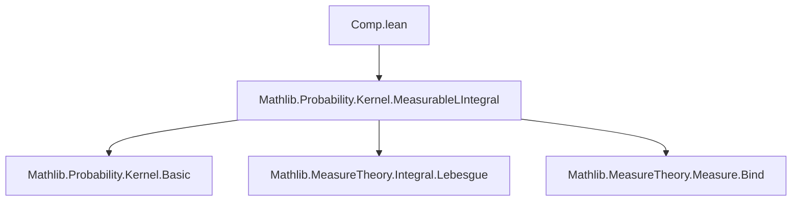
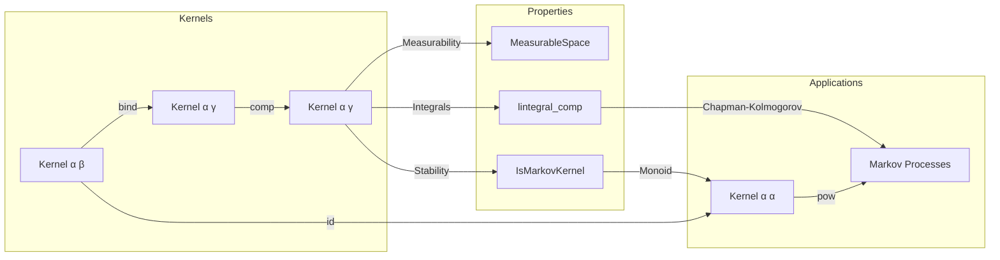
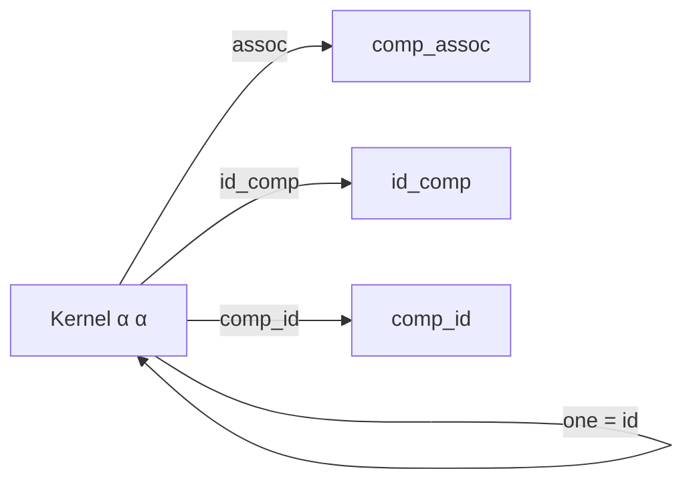

### Technical Brief: Kernel Composition in Lean 4 (`Comp.lean`)

---

#### **1. Key Definitions & Theorems**

| Name | Type / Signature | Purpose |
|------|------------------|---------|
| `comp` | `Kernel β γ → Kernel α β → Kernel α γ` | Defines composition of two measurable kernels: $(\eta \circ_k \kappa)(a) = (\kappa a) \bind \eta$ |
| `∘ₖ` | Infix notation for `comp` | Syntactic sugar: `η ∘ₖ κ` |
| `comp_apply` | `(η ∘ₖ κ) a = (κ a).bind η` |unfold definition of composition pointwise |
| `comp_apply'` | `(η ∘ₖ κ) a s = ∫⁻ b, η b s ∂κ a` | Evaluates composition on measurable sets via iterated integral |
| `lintegral_comp` | `∫⁻ c, g c ∂(η ∘ₖ κ) a = ∫⁻ b, ∫⁻ c, g c ∂η b ∂κ a` | Fundamental property: integral w.r.t. composite kernel equals iterated integral |
| `comp_assoc` | `(ξ ∘ₖ η) ∘ₖ κ = ξ ∘ₖ (η ∘ₖ κ)` | Associativity of kernel composition |
| `id_comp`, `comp_id` | `id ∘ₖ κ = κ`, `κ ∘ₖ id = κ` | Identity laws for kernel composition |
| `zero_comp`, `comp_zero` | `0 ∘ₖ κ = 0`, `κ ∘ₖ 0 = 0` | Zero kernel absorbs under composition |
| `pow_add` | `κ^(m+n) = κ^m ∘ₖ κ^n` | Chapman–Kolmogorov equation (kernel version) |
| `pow_add_apply_eq_lintegral` | `(κ^(m+n)) a s = ∫⁻ b, (κ^n) b s ∂(κ^m a)` | Integral form of Chapman–Kolmogorov |
| `IsMarkovKernel.comp` | Instance: `IsMarkovKernel η → IsMarkovKernel κ → IsMarkovKernel (η ∘ₖ κ)` | Stability of Markov kernels under composition |
| `IsZeroOrMarkovKernel.comp`, `IsFiniteKernel.comp`, `IsSFiniteKernel.comp` | Similar stability instances | Closure properties of subclasses under composition |

---

#### **2. Naming Conventions**

- **Prefixes**:
  - `comp_`: for composition-related lemmas (`comp_apply`, `comp_assoc`, `comp_zero`, etc.)
  - `lintegral_`: for integral properties (`lintegral_comp`)
  - `ae_`: for almost-everywhere statements (`ae_ae_of_ae_comp`, `ae_comp_of_ae_ae`, `ae_null_of_comp_null`)
  - `pow_`: for powers and Chapman–Kolmogorov (`pow_add`, `pow_succ_apply_eq_lintegral`)
  - `const_`, `swap_`, `copy_`, `discard_`: for specific kernel constructions

- **Suffixes**:
  - `_apply`, `_apply'`: pointwise evaluation or measurable-set evaluation
  - `_le`, `_null`, `_comp`: relational or structural properties
  - `_right`, `_left`: for distributivity over addition (e.g., `comp_add_right`, `comp_add_left`)
  - `_sum_right`, `_sum_left`: for sums over countable families

- **Notation**:
  - `η ∘ₖ κ` for `comp η κ`
  - `Kernel.id`, `discard α`, `copy α`, `swap α β`, `const β μ`: standard kernel constructors

---

#### **3. Tactic Stack**

Frequently used tactics in proofs:

| Tactic | Usage |
|--------|-------|
| `ext` | Extensionality for kernels (pointwise equality) |
| `simp` / `simp_rw` | Simplification using definitions (`comp_apply`, `id_apply`, etc.) |
| `rw` | Rewriting using lemmas like `comp_apply'`, `lintegral_comp`, `bind_apply` |
| `calc` | Chain of inequalities (e.g., in `comp_apply_univ_le`) |
| `gcongr` | For monotonicity in inequalities involving ENNReal multiplication |
| `filter_upwards` | For almost-everywhere arguments |
| `aesop` / `linarith` | Not explicitly visible here, but likely used in background (e.g., ENNReal arithmetic) |
| `exact`, `refine`, `congr` | For constructing proofs of equality or membership |
| `rwa`, `convert`, `congr'` | Advanced rewriting and congruence handling |

---

#### **4. Proof Logic**

- **Structure of proofs**:
  - Most proofs follow a **two-step pattern**:
    1. **Extensionality**: `ext a s hs` to reduce to measurable sets.
    2. **Rewrite using `comp_apply'`** and apply known measure-theoretic lemmas (`bind_apply`, `lintegral_bind`, `lintegral_eq_zero_iff`, etc.).
  - **Inductive or algebraic reasoning** appears in monoid and Chapman–Kolmogorov sections:
    - `pow_add` uses generic `pow_add` from `Monoid` theory.
    - Instances (`IsMarkovKernel.comp`, etc.) use case analysis (`obtain rfl | _`) and `simpa`.
  - **Measure-theoretic arguments** dominate:
    - Use of `ae` (almost everywhere) filters and `ae_iff`, `ae_null_of_comp_null`.
    - `lintegral_mono`, `lintegral_add_left`, `lintegral_tsum`, `lintegral_bind` are heavily used.

- **Typical flow**:
  ```text
  ext a s hs
  rw [comp_apply' _ _ _ hs]
  [apply measure/lintegral lemma]
  [simplify using assumptions]
  ```

---

#### **5. Imports & Dependencies**

| Import | Purpose |
|--------|---------|
| `Mathlib.Probability.Kernel.MeasurableLIntegral` | Core kernel theory: definition of kernels, measurability, and integral properties |
| `MeasureTheory` (via `open MeasureTheory`) | Bind, measurable functions, integrals, measures |
| `ENNReal` (via `open scoped ENNReal`) | Extended non-negative reals for unbounded measures |

---

#### **6. Mermaid Diagrams**

##### **Dependency Graph (Module-Level)**



##### **Overview of Theory Flow**



##### **Kernel Composition as Monoid**



---

#### **7. Summary**

This file formalizes **kernel composition** in the context of measurable spaces and probability theory. It establishes:
- The foundational definition (`comp`) and its basic properties (`comp_apply`, `comp_apply'`).
- Integral behavior (`lintegral_comp`) and measure-theoretic consequences (`ae`-properties, null sets).
- Closure of important subclasses (Markov, finite, σ-finite kernels) under composition.
- Monoid structure on `Kernel α α`, enabling power notation and Chapman–Kolmogorov equations.

The formalization is highly structured, leveraging Lean’s typeclass system and measure-theoretic infrastructure from `Mathlib`. It serves as a cornerstone for stochastic processes and Markov decision processes in formal probability theory.
