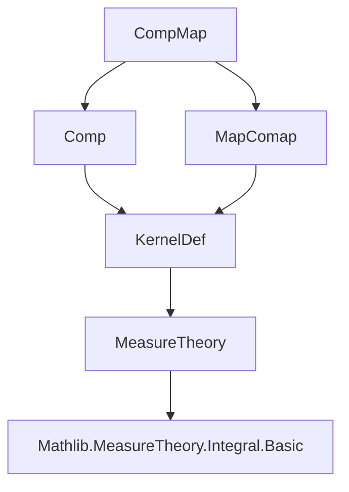
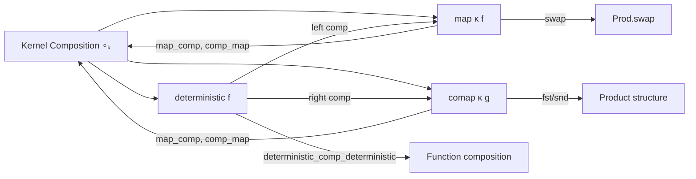

**Technical Brief: `CompMap.lean` — Composition and Map/Comap of Probability Kernels**

---

### 1. **Key Definitions & Theorems**

| Name | Type / Statement | Purpose |
|------|------------------|---------|
| `deterministic` | `Measurable f → Kernel α β` | Constructs a *deterministic kernel* from a measurable function `f : α → β`, mapping each `a` to Dirac measure at `f a`. |
| `map` | `Kernel α β → (β → γ) → Measurable (f : β → γ) → Kernel α γ` | Pushforward of a kernel along a measurable function: `map κ f` applies `f` to the output of `κ`. |
| `comap` | `Kernel α β → (γ → β) → Measurable g → Kernel γ β` | Pullback (change of base space) of a kernel: `comap κ g` precomposes the input with `g`. |
| `∘ₖ` | `Kernel α β → Kernel β γ → Kernel α γ` | Composition of kernels (Chapman–Kolmogorov). |
| `deterministic_comp_eq_map` | `deterministic f hf ∘ₖ κ = map κ f` | Shows `map` is a special case of composition with a deterministic kernel on the left. |
| `comp_deterministic_eq_comap` | `κ ∘ₖ deterministic g hg = comap κ g hg` | Shows `comap` is composition with a deterministic kernel on the right. |
| `deterministic_comp_deterministic` | `(deterministic g) ∘ₖ (deterministic f) = deterministic (g ∘ f)` | Composition of deterministic kernels corresponds to composition of their underlying functions. |
| `swap_swap` | `(swap α β) ∘ₖ (swap β α) = Kernel.id` | The swap kernel is an involution (up to composition). |
| `swap_comp_eq_map` | `(swap β γ) ∘ₖ κ = κ.map Prod.swap` | Swap kernel composition equals mapping by `Prod.swap`. |
| `map_comp` | `(η ∘ₖ κ).map f = (η.map f) ∘ₖ κ` | Map commutes with composition (pushforward after composition = composition after pushforward). |
| `comp_map` | `η ∘ₖ (κ.map f) = (η.comap f) ∘ₖ κ` | Composition with a mapped kernel equals composition with a comapped kernel. |
| `fst_comp`, `snd_comp` | `(η ∘ₖ κ).fst = η.fst ∘ₖ κ`, similarly for `snd` | Projections commute with kernel composition. |

---

### 2. **Naming Conventions**

- **Prefixes**:
  - `deterministic_`: for kernels induced by measurable functions.
  - `map_`, `comap_`: for pushforward/pullback operations.
  - `comp_`: for composition-related lemmas.
  - `swap_`: for symmetry/swap-related properties.
- **Suffixes**:
  - `_eq_map`, `_eq_comap`: identify equivalence to `map`/`comap`.
  - `_comp`: for composition identities.
  - `_apply'`: used in proofs to expand definitions of kernel application (e.g., `comp_apply'`, `map_apply'`).
- **Function names**:
  - `swap`, `fst`, `snd`: standard product operations.
  - `deterministic`, `map`, `comap`: core constructors.

---

### 3. **Tactic Stack**

- **Core simplification & rewriting**:
  - `simp_rw [...]`: heavily used to unfold definitions (`map_apply'`, `comp_apply'`, `deterministic_apply'`, etc.).
- **Measure-theoretic reasoning**:
  - `lintegral_indicator_const_comp`, `lintegral_map`, `lintegral_dirac'`: for handling integrals against Dirac or pushforward measures.
- **Case analysis**:
  - `by_cases hf : Measurable f`: splits on measurability (e.g., in `map_comp`).
- **Algebraic simplification**:
  - `simp`: for structural simplifications (e.g., `swap_swap`, `fst_comp`, `snd_comp`).
- **Extensionality**:
  - `ext a s hs`: kernel extensionality (equality of kernels = equality of all evaluations on measurable sets).

---

### 4. **Proof Logic**

- **Structure**:
  - Most proofs follow a **kernel extensionality** pattern: `ext a s hs` → expand both sides using `comp_apply'`, `map_apply'`, `deterministic_apply'`, etc.
  - Then apply **integral simplifications** (e.g., `lintegral_indicator_const_comp`, `lintegral_map`) to reduce to known forms.
  - Use `simp_rw` with a list of lemmas to automate rewriting.
- **Induction**: Not used (no inductive types involved).
- **Case splits**: Only on measurability assumptions (e.g., `by_cases hf`).
- **Key insight**: `map` and `comap` are *definitional specializations* of kernel composition with deterministic kernels — this is leveraged repeatedly.

---

### 5. **Imports & Dependencies**

- **Core imports**:
  ```lean
  Mathlib.Probability.Kernel.Composition.Comp
  Mathlib.Probability.Kernel.Composition.MapComap
  ```
- **Underlying theory**:
  - `MeasureTheory`: measurable spaces, measurable functions, integrals.
  - `ProbabilityTheory.Kernel`: foundational definitions of kernels, `map`, `comap`, `comp`.
  - `ENNReal`: extended non-negative reals for integrals.
- **Scopes**:
  - `open scoped ENNReal`: for `∫⁻`, `∫⁻ ⦃x⦄, ...` notation.

---

### 6. **Mermaid Diagrams**

#### **Dependency Graph (Module-Level)**



#### **Conceptual Overview of `CompMap.lean`**



#### **Proof Strategy Flow (Typical Lemma)**

```mermaid
flowchart TD
  Start[Start: ext a s hs] --> Expand[Expand via comp_apply', map_apply', ...]
  Expand --> Simplify[simp_rw with integral lemmas]
  Simplify --> Match[Match target expression]
  Match --> End[QED]
  Simplify -.->|measurability check| Case[by_cases hf]
  Case -->|hf| Simplify
  Case -->|¬hf| SimpSimp[simp [map_of_not_measurable]]
```

---

### Summary

This file formalizes the *interplay* between kernel composition and the map/comap operations, showing that `map` and `comap` are not primitive but derived from composition with deterministic kernels. It is foundational for reasoning about probabilistic programs with deterministic transformations (e.g., change of variables, projections, symmetries). The proofs rely heavily on measure-theoretic simplifications and extensionality, with a clean, uniform structure.
