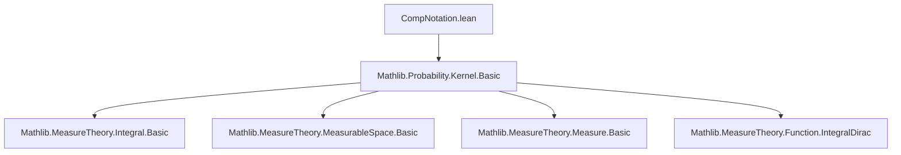
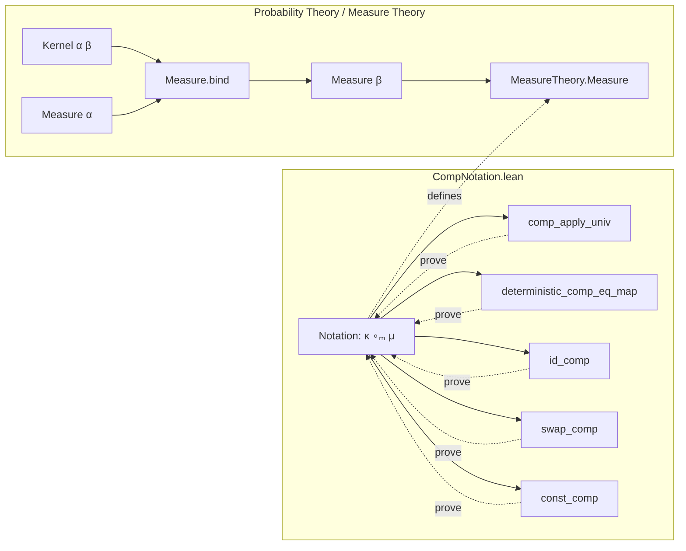

**Technical Brief: `CompNotation.lean`**

---

### 1. **Key Definitions & Theorems**

| Name | Type / Signature | Purpose |
|------|------------------|---------|
| `∘ₘ` (notation) | `κ : Kernel α β → μ : Measure α ↦ Measure β` | Notation for `Measure.bind μ κ`, i.e., composition of a kernel with a measure (disintegration / Fubini-style integration). |
| `comp_apply_univ` | `(κ ∘ₘ μ) Set.univ = μ Set.univ` | Special case of `bind_apply` for Markov kernels: total mass preserved. |
| `deterministic_comp_eq_map` | `Kernel.deterministic f hf ∘ₘ μ = μ.map f` | Links deterministic kernel composition with pushforward (map) of a measurable function. |
| `id_comp` | `Kernel.id ∘ₘ μ = μ` | Identity kernel acts as unit for `∘ₘ`. |
| `swap_comp` | `(Kernel.swap α β) ∘ₘ μ = μ.map Prod.swap` | Composition with swap kernel yields pushforward under `Prod.swap`. |
| `const_comp` | `(Kernel.const α ν) ∘ₘ μ = μ Set.univ • ν` | Constant kernel yields scalar multiple (by total mass of `μ`) of the constant measure `ν`. |

---

### 2. **Naming Conventions**

- **Prefixes / Suffixes**:
  - `comp_`: for lemmas about `∘ₘ` (e.g., `comp_apply_univ`, `deterministic_comp_eq_map`, `id_comp`, `swap_comp`, `const_comp`).
  - `deterministic_`: for lemmas involving deterministic kernels (`Kernel.deterministic`).
  - `const_`: for constant kernels (`Kernel.const`).
  - `swap_`: for kernel `Kernel.swap`.
- **Notation**:
  - `∘ₘ` is scoped under `ProbabilityTheory`, with precedence 100/101 (right-associative, like function composition).
  - `bind` is the underlying definition.

---

### 3. **Tactic Stack**

- `simp`: heavily used, especially with `bind_apply`, `aemeasurable`, and kernel properties.
- `rw`: for rewriting using lemmas like `Kernel.id`, `deterministic_comp_eq_map`, etc.
- `Measure.bind_dirac_eq_map`, `μ.bind_const`: used implicitly via `rw` or `simp`.

No heavy automation (e.g., `aesop`, `linarith`, `ring`) appears—proofs are mostly direct simplifications using kernel/measure-theoretic lemmas.

---

### 4. **Proof Logic**

- **Pattern**: Most proofs are *one-liners* or *two-liners*:
  - Apply `simp` with relevant lemmas (`bind_apply`, `Kernel.id`, `deterministic_comp_eq_map`, etc.).
  - Use `rw` to rewrite with definitions (e.g., `Kernel.deterministic f hf` → `fun a ↦ dirac (f a)`).
- **Structure**:
  - Leverage known equalities: `bind_dirac_eq_map`, `bind_const`.
  - Use `MeasurableSpace`/`MeasureTheory` infrastructure (e.g., `aemeasurable`, `map`, `dirac`).
- **No induction or case analysis** needed—lemmas are algebraic/functional equalities.

---

### 5. **Imports**

- `Mathlib.Probability.Kernel.Basic`: core definitions of kernels, `bind`, `dirac`, `map`, `deterministic`, `const`, `swap`, `id`, `isMarkovKernel`.

---

### 8. **Mermaid Diagrams**

#### **Dependency Graph (Module-Level)**



#### **Overview of File & Theory Context**



#### **Relationship to Related Files**

```mermaid
graph LR
  CompNotation -->|extends| KernelBasic[Mathlib.Probability.Kernel.Basic]
  CompNotation -->|complements| MeasureComp[MeasureComp.lean (future)]
  KernelBasic -->|defines| Bind[Measure.bind]
  KernelBasic -->|defines| Kernel[Kernel α β]
  KernelBasic -->|defines| Dirac[dirac]
  KernelBasic -->|defines| Map[μ.map f]
```

> **Note**: The comment `assert_not_exists ProbabilityTheory.Kernel.compProd` indicates that `compProd` (product kernel composition) is intentionally *not* defined here—its absence is asserted to avoid conflicts or duplication.

--- 

**Summary**: This file is a *notation and lightweight lemma* module for `Measure.bind` specialized to kernels, with a focus on clean, readable syntax (`∘ₘ`) and immediate corollaries (e.g., identity, const, swap, deterministic cases). It assumes foundational kernel theory from `Mathlib.Probability.Kernel.Basic`.
