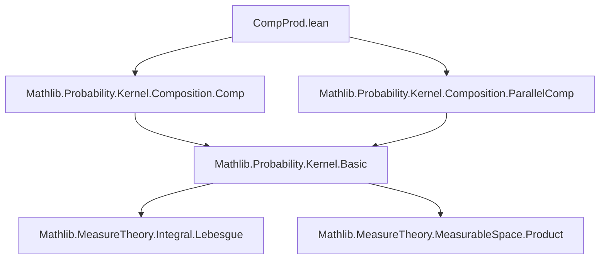

### Technical Brief: `CompProd.lean` — Composition-Product of S-Finite Kernels

---

#### **1. Key Definitions & Theorems**

| Name | Type / Signature | Purpose |
|------|------------------|---------|
| `compProd` | `Kernel α β → Kernel (α × β) γ → Kernel α (β × γ)` | Main definition: composition-product of two s-finite kernels. Notation: `κ ⊗ₖ η`. |
| `lintegral_compProd` | `∫⁻ bc, f bc ∂(κ ⊗ₖ η) a = ∫⁻ b, ∫⁻ c, f (b, c) ∂η (a, b) ∂κ a` | Fubini-type theorem for integrals w.r.t. composition-product. |
| `compProd_apply` | `(κ ⊗ₖ η) a s = ∫⁻ b, η (a, b) (Prod.mk b ⁻¹' s) ∂κ a` | Explicit formula for evaluation on measurable sets (under s-finiteness). |
| `compProd_zero_left/right` | `(0 ⊗ₖ η) = 0`, `(κ ⊗ₖ 0) = 0` | Vanishing behavior when either kernel is zero. |
| `compProd_eq_zero_iff` | `κ ⊗ₖ η = 0 ↔ ∀ a, ∀ᵐ b ∂κ a, η (a, b) = 0` | Characterization of when composition-product is zero. |
| `compProd_restrict` | `restrict κ hs ⊗ₖ restrict η ht = restrict (κ ⊗ₖ η) (hs.prod ht)` | Compatibility with restriction of kernels. |
| `compProd_assoc` | `(κ ⊗ₖ (η ⊗ₖ ξ.comap prodAssoc)) .map prodAssoc.symm = κ ⊗ₖ η ⊗ₖ ξ` | Associativity up to measurable equivalence `prodAssoc`. |
| `compProd_add_left/right` | `(μ + κ) ⊗ₖ η = μ ⊗ₖ η + κ ⊗ₖ η`, `μ ⊗ₖ (κ + η) = μ ⊗ₖ κ + μ ⊗ₖ η` | Distributivity over kernel addition. |
| `compProd_sum_left/right` | `sum κ ⊗ₖ η = sum (κ i ⊗ₖ η)`, `κ ⊗ₖ sum η = sum (κ ⊗ₖ η i)` | Compatibility with countable sums (for s-finite kernels). |
| `IsMarkovKernel.compProd`, `IsFiniteKernel.compProd`, `IsSFiniteKernel.compProd` | Instances | Stability of kernel classes under `⊗ₖ`. |

---

#### **2. Naming Conventions**

- **Prefixes**:
  - `compProd_`: All definitions/theorems about composition-product.
  - `comp_`: General composition of kernels (from `Comp.lean`).
  - `parallelComp_`: Parallel composition (from `ParallelComp.lean`).
- **Suffixes**:
  - `_left`, `_right`: Argument position in binary operation.
  - `_univ`, `_prod`: Special cases involving `Set.univ` or product sets.
  - `_ae`: Statements about almost-everywhere properties.
  - `_restrict`: Behavior under kernel restriction.
- **Notation**:
  - `⊗ₖ` is scoped infix at level 100: `κ ⊗ₖ η`.

---

#### **3. Tactic Stack**

Frequent tactics used in proofs:

| Tactic | Purpose |
|--------|---------|
| `rw [...]` | Rewriting using definitions (`compProd`, `parallelComp`, `comp`, `copy`, `deterministic`, `swap`, etc.). |
| `simp` / `simp_rw` | Simplification using `@[simp]` lemmas (e.g., `compProd_of_not_isSFiniteKernel_*`, `compProd_apply_univ`, `compProd_zero_*`). |
| `congr` / `ext` | Extensionality for kernels (pointwise equality on measurable sets). |
| `lintegral_mono`, `lintegral_congr_ae`, `lintegral_add_left` | Manipulating integrals (monotonicity, equality a.e., additivity). |
| `filter_upwards` | Handling almost-everywhere quantifiers. |
| `aesop`, `grind` | Automated reasoning (used in `comapRight_compProd_id_prod`). |
| `fun_prop` | Proving measurability of functions (e.g., preimages, compositions). |
| `measurableSet_toMeasurable`, `measure_toMeasurable` | Measurable hull tricks. |
| `prod_assoc`, `prod_mk`, `swap_apply'` | Reasoning about product types and swaps. |

---

#### **4. Proof Logic**

- **Structure of proofs**:
  - **Case analysis** on s-finiteness (`by_cases h : IsSFiniteKernel _`) to reduce to zero or nontrivial cases.
  - **Extensionality**: Prove kernel equality by `ext a s hs`, then apply `compProd_apply`.
  - **Integral decomposition**: Use `lintegral_compProd` or `lintegral_compProd'` to reduce to iterated integrals.
  - **Approximation**: For general integrals, use `SimpleFunc.eapprox` and monotone convergence (`lintegral_iSup`).
  - **Measurability checks**: `fun_prop`, `measurable_kernel_prodMk_left'`, `measurableSet_prod`.
  - **A.E. reasoning**: `ae_null_of_compProd_null`, `ae_compProd_iff`, `ae_ae_of_ae_compProd`.

- **Typical flow**:
  1. Reduce to s-finite case via `by_cases`.
  2. Expand `compProd` using its definition (via `comp`, `parallelComp`, `copy`, `deterministic`, `swap`).
  3. Apply `compProd_apply` to get integral expression.
  4. Simplify using `lintegral_*` lemmas and change of variables (e.g., `lintegral_prod`, `lintegral_dirac'`).
  5. Use `congr` or `ext` to finish.

---

#### **5. Imports & Dependencies**

- **Core imports**:
  ```lean
  Mathlib.Probability.Kernel.Composition.Comp
  Mathlib.Probability.Kernel.Composition.ParallelComp
  ```
- **Underlying theory**:
  - `MeasureTheory` (measures, integrals, `lintegral`, `ae`, `toMeasurable`)
  - `ProbabilityTheory.Kernel` (s-finite kernels, `Kernel`, `IsSFiniteKernel`, `IsMarkovKernel`, etc.)
  - `MeasurableEquiv`, `Prod`, `SimpleFunc`, `ENNReal`

---

#### **6. Mermaid Diagrams**

##### **Dependency Graph (Module-Level)**



##### **Conceptual Overview of `compProd`**

```mermaid
graph LR
  α --κ--> β
  α × β --η--> γ
  subgraph Definition
    κ ⊗ₖ η = swap ∘ₖ (η ∥ₖ id) ∘ₖ deterministic prodAssoc.symm ∘ₖ (id ∥ₖ copy β) ∘ₖ (id ∥ₖ κ) ∘ₖ copy α
  end
  α --κ⊗ₖη--> β × γ
```

##### **Fubini Diagram (Integral Behavior)**

```mermaid
graph LR
  f : β × γ → ℝ≥0∞
  subgraph "∫⁻ over κ ⊗ₖ η"
    A["∫⁻_{b,c} f(b,c) d(κ⊗ₖη)_a"] --> B["∫⁻_b ∫⁻_c f(b,c) dη_{a,b} dκ_a"]
  end
  A <-->|lintegral_compProd| B
```

##### **Stability Diagram (Instances)**

```mermaid
graph TD
  IsSFiniteKernel[IsSFiniteKernel κ] -->|compProd| IsSFiniteKernel[IsSFiniteKernel (κ⊗ₖη)]
  IsMarkovKernel[IsMarkovKernel κ] -->|compProd| IsMarkovKernel[IsMarkovKernel (κ⊗ₖη)]
  IsFiniteKernel[IsFiniteKernel κ] -->|compProd| IsFiniteKernel[IsFiniteKernel (κ⊗ₖη)]
  IsZeroOrMarkovKernel[...] -->|compProd| IsZeroOrMarkovKernel[...]
```

---

#### **7. Summary**

This module formalizes the **composition-product** of s-finite kernels, a fundamental operation in measure-theoretic probability and category-theoretic treatments of kernels. It provides:

- A concrete definition via existing kernel operations (`comp`, `parallelComp`, `deterministic`, `swap`, `copy`).
- A Fubini-type integral formula (`lintegral_compProd`).
- Stability results for key kernel classes (Markov, finite, s-finite).
- Compatibility with restrictions, sums, and associativity (up to `prodAssoc`).
- A rich set of lemmas for reasoning about integrals, null sets, and measurable equivalences.

The formalization follows Lean’s `mathlib` conventions, with careful attention to s-finiteness conditions and measurable structure.
