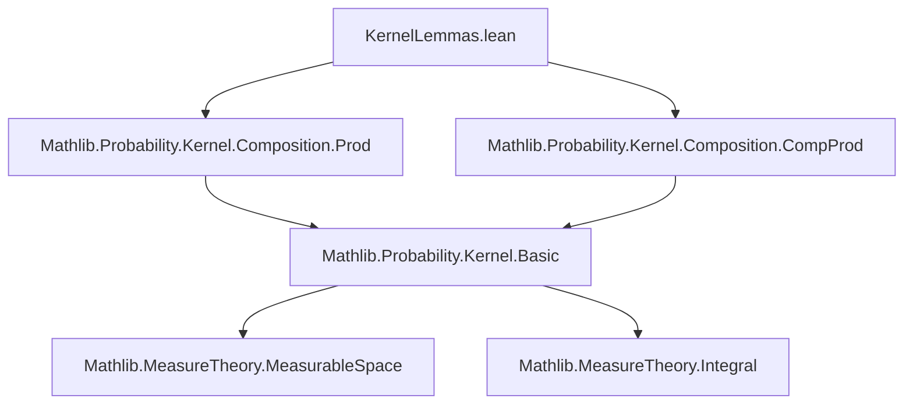
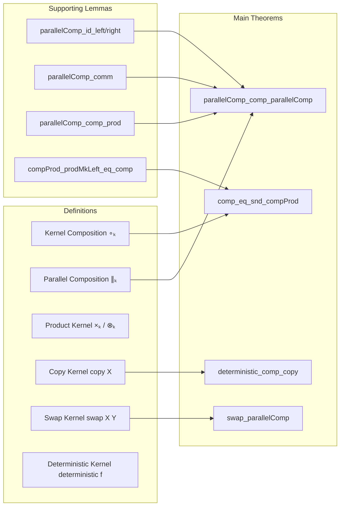

### Technical Brief: `KernelLemmas.lean`

---

#### **1. Key Definitions & Theorems**

| Name | Type / Signature | Purpose |
|------|------------------|---------|
| `comp_eq_snd_compProd` | `η ∘ₖ κ = snd (κ ⊗ₖ prodMkLeft X η)` | Relates kernel composition to projection from a product kernel. |
| `snd_compProd_prodMkLeft` | `snd (κ ⊗ₖ prodMkLeft X η) = η ∘ₖ κ` | Symmetric version of `comp_eq_snd_compProd`; simplifies expressions involving `snd`. |
| `compProd_prodMkLeft_eq_comp` | `κ ⊗ₖ (prodMkLeft X η) = (Kernel.id ×ₖ η) ∘ₖ κ` | Expresses product of kernels with `prodMkLeft` as composition with a product kernel. |
| `swap_parallelComp` | `swap Y T ∘ₖ (κ ∥ₖ η) = η ∥ₖ κ ∘ₖ swap X Z` | Commutes parallel composition with swap kernel. |
| `deterministic_comp_copy` | `(deterministic f hf ∥ₖ deterministic f hf) ∘ₖ copy X = copy Y ∘ₖ deterministic f hf` | For deterministic kernels, copying before applying equals applying then copying. |
| `parallelComp_id_left_comp_parallelComp` | `(Kernel.id ∥ₖ ξ) ∘ₖ (κ ∥ₖ η) = κ ∥ₖ (ξ ∘ₖ η)` | Left-unital property of parallel composition w.r.t. composition. |
| `parallelComp_id_right_comp_parallelComp` | `(ξ ∥ₖ Kernel.id) ∘ₖ (η ∥ₖ κ) = (ξ ∘ₖ η) ∥ₖ κ` | Right-unital property of parallel composition w.r.t. composition. |
| `parallelComp_comp_parallelComp` | `(η ∥ₖ η') ∘ₖ (κ ∥ₖ κ') = (η ∘ₖ κ) ∥ₖ (η' ∘ₖ κ')` | Distributivity of composition over parallel composition. |
| `parallelComp_comp_prod` | `(η ∥ₖ η') ∘ₖ (κ ×ₖ κ') = (η ∘ₖ κ) ×ₖ (η' ∘ₖ κ')` | Distributivity of composition over product kernel. |
| `parallelComp_comm` | `(Kernel.id ∥ₖ κ) ∘ₖ (η ∥ₖ Kernel.id) = (η ∥ₖ Kernel.id) ∘ₖ (Kernel.id ∥ₖ κ)` | Commutativity of parallel composition with identity kernels. |

---

#### **2. Naming Conventions**

- **Prefixes**:
  - `comp_`: relates to kernel composition (`∘ₖ`)
  - `parallelComp_`: relates to parallel composition (`∥ₖ`)
  - `prod_` / `compProd_`: relates to product kernels (`×ₖ`, `⊗ₖ`)
  - `deterministic_`: for deterministic kernels
  - `swap_`: for swap kernels
  - `copy_`: for copying kernels

- **Suffixes**:
  - `_eq_`: equality lemmas
  - `_left` / `_right`: positional properties (e.g., left/right identity)
  - `_comm`: commutativity lemmas
  - `_copy`: copying-related lemmas

---

#### **3. Tactic Stack**

Frequently used tactics in proofs:
- `ext`: extensionality for kernel equality
- `rw [ ... ]`: rewriting using lemmas, definitions
- `simp_rw [ ... ]`: simplification + rewriting
- `simp`: simplification with `@[simp]` lemmas
- `by_cases`: case analysis on `IsSFiniteKernel` hypotheses
- `swap; · exact ...`: reordering goals for cleaner proof structure
- `congr with x`: congruence for function extensionality
- `lintegral_dirac'`, `lintegral_prod`, `lintegral_indicator`: integral simplifications
- `measurable_*`: measurable space reasoning (e.g., `measurable_prodMk_left`, `measurable_swap`)

---

#### **4. Proof Logic**

- **Induction / Case Analysis**: Most proofs rely on case analysis on `IsSFiniteKernel` assumptions to reduce to the s-finite case.
- **Extensionality (`ext`)**: Kernel equality is proven by extensionality over measurable sets and points.
- **Rewriting Chains**: Proofs often proceed by rewriting using definitions (`comp_apply'`, `parallelComp_apply`, etc.) and simplifying integrals.
- **Symmetry & Swaps**: The `swap` kernel is used to reorder components, often combined with `swap_parallelComp`.
- **Reduction to Known Lemmas**: Many proofs reduce to previously established lemmas like `parallelComp_id_left_comp_parallelComp`, `parallelComp_comp_parallelComp`, etc.

---

#### **5. Imports & Dependencies**

- **Core Imports**:
  ```lean
  Mathlib.Probability.Kernel.Composition.CompProd
  Mathlib.Probability.Kernel.Composition.Prod
  ```
- **Key Theories Used**:
  - `MeasureTheory`: integration, measurable spaces, product measures
  - `ProbabilityTheory.Kernel`: general kernel theory (composition, product, parallel composition, deterministic kernels, copy, swap)
  - `ENNReal`: extended non-negative reals for integrals

---

#### **6. Mermaid Diagrams**

##### **Dependency Graph (High-Level)**



##### **Overview of File Structure**



---

This file serves as a **compositional algebra** for probability kernels, enabling manipulation of complex kernel expressions by decomposing them into simpler components and recombining them using structured lemmas. It is foundational for higher-level probabilistic reasoning in Lean, especially in settings involving joint distributions, conditional independence, and stochastic processes.
