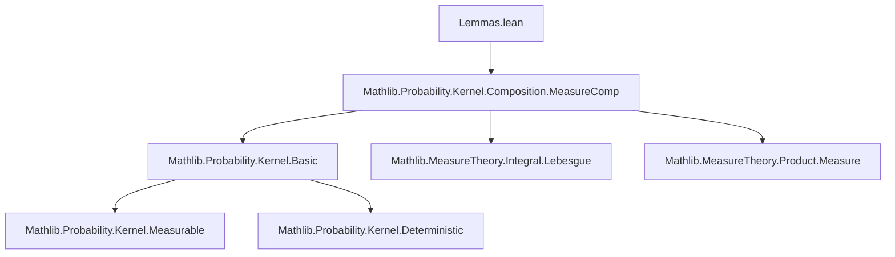
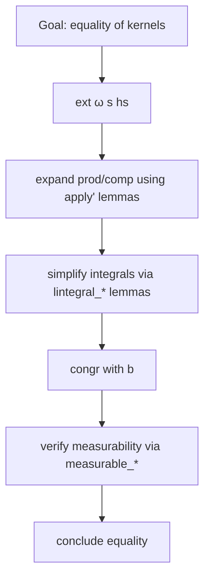

**Technical Brief: Lemmas on Composition of Measures and Kernels**

---

### **1. Key Definitions & Theorems**

| Name | Type / Signature | Purpose |
|------|------------------|---------|
| `prod_prodMkLeft_comp_prod_deterministic` | `lemma` | Shows that when composing product kernels `(ξ ×ₖ η.prodMkLeft β) ∘ₖ (κ ×ₖ deterministic f hf)`, the result factorizes as `(ξ ∘ₖ (κ ×ₖ deterministic f hf)) ×ₖ (η ∘ₖ deterministic f hf)` under conditions: `ζ = deterministic f hf`, and `η' = η.prodMkLeft β`. |
| `prod_prodMkRight_comp_deterministic_prod` | `lemma` | Dual of the above: for `(ξ ×ₖ η.prodMkRight β) ∘ₖ (deterministic f hf ×ₖ κ)`, factorization holds similarly. |
| `compProd_eq_parallelComp_comp_copy_comp` | `lemma` | Relates product measure `μ ⊗ₘ κ` to parallel composition with copy: `μ ⊗ₘ κ = (Kernel.id ∥ₖ κ) ∘ₘ Kernel.copy α ∘ₘ μ`. |
| `prod_comp_right` | `lemma` | Expresses right composition with a kernel in product: `μ.prod (κ ∘ₘ ν) = (Kernel.id ∥ₖ κ) ∘ₘ (μ.prod ν)`. |
| `prod_comp_left` | `lemma` | Left version: `(κ ∘ₘ μ).prod ν = (κ ∥ₖ Kernel.id) ∘ₘ (μ.prod ν)`. |
| `parallelComp_comp_compProd` | `lemma` | Interchange law: `(Kernel.id ∥ₖ η) ∘ₘ (μ ⊗ₘ κ) = μ ⊗ₘ (η ∘ₖ κ)`. |
| `compProd_map` | `lemma` | Compatibility of product with kernel map: `μ ⊗ₘ (κ.map f) = (μ ⊗ₘ κ).map (Prod.map id f)` for measurable `f`. |

---

### **2. Naming Conventions**

- **Prefixes**:
  - `prod_`: product-related operations (`prodMkLeft`, `prodMkRight`, `prod`, `prod_swap`)
  - `comp_`: composition (`compProd`, `comp_assoc`, `comp_deterministic_eq_comap`)
  - `parallelComp_`: parallel composition (`parallelComp_comp_`, `parallelComp_apply`)
  - `deterministic_`: deterministic kernels (`deterministic_comp_eq_map`, `deterministic_parallelComp_deterministic`)
- **Suffixes**:
  - `_left`, `_right`: indicate projection or insertion on left/right factor
  - `_comp`: composition with kernel/measure
  - `_map`: mapping under measurable functions
- **Operators**:
  - `×ₖ`: product of kernels
  - `∘ₖ`, `∘ₘ`: kernel/measure composition
  - `∥ₖ`: parallel composition of kernels
  - `⊗ₘ`: product of measures

---

### **3. Tactic Stack**

Frequent tactics used in proofs:

- `ext`: extensionality (on sets or functions)
- `rw`: rewriting using lemmas
- `congr`: congruence for function equality
- `simp_rw`: simplification with rewrite rules (especially for bind/lintegral)
- `calc`: chained equalities
- `swap`: reordering goals (e.g., for `by_cases`)
- `exact`, `rintro`, `intro`: basic proof steps
- `lintegral_*` lemmas: used to simplify integrals involving kernels
- `measurable_*`: to discharge measurability side conditions

---

### **4. Proof Logic**

- **Structure**: Most proofs follow a pattern:
  1. **Extensionality**: `ext ω s hs` to reduce to pointwise equality on measurable sets.
  2. **Rewrite**: Expand definitions (`prod_apply'`, `comp_apply'`, `lintegral_*`).
  3. **Simplify integrals**: Use lemmas like `lintegral_deterministic_prod`, `lintegral_prod_deterministic`, `lintegral_comp`.
  4. **Congruence**: Reduce to equality of integrands.
  5. **Measurability checks**: Use `measurable_measure_*` and `Kernel.measurable_coe` to verify integrability conditions.

- **Induction/Case analysis**: Not used here; proofs are direct calculations leveraging kernel/measure calculus.

- **Key insight**: Deterministic kernels behave like measurable functions, enabling simplifications like `comp_deterministic_eq_comap` and `deterministic_comp_eq_map`.

---

### **5. Imports & Dependencies**

- **Primary dependency**:
  ```lean
  import Mathlib.Probability.Kernel.Composition.MeasureComp
  ```
  This file builds on foundational results about kernel composition and measure binding.

- **Used modules**:
  - `MeasureTheory`: for measures, measurable spaces, product measures, integrals.
  - `ProbabilityTheory`: for kernels, product kernels, parallel composition, copy kernel.

- **Scoped notation**:
  - `ENNReal`: extended non-negative reals for integrals.

---

### **6. Mermaid Diagrams**

#### **Dependency Graph (File-Level)**



#### **Overview of Theoretical Flow**

```mermaid
graph LR
  subgraph Kernels
    K1[Kernel α β] -->|×ₖ| K2[Kernel γ δ]
    K1 -->|∘ₖ| K3[Kernel β γ]
    K2 -->|∥ₖ| K4[Kernel (α × γ) (β × δ)]
  end

  subgraph Measures
    M1[Measure α] -->|⊗ₘ| M2[Measure β]
    M1 -->|∘ₘ| M3[Measure β]
  end

  subgraph Connections
    K1 -->|bind| M1
    K2 -->|bind| M2
    M1 -->|copy| K5[Kernel α (α × α)]
    K5 -->|parallelComp| K4
  end

  style K1 fill:#f9f,stroke:#333
  style M1 fill:#bbf,stroke:#333
```

#### **Proof Strategy Flow (Example Lemma)**



---

### **7. Summary**

This file formalizes key algebraic laws for composing measures and kernels, especially when deterministic kernels are involved. It bridges product constructions (`×ₖ`, `⊗ₘ`) with parallel composition (`∥ₖ`) and copy operations, enabling modular reasoning about probabilistic programs and stochastic processes. The proofs rely heavily on the interplay between measurable functions, kernels, and integration theory, and are verified using Lean’s `MeasureTheory` and `ProbabilityTheory` libraries.
