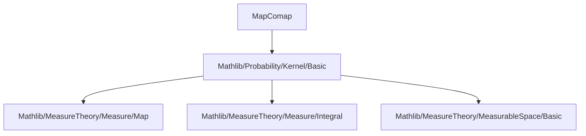

### Technical Brief: `MapComap.lean` — Kernel Map and Comap

---

#### **1. Key Definitions & Theorems**

| Name | Type / Signature | Purpose |
|------|------------------|---------|
| `mapOfMeasurable` | `Kernel α β → (β → γ) → Measurable f → Kernel α γ` | Construct `map` when the function is measurable (implementation detail). |
| `map` | `Kernel α β → (β → γ) → Kernel α γ` | Pushforward of a kernel along a function; returns `0` if the function is not measurable. |
| `comap` | `Kernel α β → (γ → α) → Measurable g → Kernel γ β` | Pullback of a kernel along a measurable function: `comap κ g hg c = κ (g c)`. |
| `lintegral_map` | `∫⁻ b, g' b ∂map κ f a = ∫⁻ a, g' (f a) ∂κ a` | Integral transformation law for `map`. |
| `lintegral_comap` | `∫⁻ b, g' b ∂comap κ g g c = ∫⁻ b, g' b ∂κ (g c)` | Integral transformation law for `comap`. |
| `prodMkLeft` | `Kernel α β → Kernel (γ × α) β` | Lifts a kernel to act on the second component of a product space via `comap` of `Prod.snd`. |
| `prodMkRight` | `Kernel α β → Kernel (α × γ) β` | Lifts a kernel to act on the first component of a product space via `comap` of `Prod.fst`. |
| `swapLeft` | `Kernel (α × β) γ → Kernel (β × α) γ` | Swaps arguments of kernel input via `comap` of `Prod.swap`. |
| `swapRight` | `Kernel α (β × γ) → Kernel α (γ × β)` | Swaps arguments of kernel output via `map` of `Prod.swap`. |
| `fst`, `snd` | `Kernel α (β × γ) → Kernel α β / γ` | Marginal kernels obtained by projecting kernel output via `map` of `Prod.fst`/`Prod.snd`. |
| `sectL`, `sectR` | `Kernel (α × β) γ → β → Kernel α γ`, `α → Kernel β γ` | Sectioning a kernel by fixing one argument of the input space. |

**Key Theorems:**
- `map_comp_right`: `κ.map (g ∘ f) = (κ.map f).map g`
- `comap_comp_right`: `comap κ (g ∘ f) = (comap κ g).comap f`
- `comap_map_comm`: `comap (map κ g) f = map (comap κ f) g`
- `fst_map_prod`, `snd_map_prod`: Marginals of product kernels:  
  `fst (map κ (λx, (f x, g x))) = map κ f`,  
  `snd (map κ (λx, (f x, g x))) = map κ g`
- `fst_swapRight = snd`, `snd_swapRight = fst`: Interaction of `swapRight` with marginals.

---

#### **2. Naming Conventions**

- **Prefixes:**
  - `map_`, `comap_`, `prodMkLeft_`, `prodMkRight_`, `swapLeft_`, `swapRight_`, `fst_`, `snd_`, `sectL_`, `sectR_`: indicate construction type.
  - `of_not_measurable`: for behavior when function is not measurable.
  - `zero`: for zero-kernel special cases.
  - `id`, `id'`: identity maps.

- **Suffixes:**
  - `_apply`, `_apply'`: evaluation on points / measurable sets.
  - `_eq`: equality lemmas (e.g., `map_zero`, `comap_id`).
  - `lintegral_`: integral transformation lemmas.
  - `instance _`: typeclass inference lemmas (e.g., `IsMarkovKernel.map`).

- **Special:**
  - `mapOfMeasurable` vs `map`: distinction between measurable and general case.
  - `prodMkLeft`/`Right`: “left/right” refers to which factor of the product is used.

---

#### **3. Tactic Stack**

Frequently used tactics:
- `ext`: extensionality for kernels (via `Kernel.ext_iff`).
- `simp` / `simp_rw`: simplification using definitional equalities and lemmas.
- `rw`: rewriting using lemmas like `map_apply`, `comap_apply`, `lintegral_map`.
- `by_cases`: splitting on `Measurable f`.
- `infer_instance`: typeclass inference for `IsMarkovKernel`, `IsSFiniteKernel`, etc.
- `fun_prop`: propositional reasoning about measurability (e.g., `measurable_id`, `measurable_swap`).
- `ring`, `aesop`: not heavily used here; mostly measure-theoretic reasoning.

---

#### **4. Proof Logic**

- **Structure:** Most proofs follow a pattern:
  1. **Extensionality (`ext`)**: reduce to equality of measures on measurable sets.
  2. **Case split on measurability** (`by_cases hf : Measurable f`).
  3. **Apply definitions** (`map_apply`, `comap_apply`, etc.).
  4. **Rewrite using measure-theoretic lemmas** (e.g., `Measure.map_apply`, `lintegral_map`).
  5. **Simplify using `rfl`, `simp`, or `simp_rw`**.

- **Induction/Recursion:** Not used directly; instead, structural reasoning via:
  - `sum_seq`, `seq`, and `IsSFiniteKernel` for σ-finiteness.
  - `comap_map_comm`, `map_comp_right` for compositionality.

- **Typeclass reasoning:** Heavy use of `infer_instance` to propagate properties like `IsMarkovKernel`, `IsFiniteKernel`, `IsSFiniteKernel`.

---

#### **5. Imports**

- **Primary dependency:**  
  `Mathlib.Probability.Kernel.Basic`  
  Provides foundational definitions: `Kernel`, `lintegral`, `Measure.map`, `IsMarkovKernel`, etc.

- **Scoped notation:**  
  `open scoped ENNReal` — for extended non-negative reals in integrals.

- **Classical logic:**  
  `open Classical` used for classical choice in `map` definition.

---

#### **6. Mermaid Diagrams**

##### **Dependency Graph (Module-Level)**



##### **Overview of Theory Flow**

```mermaid
flowchart LR
  A[Kernel α β] -->|map f| B[Kernel α γ]
  A -->|comap g| C[Kernel γ β]
  B -->|fst/snd| D[Kernel α β / γ]
  C -->|fst/snd| E[Kernel ? β / γ]
  A -->|prodMkLeft/Right| F[Kernel (γ×α) β / (α×γ) β]
  A -->|swapRight| G[Kernel α (γ×β)]
  F -->|sectL/sectR| H[Kernel α β]
  G -->|fst/snd| I[Kernel α γ / β]
```

##### **Key Relationships (Lemmas)**

```mermaid
graph LR
  map_comp_right[κ.map (g ∘ f)] --> (κ.map f).map g
  comap_comp_right[comap κ (g ∘ f)] --> (comap κ g).comap f
  comap_map_comm[comap (map κ g) f] --> map (comap κ f) g
  fst_map_prod[fst (map κ (λx, (f x, g x)))] --> map κ f
  snd_map_prod[snd (map κ (λx, (f x, g x)))] --> map κ g
  fst_swapRight[fst (swapRight κ)] --> snd κ
  snd_swapRight[snd (swapRight κ)] --> fst κ
```

---

#### **7. Summary**

This file formalizes **pushforward (`map`)** and **pullback (`comap`)** operations on probability kernels, along with their interaction with product spaces, projections, and sections. It establishes foundational properties (e.g., integral transformation, typeclass preservation) and supports higher-level constructions like marginals (`fst`, `snd`), sections (`sectL`, `sectR`), and symmetry (`swapLeft`, `swapRight`). The design prioritizes **definitional clarity** (via `mapOfMeasurable` vs `map`) and **typeclass compatibility**, making it suitable for probabilistic programming and stochastic process formalization.

--- 

Let me know if you'd like a **dependency graph of definitions** or a **proof automation sketch** for key lemmas.
