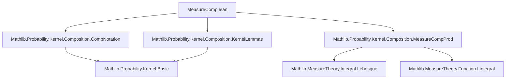

### Technical Brief: `MeasureComp.lean`

---

#### **1. Key Definitions & Theorems**

| Name | Type / Signature | Purpose |
|------|------------------|---------|
| `comp_assoc` | `η ∘ₘ (κ ∘ₘ μ) = (η ∘ₖ κ) ∘ₘ μ` | Associativity of measure-kernel composition with kernel-kernel composition. |
| `comp_eq_comp_const_apply` | `κ ∘ₘ μ = (κ ∘ₖ (Kernel.const Unit μ)) ()` | Relates `∘ₘ` to `∘ₖ` via constant kernel; enables transfer of `∘ₖ` properties. |
| `comp_eq_sum_of_countable` | `κ ∘ₘ μ = Measure.sum (fun ω ↦ μ {ω} • κ ω)` | Expresses composition as countable sum when domain is countable. |
| `snd_compProd` | `(μ ⊗ₘ κ).snd = κ ∘ₘ μ` | Connects product kernel composition (`⊗ₘ`) with `∘ₘ`. |
| `comp_congr` | `∀ᵐ a ∂μ, κ a = η a → κ ∘ₘ μ = η ∘ₘ μ` | Congruence under almost-everywhere equality of kernels. |
| `ae_comp_iff` | `(∀ᵐ z ∂(κ ∘ₘ μ), p z) ↔ ∀ᵐ y ∂μ, ∀ᵐ z ∂κ y, p z` | Characterizes almost-everywhere properties of composed measures. |
| `comp_add`, `add_comp`, `add_comp'` | Linearity of `∘ₘ` in measure and kernel. | Additivity of composition w.r.t. measure or kernel. |
| `comp_smul` | `κ ∘ₘ (a • μ) = a • (κ ∘ₘ μ)` | Homogeneity of composition w.r.t. scalar multiplication. |
| `AbsolutelyContinuous.comp_right/left/comp` | Various AC preservation lemmas | Propagation of absolute continuity through composition. |
| `comp_boolKernel`, `boolKernel_comp_measure` | Boolean kernel composition lemmas | Simplify composition involving `boolKernel`. |
| `compProd_eq_comp_prod` | `μ ⊗ₘ κ = (Kernel.id ×ₖ κ) ∘ₘ μ` | Relates product measure-kernel (`⊗ₘ`) to kernel product (`×ₖ`) and `∘ₘ`. |
| `comp_compProd_comm` | `η ∘ₘ (μ ⊗ₘ κ) = ((κ ⊗ₖ η) ∘ₘ μ).snd` | Commutativity of composition with product kernel. |

---

#### **2. Naming Conventions**

- **Prefixes**:
  - `comp_`: composition (`∘ₘ` or `∘ₖ`)
  - `compProd_`: product kernel composition (`⊗ₘ`)
  - `add_`, `smul_`: linearity properties
  - `absolutelyContinuous_`: absolute continuity properties
  - `ae_`: almost-everywhere properties

- **Suffixes**:
  - `_left`, `_right`: position of argument in binary operation
  - `_eq_`: equality lemmas
  - `_iff`: equivalence lemmas
  - `_apply`: lemmas about evaluation on sets

- **Special**:
  - `_const`: constant kernel cases
  - `_deterministic`: deterministic kernel cases
  - `_copy`, `_discard`, `_map`: structural operations

---

#### **3. Tactic Stack**

Frequent tactics used:
- `rw` / `simp_rw`: rewriting using definitions and lemmas
- `simp`: simplification with `@[simp]` lemmas
- `ext`: extensionality (for measures, functions)
- `exact`, `apply`: direct proof steps
- `cases`: case analysis (e.g., on `Bool`)
- `filter_upwards`: for AE arguments
- `congr`: congruence for lambda expressions
- `infer_instance`: typeclass inference
- `by_cases`: case split on typeclass or proposition
- `lintegral_*` lemmas: for handling integrals in proofs

---

#### **4. Proof Logic**

- **Structure**:
  - Most proofs follow a standard pattern:
    1. Expand definitions (`rw [bind_apply]`, `rw [comp_eq_comp_const_apply]`)
    2. Apply integral simplifications (`lintegral_*`, `smul_apply`, etc.)
    3. Use AE reasoning (`filter_upwards`, `ae_iff_of_countable`)
    4. Conclude via `rfl`, `simp`, or `exact`.

- **Induction**: Not used directly; relies on measure-theoretic lemmas (`bind_bind`, `lintegral_countable'`, etc.)

- **Case analysis**: Used for discrete domains (`comp_eq_sum_of_countable`, `comp_boolKernel`)

- **Typeclass reasoning**: Heavy use of `infer_instance` and `swap` for conditional cases (`comp_compProd_comm`, `compProd_deterministic`)

---

#### **5. Imports**

- `Mathlib.Probability.Kernel.Composition.CompNotation`
- `Mathlib.Probability.Kernel.Composition.KernelLemmas`
- `Mathlib.Probability.Kernel.Composition.MeasureCompProd`

→ These imports provide foundational notation, basic kernel lemmas, and product measure-kernel composition.

---

#### **6. Theory Overview & Dependencies**

##### **Mermaid Diagram: Module Dependencies**



##### **Mermaid Diagram: Core Theory Flow**

```mermaid
graph LR
  Kernel[Kernel α β] -->|compose| Measure[Measure α]
  Measure -->|bind| Measure[Measure β]
  Kernel -->|×ₖ| Kernel[Kernel (α × β) γ]
  Measure -->|⊗ₘ| Measure[Measure (α × β)]
  Measure[Measure α] -->|∘ₘ| Kernel[Kernel α β]
  Kernel[Kernel α β] -->|map| Kernel[Kernel α γ]
  Measure[Measure α] -->|map| Measure[Measure β]
```

##### **Key Theory Concepts**
- **Composition `∘ₘ`**: A measure-kernel composition defined via `bind`, generalizing integration against a kernel.
- **Product `⊗ₘ`**: A kernel-product measure, dual to `∘ₘ`.
- **Absolute Continuity**: Preserved under composition under mild conditions.
- **AE Reasoning**: Central to proofs; leverages `ae_comp_iff` to reduce AE statements over composed measures to iterated AE statements.
- **Discrete Case**: Simplified via countable sum representation (`comp_eq_sum_of_countable`).
- **Bool Kernels**: Special case for probabilistic branching, with explicit formulas.

---

#### **7. Summary**

This file formalizes foundational properties of the composition of a measure with a kernel (`∘ₘ`), emphasizing:
- Equivalence with kernel-kernel composition via constant kernels,
- Linearity and homogeneity,
- Preservation of measure-theoretic properties (σ-finiteness, finiteness, probability),
- Almost-everywhere behavior,
- Interaction with product kernels (`⊗ₘ`) and structural operations (`map`, `copy`, `discard`).

It serves as a bridge between measure-theoretic integration and kernel-based probabilistic modeling, enabling modular reasoning about stochastic processes and conditional distributions.

--- 

Let me know if you'd like a dependency graph of the `ProbabilityTheory.Kernel` hierarchy or a formalization roadmap for extending this theory.
