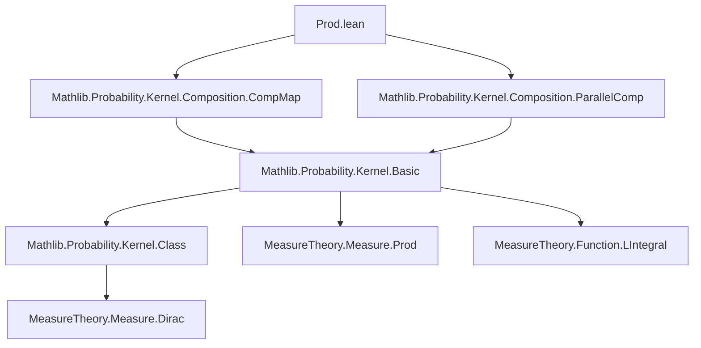

### Technical Brief: `Prod.lean` — Product of S-Finite Kernels in Lean 4

---

#### **1. Key Definitions & Theorems**

| Name | Type / Signature | Purpose |
|------|------------------|---------|
| `prod` | `Kernel α β → Kernel α γ → Kernel α (β × γ)` | Defines the product kernel: given two kernels from the same source `α`, produces a kernel into the product space `β × γ`. |
| `×ₖ` | Infix notation for `prod` | Syntactic sugar: `κ ×ₖ η` |
| `lintegral_prod` | `∫⁻ c, g c ∂(κ ×ₖ η) a = ∫⁻ b, ∫⁻ c, g (b, c) ∂η a ∂κ a` | Fubini-type theorem for iterated integrals w.r.t. product kernel. |
| `prod_apply` | `(κ ×ₖ η) a = (κ a).prod (η a)` | Pointwise equality of the product kernel with the product of measures (when both kernels are s-finite). |
| `prod_apply_prod` | `(κ ×ₖ η) a (s ×ˢ t) = (κ a s) * (η a t)` | Evaluates product kernel on measurable rectangles. |
| `deterministic_prod_deterministic` | `deterministic f hf ×ₖ deterministic g hg = deterministic (λ a ↦ (f a, g a)) ...` | Product of deterministic kernels is deterministic for the pair map. |
| `map_prod_swap` | `map (κ ×ₖ η) Prod.swap = η ×ₖ κ` | Swapping coordinates corresponds to reversing kernel order. |
| `prodComm_prod` | `(κ ×ₖ η).map MeasurableEquiv.prodComm = η ×ₖ κ` | Same as above, phrased via equivalence. |
| `prodAssoc_prod` | `((κ ×ₖ ξ) ×ₖ η).map MeasurableEquiv.prodAssoc = κ ×ₖ (ξ ×ₖ η)` | Associativity of product up to measurable equivalence. |
| `id_prod_eq` | `Kernel.id = (deterministic fst measurable_fst) ×ₖ (deterministic snd measurable_snd)` | Identity kernel decomposes into projections. |
| `fst_prod`, `snd_prod` | `fst (κ ×ₖ η) = κ`, `snd (κ ×ₖ η) = η` | Projections recover original kernels (under Markov/s-finite assumptions). |
| `IsMarkovKernel.prod`, `IsSFiniteKernel.prod`, etc. | Instance proofs | Stability of kernel classes under product. |

---

#### **2. Naming Conventions**

- **Prefixes**:
  - `prod_`: for product-related lemmas (`prod_apply`, `prod_apply_prod`, `prod_const`, etc.)
  - `lintegral_`: for integral properties (`lintegral_prod`, `lintegral_prod_symm`, `lintegral_deterministic_prod`, etc.)
  - `map_`, `comap_`: for behavior under measurable maps (`map_prod_map`, `comap_prod`, etc.)
  - `deterministic_`: for deterministic kernels (`deterministic_prod_deterministic`, `deterministic_prod_apply'`)
  - `id_`: for identity kernel (`id_prod_eq`, `id_prod_apply'`, `lintegral_id_prod`)
  - `swap_`, `prodSwap_`: for symmetry (`swap_prod`, `map_prod_swap`, `prodComm_prod`)
  - `assoc_`: for associativity (`prodAssoc_prod`, `prodAssoc_symm_prod`)
  - `zero_`: for zero kernel behavior (`zero_prod`, `prod_zero`)
  - `const_`: for constant (measure) kernels (`prod_const`, `prod_const_comp`, `const_prod_comp`)

- **Suffixes**:
  - `_left`, `_right`: indicate which argument is fixed or used (e.g., `fst_prod`, `snd_prod`, `lintegral_prod_left'`)
  - `_symm`: symmetric version of a lemma (e.g., `lintegral_prod_symm`, `prodAssoc_symm_prod`)
  - `_comp`: composition interaction (`prod_const_comp`, `const_prod_comp`)
  - `_apply`, `_apply'`: pointwise evaluation lemmas (`prod_apply`, `prod_apply'`, `deterministic_prod_apply'`, `id_prod_apply'`)

---

#### **3. Tactic Stack**

Frequent tactics used in proofs:

| Tactic | Usage |
|--------|-------|
| `rw` / `simp_rw` | Rewriting definitions (`prod`, `comp_apply`, `copy_apply`, `parallelComp_apply`, etc.) |
| `simp` | Simplifying using `@[simp]` lemmas (e.g., `zero_prod`, `prod_zero`, `fst_prod`, `snd_prod`) |
| `ext` / `ext x` | Extensionality for measures/functions |
| `fun_prop` | Proving measurability of functions (e.g., in `lintegral_*` lemmas) |
| `exact` / `infer_instance` | For instance proofs (e.g., `IsMarkovKernel.prod`) |
| `rw [Measure.prod_apply]`, `rw [Measure.prod_prod]` | Measure-theoretic simplifications |
| `rw [lintegral_*]` | Applying integral lemmas |
| `rw [Kernel.id]`, `rw [deterministic_apply]` | Kernel-specific rewrites |
| `rw [map_apply]`, `rw [comap_apply]` | For map/comap interactions |
| `refine (lintegral_lintegral_swap ?_).symm` | Invoking Fubini-style symmetry in integrals |

---

#### **4. Proof Logic**

- **Structure of proofs**:
  - Most lemmas follow a **measure-theoretic extensionality pattern**: `ext s hs; rw [...]`.
  - For integral lemmas (`lintegral_*`), the pattern is:
    1. Expand `prod` definition via `simp_rw [prod, ...]`
    2. Use `lintegral_comp`, `copy_apply`, `parallelComp_apply`
    3. Apply known measure-theoretic results: `lintegral_prod`, `lintegral_dirac'`, `lintegral_lintegral_swap`
    4. Use `fun_prop` to verify measurability assumptions.
  - Instance proofs (`IsMarkovKernel.prod`, etc.) use `rw [Kernel.prod]; infer_instance`, relying on existing stability lemmas in `MeasureTheory`.
  - Associativity/commutativity proofs use measurable equivalences (`MeasurableEquiv.prodAssoc`, `Prod.swap`) and `map`/`comap` lemmas.

- **Induction**: Not used — all proofs are direct measure-theoretic reasoning.

- **Case analysis**: Used in `IsZeroOrMarkovKernel.prod` to split on `eq_zero_or_isMarkovKernel`.

---

#### **5. Imports & Dependencies**

- **Core imports**:
  ```lean
  Mathlib.Probability.Kernel.Composition.CompMap
  Mathlib.Probability.Kernel.Composition.ParallelComp
  ```
- **Key dependencies**:
  - `MeasureTheory.Measure.Prod` — product measures
  - `MeasureTheory.Measure.Dirac` — Dirac measures and `bind`
  - `MeasureTheory.Function.LIntegral` — iterated integrals
  - `Mathlib.Probability.Kernel.Basic` — kernel definitions, `copy`, `deterministic`, `id`, `map`, `comap`
  - `Mathlib.Probability.Kernel.Class` — `IsMarkovKernel`, `IsSFiniteKernel`, etc.

---

#### **6. Mermaid Diagrams**

##### **Dependency Graph (Module-Level)**



##### **Overview of Theory Flow**

```mermaid
flowchart LR
  subgraph Kernels
    K[Kernel α β]
    L[Kernel α γ]
  end

  subgraph Product
    P[K ×ₖ L : Kernel α (β × γ)]
  end

  subgraph Properties
    I[integrals: lintegral_prod]
    S[stability: IsMarkovKernel.prod]
    A[associativity/commutativity]
  end

  K --> P
  L --> P
  P --> I
  P --> S
  P --> A
```

##### **Key Equivalences & Laws**

```mermaid
graph LR
  A[(κ ×ₖ η)] -->|map Prod.swap| B[η ×ₖ κ]
  A -->|map prodAssoc| C[(κ ×ₖ ξ) ×ₖ η]
  C -->|map prodAssoc.symm| A
  A -->|fst| D[κ]
  A -->|snd| E[η]
  F[deterministic f ×ₖ deterministic g] -->|eq| G[deterministic (f,g)]
```

---

#### **7. Summary**

This file formalizes the **product of s-finite kernels**, a foundational construction in probability theory and measure-theoretic computation. It provides:

- A clean definition via composition with `copy` and parallel composition (`∥ₖ`)
- A suite of lemmas for evaluation (`prod_apply`, `prod_apply_prod`)
- Integral Fubini theorems (`lintegral_prod`, `lintegral_prod_symm`)
- Structural properties (associativity, commutativity, projection recovery)
- Stability of kernel classes under product

The formalization is highly structured, leveraging Lean’s typeclass inference and measurable function machinery, and aligns with standard measure-theoretic treatments (e.g., in *Kallenberg, Foundations of Modern Probability*).
